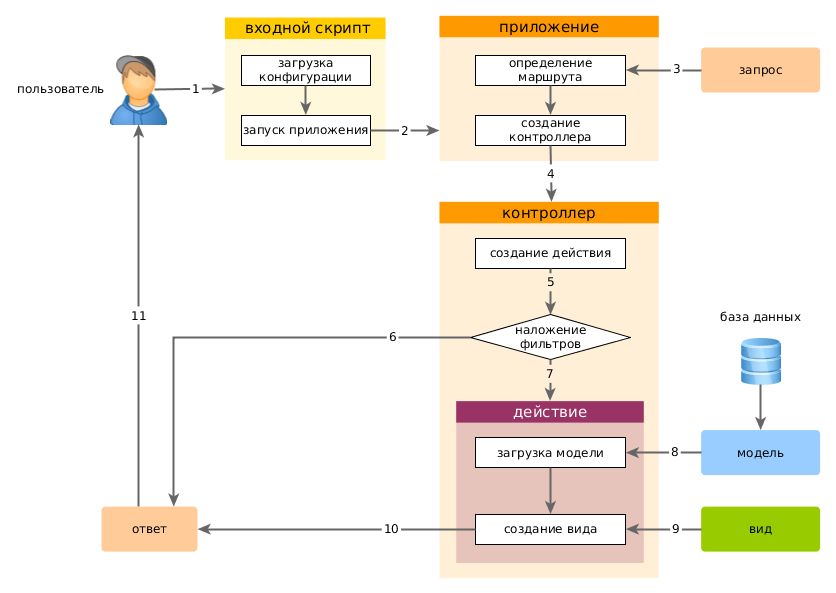

Запуск приложения
====================

 После установки Yii, базовое приложение будет доступно либо по URL `http://hostname/basic/web/index.php`, либо по `http://hostname/index.php`, в зависимости от настроек Web сервера. Данный раздел - общее введение в орагнизацию кода, встроенный функционал и обработку обращений приложением Yii.

> Информация: Далее, в данном руководстве предполагается что Yii установлен в директорию `basic/web`, которая, в свою очередь, установлена как корневой каталог в настройках Web сервера. В результате, обратившись по URL `http://hostname/index.php` Вы получите доступ к приложению, расположенному в `basic/web`. Детальнее с процессом начальной настройки можно познакомиться в разделе [Установка Yii](start-installation.md).

Функционал <a name="functionality"></a>
---------------

Установленный шаблон простого приложения состоит из четырех страниц:

* домашняя страница, отображается при переходе по URL `http://hostname/index.php`
* "About" ("О нас")
* на странице "Contact" находится форма обратной связи, на которой пользователь может обратиться к разработчику по e-mail
* на странице "Login" отображается форма авторизации. Попытайтесь авторизоваться с логином/паролем "admin/admin". Обратите внимание на изменение раздела "Login" в главном меню на "Logout".

Эти страницы используют смежный хидер (шапка сайта) и футер (подвал). В "шапке" находится главное меню, при помощи которого пользователь перемещается по сайту. В "подвале" - копирайт и общая информация.

В самой верхней части окна Вы будете видеть системные сообщения Yii - журнал, отладочная информация, сообщения об ошибках, запросы к базе данных и т.п. Выводом данной информации руководит [встроенный отладчик](tool-debugger.md), он записывает и отображает информацию о ходе выполнения приложения.


Структура приложения Yii <a name="application-structure"></a>
---------------------

Ниже приведен список основных директорий и файлов вашего приложения The most important directories and files in your application are (assuming the application's root directory is `basic`):

```
basic/                  application base path
    composer.json       used by Composer, describes package information
    config/             contains application and other configurations
        console.php     the console application configuration
        web.php         the Web application configuration
    commands/           contains console command classes
    controllers/        contains controller classes
    models/             contains model classes
    runtime/            contains files generated by Yii during runtime, such as logs and cache files
    vendor/             contains the installed Composer packages, including the Yii framework itself
    views/              contains view files
    web/                application Web root, contains Web accessible files
        assets/         contains published asset files (js, css) by Yii
        index.php       the entry (or bootstrap) script for the application
    yii                 the Yii console command execution script
```

In general, the files in the application can be divided into two types: those under `basic/web` and those
under other directories. The former can be directly accessed from via HTTP (i.e., in a browser), while the latter can not and should not be.

Yii implements the [model-view-controller (MVC)](http://wikipedia.org/wiki/Model-view-controller) design pattern,
which is reflected in the above directory organization. The `models` directory contains all [model classes](structure-models.md),
the `views` directory contains all [view scripts](structure-views.md), and the `controllers` directory contains
all [controller classes](structure-controllers.md).

The following diagram shows the static structure of an application.


Each application has an entry script `web/index.php` which is the only Web accessible PHP script in the application.
The entry script takes an incoming request and creates an [application](structure-applications.md) instance to handle it.
The [application](structure-applications.md) resolves the request with the help of its [components](concept-components.md),
and dispatches the request to the MVC elements. [Widgets](structure-widgets.md) are used in the [views](structure-views.md)
to help build complex and dynamic user interface elements.


Request Lifecycle <a name="request-lifecycle"></a>
-----------------

The following diagram shows how an application handles a request.



1. A user makes a request to the [entry script](structure-entry-scripts.md) `web/index.php`.
2. The entry script loads the application [configuration](concept-configurations.md) and creates
   an [application](structure-applications.md) instance to handle the request.
3. The application resolves the requested [route](runtime-routing.md) with the help of
   the [request](runtime-requests.md) application component.
4. The application creates a [controller](structure-controllers.md) instance to handle the request.
5. The controller creates an [action](structure-controllers.md) instance and performs the filters for the action.
6. If any filter fails, the action is cancelled.
7. If all filters pass, the action is executed.
8. The action loads a data model, possibly from a database.
9. The action renders a view, providing it with the data model.
10. The rendered result is returned to the [response](runtime-responses.md) application component.
11. The response component sends the rendered result to the user's browser.

