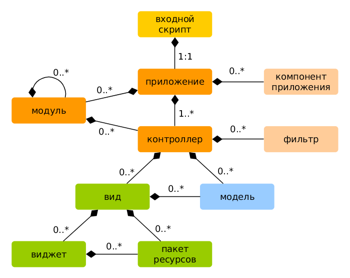

Обзор
=====

Yii приложения организованы согласно шаблону проектирования [модель-представление-контроллер (MVC)](https://ru.wikipedia.org/wiki/Model-View-Controller).
[Модели](structure-models.md) представляют собой данные, бизнес логику и бизнес правила; [представления](structure-views.md)
отвечают за отображение информации, в том числе и на основе данных, полученных из моделей; [контроллеры](structure-controllers.md) 
принимают входные данные от пользователя и преобразовывают их в понятный для [моделей](structure-models.md) формат и команды, а также отвечают за отображение 
нужного представления.

Кроме MVC, Yii приложения также имеют следующие сущности:

* [входные скрипты](structure-entry-scripts.md): это PHP скрипты, которые доступны напрямую конечному пользователю приложения.
  Они ответственны за запуск и обработку входящего запроса;
* [приложения](structure-applications.md): это глобально доступные объекты, которые осуществляют корректную работу различных 
  компонентов приложения и их координацию для обработки запроса;
* [компоненты приложения](structure-application-components.md): это объекты, зарегистрированные в приложении и предоставляющие
  различные возможности для обработки текущего запроса;
* [модули](structure-modules.md): это самодостаточные пакеты, которые включают в себя полностью все средства для MVC.
  Приложение может быть организованно с помощью нескольких модулей;
* [фильтры](structure-filters.md): это код, который должен быть выполнен до и после обработки запроса контроллерами;
* [виджеты](structure-widgets.md): это объекты, которые могут включать в себя [представления](structure-views.md).
  Они могут содержать различную логику и быть использованы в различных представлениях.

Ниже на диаграмме представлена структурная схема приложения:

