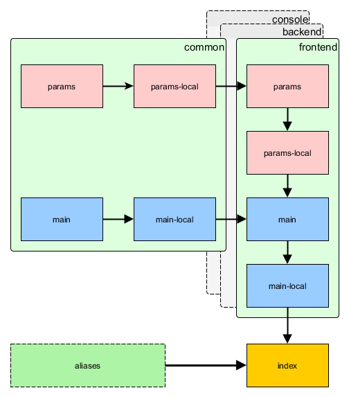

Шаблон приложения advanced
==========================

> Примечание: Данная глава находится в разработке.

Этот шаблон предназначен для крупных проектов разрабатываемых в командах где администраторская часть (backend) отделена
от приложения пользователя (frontend), приложения располагаются на нескольких серверах и т.д. Этот шаблон приложения включает
значительное количество возможностей, таких как начальная схема базы данных, регистрация пользователя и восстановление его
пароля. 

Установка
---------


### Установка при помощи Composer

Если у вас ещё не установлен [Composer](https://getcomposer.org/), следуйте инструкциям в разделе
[установка Yii](start-installation.md#installing-via-composer).

Если Composer установлен, вы можете установить приложение используя следующие команды:

    composer global require "fxp/composer-asset-plugin:~1.0.0"
    composer create-project --prefer-dist yiisoft/yii2-app-advanced yii-application

Первая команда установит плагин [composer asset plugin](https://github.com/francoispluchino/composer-asset-plugin/),
который позволит работать с пакетами bower и npm через Composer. Эту команду необходимо выполнить единожды. Вторая команда
установит приложение advanced в директорию `yii-application`. Вы можете выбрать другое имя директория если пожелаете.


Начало работы
-------------

После установки приложения, вам необходимо один раз выполнить приведённые ниже действия для того, чтобы инициализировать
установленное приложение.

1. Выполните команду `init` и выберите окружение `dev`.

    ```
    php /path/to/yii-application/init
    ```

    Для производственных серверов удобно выполнять данную команду в неинтерактивном режиме.

    ```
    php /path/to/yii-application/init --env=Production overwrite=All
    ```

2. Создайте новую базу данных и внесите соответствующие изменения в секцию `components.db` файла `common/config/main-local.php`. 
3. Примените миграции при помощи консольной команды  `yii migrate`.
4. Настройте на вебсервере URL и корневые директории:

- для приложения frontend директория `/path/to/yii-application/frontend/web/` и URL `http://yourdomain/frontend/`
- для приложения backend директория `/path/to/yii-application/backend/web/` и URL `http://yourdomain/backend/`

Структура директорий
-------------------

Корневая директория содержит следующие поддиректории:

- `backend` - веб приложение администраторской части.
- `common` - общие файлы для всех приложений.
- `console` - приложение для консоли.
- `environments` - настройки для различных окружений.
- `frontend` - веб приложение пользователя.

Корневая директория содержит следующие файлы:

- `.gitignore` содержит список директорий игнорируемых системой контроля версий git. Если вам необходимо предотвратить
  их попадание в репозиторий, перечислите их в данном файле.
- `composer.json` - Конфигурация Composer, подробно описанная в разделе «Настройка Composer» ниже.
- `init` - скрипт инициализации. Подробно описан ниже в разделе «Конфигурации и окружения».
- `init.bat` - он же для Windows.
- `LICENSE.md` - информация о лицензии. Разместите в нём лицензию вашего проекта. Особенно в случае OpenSource.
- `README.md` - основная информация об установки шаблона. Можете разместить в нём информацию о вашем проекте и его установке.
- `requirements.php` - проверка соответствия требованиям Yii.
- `yii` - входной скрипт консольного приложения.
- `yii.bat` - он же для Windows.

Встроенные псевдонимы путей
---------------------------

- `@yii` - директория фрэймворка.
- `@app` - корневая директория выполняемого в данный момент приложения.
- `@common` - директория common.
- `@frontend` - директория веб-приложения frontend.
- `@backend` - директория веб-приложения backend.
- `@console` - директория console.
- `@runtime` - директория runtime исполняемого приложения.
- `@vendor` - директория vendor, содержащая пакеты загруженые Composer'ом.
- `@bower` - директория vendor, содержащая [пакеты bower](http://bower.io/).
- `@npm` - директория vendor, содержащая [пакеты npm](https://www.npmjs.org/).
- `@web` - базовый URL исполняемого веб-приложения.
- `@webroot` - корневая веб-директория исполняемого веб-приложения.

Псевдонимы, характерные для структуры директорий приложения advanced  (`@common`,  `@frontend`, `@backend` и `@console`)
задаются в `common/config/bootstrap.php`.

Приложения
----------

В шаблоне advanced три приложения: frontend, backend и console. Frontend это та часть приложения, которае обеспечивает
взаимодействие системы с конечным пользователем проекта. Backend это административная панель, аналитика и прочая подобная
функциональность. Console обычно используется для выполнения заданий по расписанию через cron, низкоуровневого
управления сервером, при развёртывании приложения, работы с миграциями и ресурсами.

Также есть директория `common`, которая содержит файлы используемые более чем одним приложением. Например, модель `User`.
Оба веб приложения frontend и backend содержат директорию `web`. Это корневая директория, которую вы должны настроить
в вебсервере. 

У каждого приложения есть собственное пространство имён и соответствующий его названию псевдоним. Это же справедливо и для
общей директории `common`. 

Конфигурации и окружения
------------------------

Существует множество проблем при типичном подходе к настройке конфигурации:

- Каждый член команды имеет свою собственную конфигурацию. Изменение конфигурации в общем репозитории повлияет на всех
остальных.
- Пароль от эксплуатационной БД и API ключи не должны оказаться в репозитории.
- Существует много окружений: development (разработка), testing (тестирование), production (эксплуатация). Каждое окружение
  должно иметь свою собственную конфигурацию.
- Настройка всех параметров конфигурации для каждого случая однотипна и отнимает слишком много времени.


Для решения этих проблем Yii вводит простую концепцию окружений. Каждое окружение представлено набором файлов в
директории `environments`. Для переключения между окружениями используется команда `init`. Она довольно проста. Всё,
что она на самом деле делает - это копирование всех файлов из директории окружения в корневую директорию, где находятся
все приложения.

Обычно окружение содержит входные скрипты приложения, такие как `index.php`, и файлы конфигурации, имена которых
дополнены суфиксами `-local.php`. Эти файлы добавлены в `.gitignore` и никогда не попадут в репозиторий.

Чтобы избежать дублирования, конфигурации перекрывают друг друга. Например, приложение frontend считывает конфигурацию
в следующем порядке:

- `common/config/main.php`
- `common/config/main-local.php`
- `frontend/config/main.php`
- `frontend/config/main-local.php`

Параметры считываются в следующем порядке:

- `common/config/params.php`
- `common/config/params-local.php`
- `frontend/config/params.php`
- `frontend/config/params-local.php`

Значения из следующего конфигурационного файла перекрывают аналогичные значения из предыдущих конфигурационных файлов.

Полная схема:



Настройка Composer
------------------

После того как шаблон приложения установлен, хорошо бы изменить `composer.json` который находится в корневой директории
проекта:

```json
{
    "name": "yiisoft/yii2-app-advanced",
    "description": "Yii 2 Advanced Application Template",
    "keywords": ["yii2", "framework", "advanced", "application template"],
    "homepage": "http://www.yiiframework.com/",
    "type": "project",
    "license": "BSD-3-Clause",
    "support": {
        "issues": "https://github.com/yiisoft/yii2/issues?state=open",
        "forum": "http://www.yiiframework.com/forum/",
        "wiki": "http://www.yiiframework.com/wiki/",
        "irc": "irc://irc.freenode.net/yii",
        "source": "https://github.com/yiisoft/yii2"
    },
    "minimum-stability": "dev",
    "require": {
        "php": ">=5.4.0",
        "yiisoft/yii2": "*",
        "yiisoft/yii2-bootstrap": "*",
        "yiisoft/yii2-swiftmailer": "*"
    },
    "require-dev": {
        "yiisoft/yii2-codeception": "*",
        "yiisoft/yii2-debug": "*",
        "yiisoft/yii2-gii": "*",
        "yiisoft/yii2-faker": "*"
    },
    "config": {
        "process-timeout": 1800
    },
    "extra": {
        "asset-installer-paths": {
            "npm-asset-library": "vendor/npm",
            "bower-asset-library": "vendor/bower"
        }
    }
}
```

Во-первых, мы обновляем основную информацию. Меняем значения `name`, `description`, `keywords`, `homepage` и `support`
на соответствующие вашему проекту.

А сейчас интересная часть. вы можете добавить больше пакетов, необходимых для вашего приложения, в раздел `require`.
Все они с [packagist.org](https://packagist.org/). Стоит его изучить так как там множество пакетов с полезным кодом. 

После того как ваш `composer.json` настроен, вы можете выполнить в консоли команду `composer update --prefer-dist`,
подождать пока требуемые пакеты загрузятся и установятся, и начать их использовать. Автозагрузка классов этих пакетов
будет осуществляться автоматически. 

Создание ссылок на frontend из backend 
--------------------------------------

Часто приходится создавать ссылки из приложения backend на приложение frontend. Так как frontend может использовать
собственную конфигурация менеджера URL, вам придётся продублировать её в конфигурации backend под новым именем: 

```php
return [
    'components' => [
        'urlManager' => [
            // конфигурация основного менеджера URL в конфигурации backend
        ],
        'urlManagerFrontend' => [
            // конфигурация менеджера URL из frontend
        ],

    ],
];
```

После того, как это будет сделано, вы сможете получить URL, указывающий на frontend, следующим способом:

```php
echo Yii::$app->urlManagerFrontend->createUrl(...);
```
