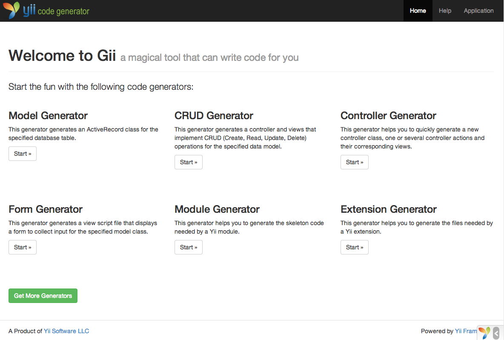
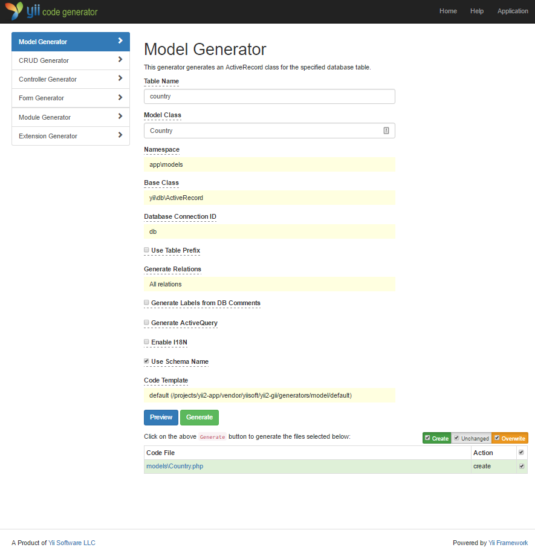
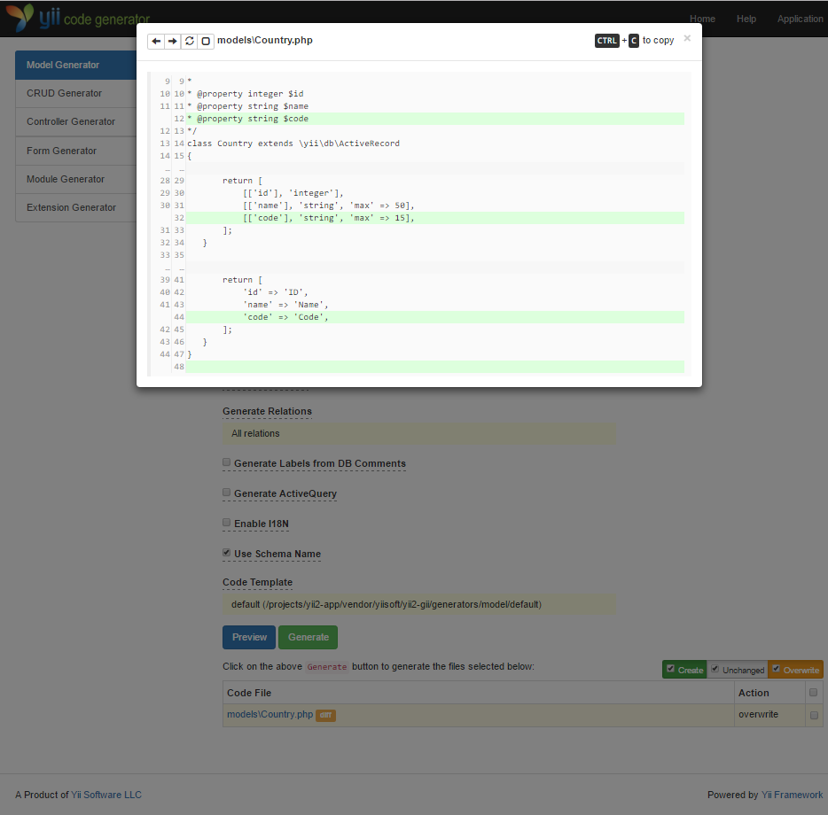
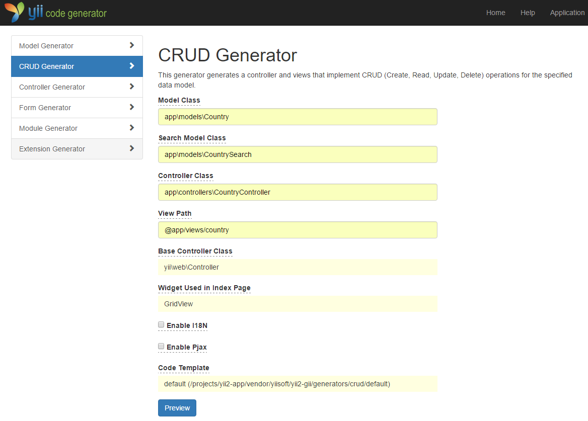
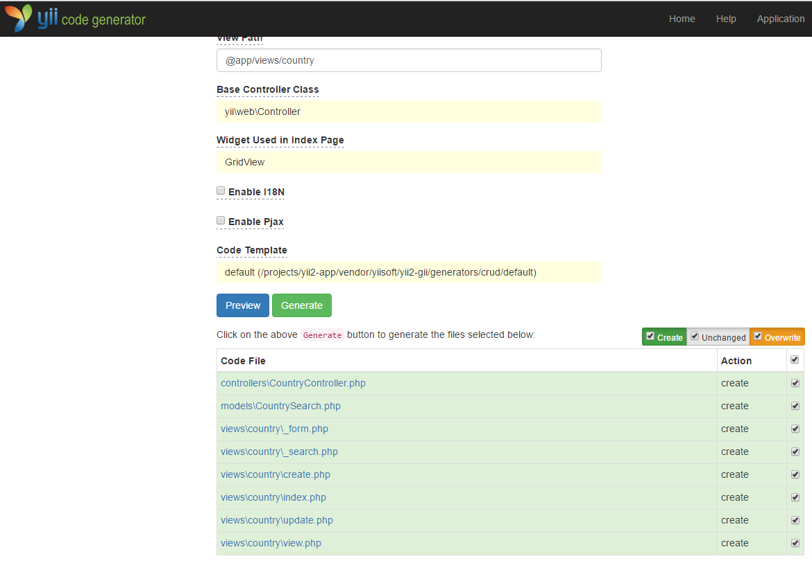
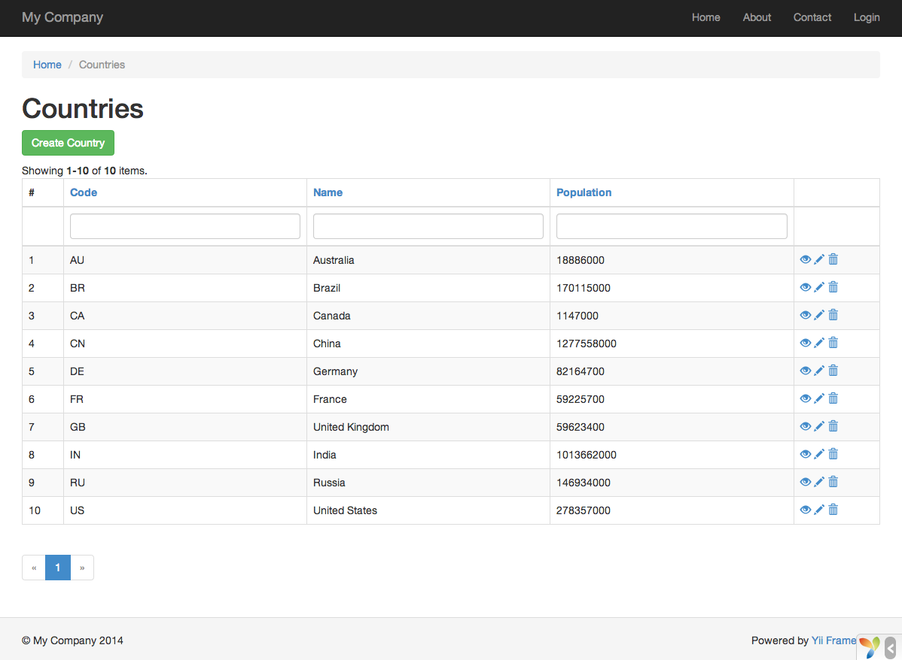
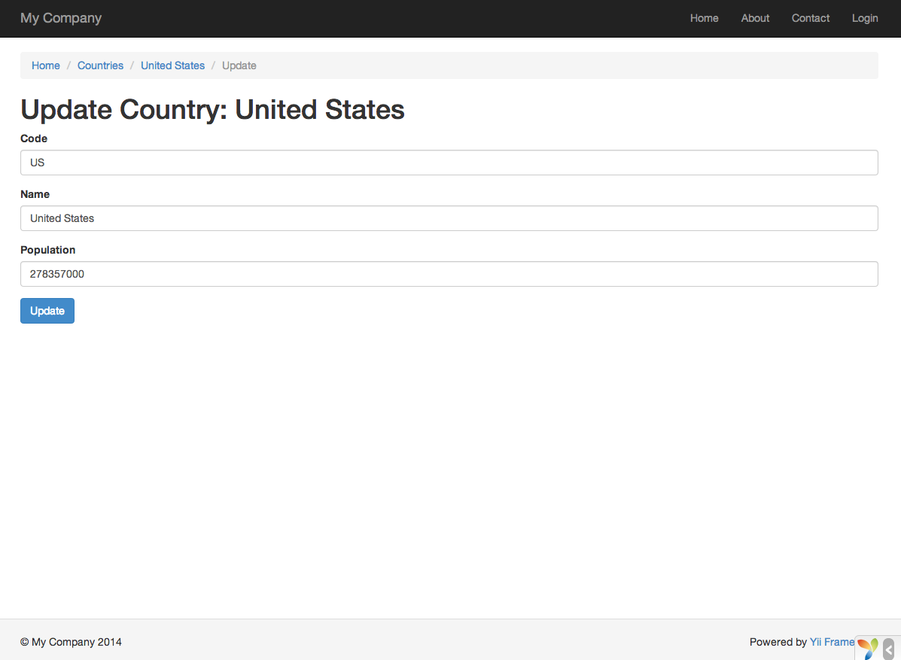

Gii ile Kod Oluşturmak
======================

Bu bölüm, bazı yaygın Web sitesi özelliklerini uygulayan kodu otomatik olarak oluşturmak için
[Gii](https://www.yiiframework.com/extension/yiisoft/yii2-gii/doc/guide)'yi nasıl kullanacağınızı açıklar. Gii ile
otomatik kod oluşturmak, Gii Web sayfalarında gösterilen talimatlara uygun olarak doğru bilgileri girmekten ibarettir.

Bu eğitim boyunca şunları öğreneceksiniz:

* uygulamanızda Gii'yi etkinleştirmeyi,
* Gii kullanarak bir Active Record sınıfı oluşturmayı,
* Gii kullanarak bir veritabanı tablosu için CRUD işlemlerini uygulayan kodu oluşturmayı,
* Gii tarafından oluşturulan kodu özelleştirmeyi.


Gii'yi Başlatmak <span id="starting-gii"></span>
----------------

[Gii](https://www.yiiframework.com/extension/yiisoft/yii2-gii/doc/guide), Yii'de bir [modül](structure-modules.md)
olarak sunulur. Gii'yi, uygulamanın [[yii\base\Application::modules|modules]] özelliğinde yapılandırarak
etkinleştirebilirsiniz. Uygulamanızı nasıl oluşturduğunuza bağlı olarak, aşağıdaki kodun `config/web.php` yapılandırma
dosyasında zaten bulunduğunu görebilirsiniz:

```php
$config = [ ... ];

if (YII_ENV_DEV) {
    $config['bootstrap'][] = 'gii';
    $config['modules']['gii'] = [
        'class' => 'yii\gii\Module',
    ];
}
```

Yukarıdaki yapılandırma, [geliştirme ortamında](concept-configurations.md#environment-constants) uygulamanın, sınıfı
[[yii\gii\Module]] olan `gii` adlı bir modül içermesi gerektiğini belirtir.

Uygulamanızın [giriş betiği](structure-entry-scripts.md) olan `web/index.php` dosyasına bakarsanız, esasen
`YII_ENV_DEV` değerinin `true` olmasını sağlayan aşağıdaki satırı bulacaksınız.

```php
defined('YII_ENV') or define('YII_ENV', 'dev');
```

Bu satır sayesinde uygulamanız geliştirme modundadır ve yukarıdaki yapılandırma gereği Gii zaten etkinleştirilmiş
olacaktır. Artık Gii'ye aşağıdaki URL üzerinden erişebilirsiniz:

```
https://hostname/index.php?r=gii
```

> Note: Gii'ye localhost dışındaki bir makineden erişiyorsanız, erişim güvenlik amacıyla varsayılan olarak
> reddedilecektir. İzin verilen IP adreslerini eklemek için Gii'yi aşağıdaki gibi yapılandırabilirsiniz:
>
```php
'gii' => [
    'class' => 'yii\gii\Module',
    'allowedIPs' => ['127.0.0.1', '::1', '192.168.0.*', '192.168.178.20'] // ihtiyaçlarınıza göre ayarlayın
],
```




Active Record Sınıfı Oluşturmak <span id="generating-ar"></span>
-------------------------------

Gii ile bir Active Record sınıfı oluşturmak için "Model Generator" seçeneğini seçin (Gii ana sayfasındaki bağlantıya
tıklayarak). Ardından formu aşağıdaki gibi doldurun:

* Table Name: `country`
* Model Class: `Country`



Ardından "Preview" düğmesine tıklayın. Oluşturulacak sınıf dosyası olarak sonuçlarda `models/Country.php` dosyasının
listelendiğini göreceksiniz. İçeriğini önizlemek için sınıf dosyasının adına tıklayabilirsiniz.

Gii'yi kullanırken, aynı dosyayı daha önce oluşturduysanız ve üzerine yazacaksanız, oluşturulacak kod ile mevcut sürüm
arasındaki farkları görmek için dosya adının yanındaki `diff` düğmesine tıklayın.



Mevcut bir dosyanın üzerine yazarken, "overwrite" yanındaki kutuyu işaretleyin ve ardından "Generate" düğmesine
tıklayın. Yeni bir dosya oluşturuyorsanız, doğrudan "Generate" düğmesine tıklayabilirsiniz.

Ardından, kodun başarıyla oluşturulduğunu belirten bir onay sayfası göreceksiniz. Mevcut bir dosyanız varsa, yeni
oluşturulan kodla üzerine yazıldığını belirten bir mesaj da göreceksiniz.


CRUD Kodu Oluşturmak <span id="generating-crud"></span>
--------------------

CRUD, Oluşturma (Create), Okuma (Read), Güncelleme (Update) ve Silme (Delete) sözcüklerinin kısaltmasıdır ve çoğu Web
sitesinde veriyle gerçekleştirilen dört yaygın işlemi temsil eder. Gii ile CRUD işlevselliği oluşturmak için
"CRUD Generator" seçeneğini seçin (Gii ana sayfasındaki bağlantıya tıklayarak). "country" örneği için, açılan formu
aşağıdaki gibi doldurun:

* Model Class: `app\models\Country`
* Search Model Class: `app\models\CountrySearch`
* Controller Class: `app\controllers\CountryController`



Ardından "Preview" düğmesine tıklayın. Aşağıda gösterildiği gibi, oluşturulacak dosyaların bir listesini göreceksiniz.



Daha önce `controllers/CountryController.php` ve `views/country/index.php` dosyalarını oluşturduysanız (rehberin
veritabanları bölümünde), bunların yerine geçmesi için "overwrite" kutusunu işaretleyin. (Önceki sürümler tam CRUD
desteğine sahip değildi.)


Denemek <span id="trying-it-out"></span>
-------

Nasıl çalıştığını görmek için tarayıcınızla aşağıdaki URL'ye erişin:

```
https://hostname/index.php?r=country%2Findex
```

Veritabanı tablosundaki ülkeleri gösteren bir veri ızgarası göreceksiniz. Izgarayı sıralayabilir veya sütun başlıklarına
filtre koşulları girerek filtreleyebilirsiniz.

Izgarada görüntülenen her ülke için ayrıntılarını görüntülemeyi, güncellemeyi veya silmeyi seçebilirsiniz. Ayrıca, yeni
bir ülke oluşturmak üzere bir form açmak için ızgaranın üstündeki "Create Country" düğmesine tıklayabilirsiniz.





Aşağıda, bu özelliklerin nasıl uygulandığını incelemek veya özelleştirmek istemeniz durumunda, Gii tarafından
oluşturulan dosyaların listesi yer almaktadır:

* Kontrolcü: `controllers/CountryController.php`
* Modeller: `models/Country.php` ve `models/CountrySearch.php`
* Görünümler: `views/country/*.php`

> Info: Gii, son derece özelleştirilebilir ve genişletilebilir bir kod oluşturma aracı olarak tasarlanmıştır. Onu
> akıllıca kullanmak, uygulama geliştirme hızınızı büyük ölçüde artırabilir. Daha fazla ayrıntı için lütfen
> [Gii](https://www.yiiframework.com/extension/yiisoft/yii2-gii/doc/guide) bölümüne bakın.


Özet <span id="summary"></span>
----

Bu bölümde, bir veritabanı tablosunda saklanan içerik için eksiksiz CRUD işlevselliğini uygulayan kodu oluşturmak üzere
Gii'yi nasıl kullanacağınızı öğrendiniz.
