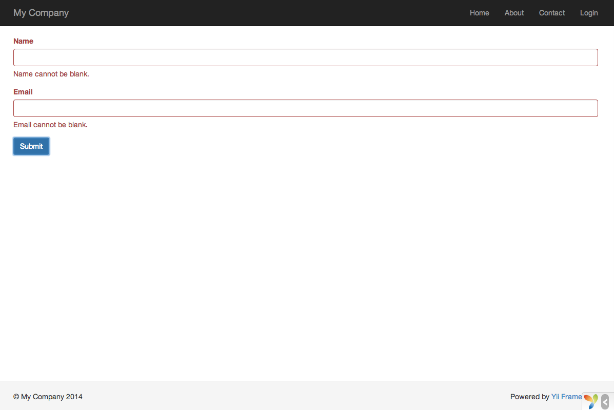

Робота з формами
================

В даному розділі буде описано як створити нову сторінку з формою для отримання даних від користувачів.
На сторінці буде розміщена форма з полями, де можна буде вказати ім’я та адресу електронної пошти.
Після отримання цих двох фрагментів інформації від користувача, сторінка відобразить введені значення знову для підтвердження.

Для досягнення даної цілі, крім створення [дії](structure-controllers.md) і
двох [представлень](structure-views.md), ви також створите [модель](structure-models.md).

В даному керівництві ви дізнаєтесь як:

* створити [модель](structure-models.md) для даних, введених користувачем через форму;
* оголосити правила перевірки введених даних;
* створити HTML-форму в [представленні](structure-views.md).


Створення моделі <span id="creating-model"></span>
----------------

Дані, отримувані від користувача, будуть представлятись моделлю класу `EntryForm` як показано нижче, який
зберігатиметься у файлі `models/EntryForm.php`. Детальніше про присвоєння імен файлам класів читайте в розділі
[Автозавантаження класів](concept-autoloading.md).

```php
<?php

namespace app\models;

use Yii;
use yii\base\Model;

class EntryForm extends Model
{
    public $name;
    public $email;

    public function rules()
    {
        return [
            [['name', 'email'], 'required'],
            ['email', 'email'],
        ];
    }
}
```

Даний клас успадкований від класу [[yii\base\Model]], який є складовою частиною фреймворку і зазвичай використовується для
роботи з даними форм.

> Інформація: Клас [[yii\base\Model]] використовується як батьківський клас для класів моделей, які *не* асоційовані з таблицями бази даних.
  Клас [[yii\db\ActiveRecord]] зазвичай є батьківським для класів моделей, що відповідають таблицям бази даних.

Клас `EntryForm` містить дві публічні властивості `name` та `email`, які використовуються для зберігання
даних, вказаних користувачем. Він також містить метод `rules()`, який повертає набір
правил перевірки даних. Правила перевірки, оголошені у вищезазначеному коді означають наступне:

* поля `name` і `email` обов’язкові для заповнення;
* поле `email` повинно містити правильну адресу електронної пошти.

Якщо об’єкт `EntryForm` заповнений даними користувача, то для їх перевірки ви можете викликати метод
цього об’єкту [[yii\base\Model::validate()|validate()]]. У випадку
невдалої перевірки властивість [[yii\base\Model::hasErrors|hasErrors]] дорівнюватиме `true`.
За допомогою [[yii\base\Model::getErrors|errors]] можна дізнатись, які саме помилки перевірки виникли.

```php
<?php
$model = new EntryForm();
$model->name = 'Qiang';
$model->email = 'bad';
if ($model->validate()) {
    // Все добре!
} else {
    // Невдача!
    // Використовуйте $model->getErrors()
}
```


Створення дії <span id="creating-action"></span>
-------------

Далі необхідно створити дію `entry` в контролері `site`, яка буде використовувати нову модель. Процес 
створення та використання дій описано у розділі [Говоримо "Привіт"](start-hello.md).

```php
<?php

namespace app\controllers;

use Yii;
use yii\web\Controller;
use app\models\EntryForm;

class SiteController extends Controller
{
    // ...наявний код...

    public function actionEntry()
    {
        $model = new EntryForm();

        if ($model->load(Yii::$app->request->post()) && $model->validate()) {
            // дані в $model успішно перевірені

            // тут робимо щось корисне з $model ...
 
            return $this->render('entry-confirm', ['model' => $model]);
        } else {
            // або сторінка відображається вперше, або ж є помилка в даних
            return $this->render('entry', ['model' => $model]);
        }
    }
}
```

Дія спочатку створює об’єкт `EntryForm`. Потім вона намагається заповнити модель
даними із масиву `$_POST`, доступ до якого забезпечується в Yii за допомогою [[yii\web\Request::post()]].
Якщо модель успішно заповнена, тобто користувач відправив дані з HTML-форми,
то для перевірки даних буде викликаний метод [[yii\base\Model::validate()|validate()]].

> Інформація: `Yii::$app` являє собою глобально доступний екземпляр-одинак [додатка](structure-applications.md) 
  (singleton). Одночасно це є [Service Locator](concept-service-locator.md), який
  надає компоненти, типу  `request`, `response`, `db` і так далі для доступу до специфічної функціональності.
  У вищезазначеному коді для доступу до даних з `$_POST` був використаний компонент екземпляру додатка `request`.

Якщо все гаразд, дія зобразить представлення `entry-confirm`, яке покаже користувачу вказані ним дані.
Якщо дані не передані або містять помилки, буде зображено представлення `entry` з
HTML-формою та повідомленнями про присутні помилки перевірки даних.

> Примітка: У цьому дуже простому прикладі ми просто відобразили сторінку підтвердження відправлення даних. На практиці,
  ви повинні розглянути використання [[yii\web\Controller::refresh()|refresh()]] або [[yii\web\Controller::redirect()|redirect()]]
  для уникнення [проблеми повторного відправлення даних форми](http://en.wikipedia.org/wiki/Post/Redirect/Get).


Створення представлення <span id="creating-views"></span>
-----------------------

На завершення, створюємо два файли представлення з іменами `entry-confirm` і `entry`, котрі зображаються дією `entry`
з минулого підрозділу.

Представлення `entry-confirm` просто зображає ім’я та адресу електронної пошти. Воно мусить бути збережене у файлі `views/site/entry-confirm.php`.

```php
<?php
use yii\helpers\Html;
?>
<p>Ви вказали наступну інформацію:</p>

<ul>
    <li><label>Ім’я</label>: <?= Html::encode($model->name) ?></li>
    <li><label>Адреса електронної пошти</label>: <?= Html::encode($model->email) ?></li>
</ul>
```

Представлення `entry` відображає HTML-форму. Воно мусить бути збережене у файлі `views/site/entry.php`.

```php
<?php
use yii\helpers\Html;
use yii\widgets\ActiveForm;
?>
<?php $form = ActiveForm::begin(); ?>

    <?= $form->field($model, 'name') ?>

    <?= $form->field($model, 'email') ?>

    <div class="form-group">
        <?= Html::submitButton('Надіслати', ['class' => 'btn btn-primary']) ?>
    </div>

<?php ActiveForm::end(); ?>
```

Для побудови HTML-форми представлення використовує потужний [віджет](structure-widgets.md)
[[yii\widgets\ActiveForm|ActiveForm]]. Методи `begin()` і `end()` виводять відкриваючий і закриваючий теги форми
відповідно. Між цими викликами створюються поля для заповнення за допомогою метода
[[yii\widgets\ActiveForm::field()|field()]]. Першим іде поле "name",
другим — "email". Далі для генерації кнопки відправлення даних викликається метод
[[yii\helpers\Html::submitButton()]].


Спробуємо <span id="trying-it-out"></span>
---------

Щоб побачити, як це працює, відкрийте в браузері наступний URL:

```
http://hostname/index.php?r=site/entry
```

Ви побачите сторінку з формою і двома полями для заповнення. Перед кожним полем є надпис, який вказує, яку саме
інформацію слід вказувати. Якщо ви натиснете на кнопку відправлення даних без самих даних або якщо вкажете адресу електронної пошти в невірному
форматі, то ви побачите повідомлення про помилку біля кожного проблемного поля.



Після введення вірних даних і їх відправлення, ви побачите нову сторінку з даними, які щойно вказали.


### Як працює вся ця "магія" <span id="magic-explained"></span>

Ви можливо здивовані роботою HTML-форми поза лаштунками, тому що може здаватись магічним те, як
зображається підпис до кожного поля та виводяться повідомлення про помилки при некоректному заповненні
й те що все це відбувається без перезавантаження сторінки.

Так, початкова перевірка даних дійсно проходить на стороні клієнта за допомогою JavaScript, і повторно перевіряється
на стороні сервера (PHP). [[yii\widgets\ActiveForm]] достатньо продуманий, щоб взяти правила перевірки, які ви 
оголосили в `EntryForm`, перетворити їх в JavaScript код і використовувати його для проведення перевірки. 
На випадок, якщо в браузері буде вимкнено JavaScript перевірка проходить і на стороні сервера, як показано в методі 
`actionEntry()`. Це дає впевненість в тому, що дані коректні за будь-яких обставин.

> Попередження: Перевірка даних на стороні клієнта - це зручність, яка забезпечує краще сприйняття користувачем.
  Перевірка на стороні сервера завжди обов’язкова, не зважаючи на клієнтську.

Підписи для полів генеруються методом `field()`, на основі імен властивостей моделі. Наприклад, підпис `Name` генерується
для властивості `name`.

Ви можете модифікувати підписи в межах представлення
наступним чином:

```php
<?= $form->field($model, 'name')->label('Ваше ім’я') ?>
<?= $form->field($model, 'email')->label('Ваша адреса електронної пошти') ?>
```

> Інформація: У Yii є велика кількість віджетів, які дозволяють швидко будувати складні та динамічні представлення.
  Як ви дізнаєтесь пізніше, розробляти нові віджети доволі просто. Багато із представлень можна винести у віджети, 
  щоб використовувати їх повторно в інших частинах і тим самим спростити розробку в майбутньому.

Підсумок <span id="summary"></span>
--------

В даному розділі ви випробували кожну частину шаблона проектування MVC. Ви дізналися, як
створити клас моделі для презентування даних, вказаних користувачем, і як перевіряти ці дані.

Також ви дізналися, як отримувати дані від користувачів та як повертати їх для відображення у браузері. Ця задача може займати 
багато часу в процесі розробки. Yii надає потужні віджети, які роблять задачу максимально простою.

В наступному розділі ви дізнаєтесь як працювати з базами даних, що необхідно в більшості додатків.
