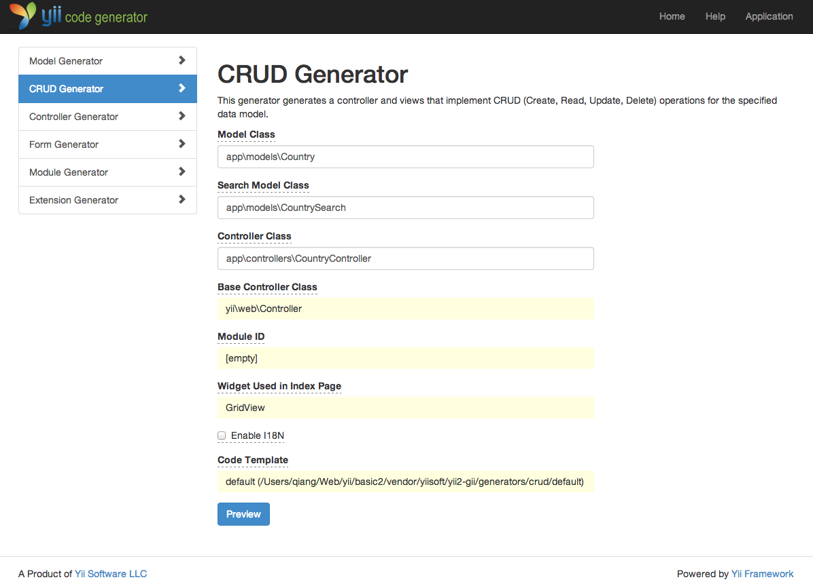
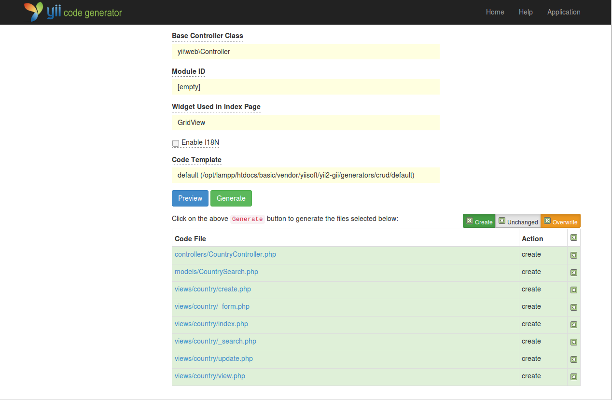

Генерування коду за допомогою Gii
=================================

Цей розділ описує, як використовувати [Gii](https://github.com/yiisoft/yii2-gii/blob/master/docs/guide-uk/README.md)
для автоматичного генерування коду, який реалізовує найбільш поширений функціонал для веб-сайту. Використання Gii для 
автоматичного створення коду є простою процедурою введення правильної інформації згідно з інструкціями, які містяться
на веб-сторінках Gii.

В даному керівництві ви дізнаєтесь як:

* увімкнути Gii у вашому додатку;
* використовувати Gii для генерування класів Active Record;
* використовувати Gii для генерування коду, який реалізовує операції CRUD для таблиці бази даних;
* налаштовувати код, що був згенерований Gii.


Підготовка Gii <span id="starting-gii"></span>
--------------

[Gii](https://github.com/yiisoft/yii2-gii/blob/master/docs/guide-uk/README.md) постачається в Yii як [модуль](structure-modules.md). 
Ви можете підключати модуль Gii, налаштувавши відповідну властивість [[yii\base\Application::modules|modules]] додатка. В залежності
від того, як ви створили ваш додаток, наступний код можливо вже присутній в конфігураційному файлі `config/web.php`:

```php
$config = [ ... ];

if (YII_ENV_DEV) {
    $config['bootstrap'][] = 'gii';
    $config['modules']['gii'] = [
        'class' => 'yii\gii\Module',
    ];
}
```

Наведена вище конфігурація підключає модуль `gii`, представлений класом [[yii\gii\Module]], у тому випадку,
коли ваш додаток знаходиться в [середовищі розробки](concept-configurations.md#environment-constants).

Якщо ви перевірите [вхідний скрипт](structure-entry-scripts.md) `web/index.php` вашого додатку, то
знайдете наступний рядок, який визначає `YII_ENV_DEV`.

```php
defined('YII_ENV') or define('YII_ENV', 'dev');
```

Завдяки даному рядку, ваш додаток знаходиться в режимі розробки, і буде підключати Gii, із вищевказаною конфігурацією.
Тепер ви можете отримати доступ до Gii за наступною URL-адресою:

```
https://hostname/index.php?r=gii
```

> Note: Якщо ви звертаєтесь до Gii від не локальної машини, доступ буде заборонений за замовчуванням із міркувань
безпеки. Ви можете налаштувати Gii, додавши дозволені IP-адреси, як показано нижче
```php
'gii' => [
    'class' => 'yii\gii\Module',
    'allowedIPs' => ['127.0.0.1', '::1', '192.168.0.*', '192.168.178.20'] // налаштувати для ваших потреб
],
```


Генерування класу Active Record <span id="generating-ar"></span>
-------------------------------

Використовуючи Gii для генерування класу Active Record, виберіть "Model Generator" (натиснувши на посилання на сторінці Gii).
Далі заповніть форму наступними даними:

* Ім’я таблиці: `country`
* Клас моделі: `Country`


Далі, натисніть на кнопку "Перегляду" ("Preview"). Ви побачите файл `models/Country.php`, який буде створено в результаті
даних дій. Ви можете натиснути на ім’я файлу класу для перегляду його вмісту.

Якщо при використанні Gii, раніше вже був створений файл моделі, то він буде перезаписаний. Для того, щоб переглянути 
відмінності в коді натисніть на кнопку `diff` поруч з ім’ям файлу.


При перезаписі наявного файлу, позначте пункт "перезаписати" ("overwrite"), а потім натисніть кнопку "Створити" ("Generate"). При створенні нового файлу, ви можете просто натиснути на кнопку "Створити" ("Generate").

Далі, ви побачите сторінку підтвердження із відображенням коду, який був успішно згенерований. Якщо ви перезаписували вже наявний 
файл, то побачите повідомлення про те, що він був переписаний і замінений на щойно згенерований код.


Генерування коду CRUD <span id="generating-crud"></span>
---------------------

CRUD - це акронім від англійських слів Create, Read, Update, Delete (Створити, Прочитати, Оновити, Видалити), що представляє чотири основні операції над даними на більшості веб-сайтів.
Щоб реалізувати функціонал CRUD використовуючи Gii, оберіть "CRUD Generator" (натиснувши відповідну кнопку на сторінці Gii). Наприклад, для таблиці "country", заповніть форму наступним чином:

* Клас моделі: `app\models\Country`
* Клас моделі пошуку: `app\models\CountrySearch`
* Клас контролера: `app\controllers\CountryController`



Далі, натисніть на кнопку "Перегляду" ("Preview"). Ви побачите список файлів, які будуть створені, як показано нижче.



Якщо ви попередньо створили контролер `controllers/CountryController.php` і файл представлення `views/country/index.php` 
(в розділі "Робота з базами даних" даного посібника), позначте пункт "перезаписати" і замініть їх. (Попередні версії файлів на мають повного функціоналу CRUD.)


Спробуємо <span id="trying-it-out"></span>
---------

Щоб побачити як це працює, відкрийте в браузері наступний URL:

```
https://hostname/index.php?r=country%2Findex
```

Ви побачите таблицю даних, що показує країни з таблиці бази даних. Ви можете відсортувати дані,
або відфільтрувати їх, вказавши умови фільтрації в заголовках колонок.

Для кожної країни, що відображається в таблиці, ви можете використати функції перегляду деталей, оновлення даних, або взагалі видалити її.
Ви також можете натиснути на кнопку "Створити країну" ("Create Country") над таблицею, яка переадресує вас на форму створення нової країни.


Нижче наведено перелік файлів, згенерованих Gii, у тому разі, якщо ви захочете дослідити як реалізовані ці можливості, 
або налаштувати їх під свої потреби:

* Контролер: `controllers/CountryController.php`
* Моделі: `models/Country.php` і `models/CountrySearch.php`
* Представлення: `views/country/*.php`

> Info: Gii - це гнучкий і розширюваний інструмент для генерування коду. При правильному використані, він дозволить
вам значно прискорити розробку ваших додатків. Для більш докладної інформації, будь ласка, зверніться до розділу
[Gii](https://github.com/yiisoft/yii2-gii/blob/master/docs/guide-uk/README.md).


Підсумок <span id="summary"></span>
--------

В цьому розділі ви дізналися як, використовуючи Gii, генерувати код, який реалізує повну функціональність CRUD для 
маніпулювання даними, що зберігаються в таблицях баз даних.
