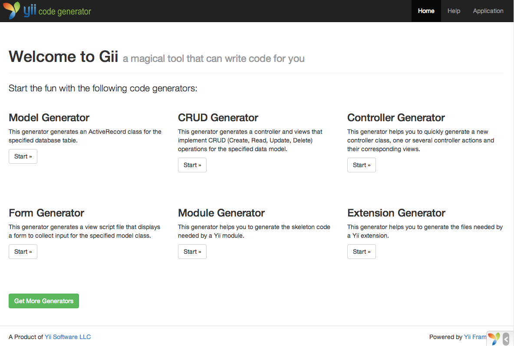

Генерація коду за допомогою Gii
===============================

Цей розділ описує, як використовувати [Gii](tool-gii.md) для автоматичної генерації коду, процедура якої має певні 
спільні риси з веб-сайтом. Використання Gii для автоматичного створення коду є простою процедурою введення 
правильної інформації згідно інструкцій, які містяться на Gii.

В даному керівництві ви дізнаєтесь:

* Увімкнути Gii у вашому додатку
* Використання Gii для генерації класів Active Record
* Використання Gii для генерації коду по операціям CRUD бази даних
* Налаштування коду, що був згенерований Gii


Підготовка Gii <a name="starting-gii"></a>
--------------

[Gii](tool-gii.md) надається як [модуль](structure-modules.md). Ви можете підключити модуль Gii, налаштувавши відповідну
властивість [[yii\base\Application::modules|modules]] в налаштуваннях додатка. В залежності від налаштувань вашого додатка,
ви можете знайти наступний код в конфігураційному файлі `config/web.php`:

```php
$config = [ ... ];

if (YII_ENV_DEV) {
    $config['bootstrap'][] = 'gii';
    $config['modules']['gii'] = 'yii\gii\Module';
}
```

Наведена вище конфігурація підключає модуль `gii` у тому випадку, коли ваш додаток знаходиться в 
[середовищі розробки](concept-configurations.md#environment-constants) і наслідує клас [[yii\gii\Module]].

Якщо ви перевірите [вхідний скрипт](structure-entry-scripts.md) `web/index.php` вашого додатку, то знайдете наступний 
рядок `YII_ENV_DEV`, який переводить додаток в середовище розробки.

```php
defined('YII_ENV') or define('YII_ENV', 'dev');
```

Завдяки даному рядку, ваш додаток знаходиться в режимі розробки, і буде підключати Gii, із вищевказаною конфігурацією.
Тепер ви можете отримати доступ до Gii за наступною адресою:

```
http://hostname/index.php?r=gii
```

> Примітка: Якщо ви звертаєтеся до Gii від машини, крім локальної, доступ буде заборонений за замовчуванням із міркувань
  безпеки. Ви можете налаштувати Gii, додавши дозволені IP адреси, як показано нижче,
>
```php
'gii' => [
    'class' => 'yii\gii\Module',
    'allowedIPs' => ['127.0.0.1', '::1', '192.168.0.*', '192.168.178.20'] // налаштувати для ваших потреб
],
```




Генерація класу Active Record <a name="generating-ar"></a>
-----------------------------

Використовуючи Gii для генерації класу Active Record, виберіть "Model Generator" (натиснувши на посилання на сторінці Gii).
Далі заповніть форму наступними даними:

* Ім’я таблиці: `country`
* Клас моделі: `Country`


Далі, натисніть на кнопку "Перегляду" ("Preview"). Ви побачите файл `models/Country.php`, який буде створено в результаті
даних дій. Ви можете натиснути на ім’я файлу класу для перегляду його вмісту.

Якщо при використанні Gii, раніше вже був створений файл моделі, то він буде перезаписаний. Для того, щоб переглянути 
відмінності в коді натисніть на кнопку `diff` поруч з ім’ям файлу.


При перезаписі існуючого файлу, встановіть прапорець поруч із чекбоксом "перезаписати" ("overwrite"), а потім натисніть 
кнопку "Створити" ("Generate"). При створенні нового файлу, ви можете просто натиснути на кнопку "Створити" ("Generate").

Далі, ви побачите сторінку підтвердження із відображенням коду, який був сгенерований. Якщо ви перезаписували вже існуючий 
файл, то побачите повідомлення про те, що він був переписаний і замінений на щойно згенерований код.


Генерація коду CRUD <a name="generating-crud"></a>
-------------------

CRUD розшифровується як Створити, Прочитати, Оновити, і Видалити, це операції що вирішують чотири спільні завдання 
з маніпулюванням даними на більшості веб-сайтів. Щоб створити CRUD інтерфейс використовуючи Gii, оберіть 
"CRUD Generator" (натиснувши відповідну кнопку на сторінці Gii). Наприклад, для таблиці "country", заповніть наступні поля форми:

* Клас моделі: `app\models\Country`
* Клас моделі пошуку: `app\models\CountrySearch`
* Клас контролера: `app\controllers\CountryController`


Далі, натисніть на кнопку "Перегляду" ("Preview"). Ви побачите файл `models/Country.php` який буде створений в 
результаті даних дій. Ви можете натиснути на ім’я файлу класу для перегляду його вмісту.


Якщо ви попередньо створили контролер `controllers/CountryController.php` і файл представлення `views/country/index.php` 
(в розділі "Робота з базами даних" даного посібника), оберіть чекбокс "перезаписати" і замініть їх. 
(Попередні версії файлів на мають повного CRUD функціоналу.)


Спробуємо <a name="trying-it-out"></a>
---------

Щоб побачити все, що було створено під час роботи, відкрийте в браузері наступний URL:

```
http://hostname/index.php?r=country/index
```

Ви побачите таблицю даних, що показує країни з таблиці бази даних. Ви зможете відсортувати сітку, або відфільтрувати 
пошук, вказавши умови фільтрації в заголовках стовпців.

Для кожної країни, що відображається в таблиці, ви можете використати функції перегляду деталей, оновлення даних, або 
взагалі видалити її. Ви також можете натиснути на кнопку "Створити країну" зверху сітки відображення, яка переадресує 
вас на форму створення нової країни.


Нижче наведено перелік файлів, згенерованих Gii, у тому разі, якщо ви захочете дослідити, як реалізовані ці можливості, 
або доналаштувати їх під свої потреби:

* Контролер: `controllers/CountryController.php`
* Моделі: `models/Country.php` і `models/CountrySearch.php`
* Представлення: `views/country/*.php`

> Інформація: Gii це гнучкий і розширюваний інструмент для генерації коду. При правильному використувані, від дозволить 
  вам значно прискорити розробку ваших додатків. Для більш докладної інформації, будьласка, зверніться до розділу [Gii](tool-gii.md).


Підсумок <a name="summary"></a>
--------

В цьому розділі ви дізналися як, використовуючи Gii, генерувати код, який реалізує повну функціональність CRUD для 
маніпулювання даними, що зберігаються в таблицях баз даних.
