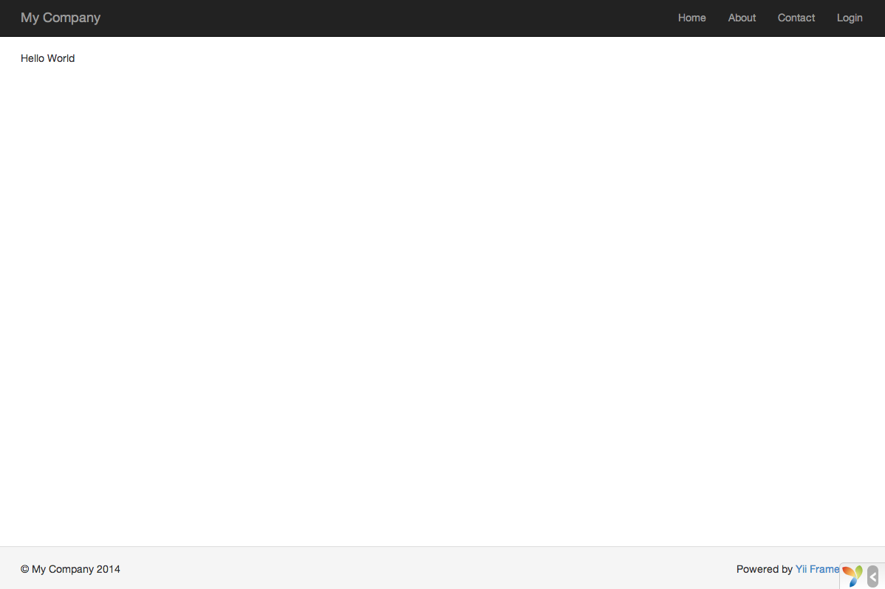

Говоримо "Привіт"
=================

В даному розділі розглянемо як створити нову сторінку з надписом "Привіт".
У процесі вирішення задачі ви створите [дію контролера](structure-controllers.md#creating-actions) і
[представлення](structure-views.md):

* Додаток опрацює запит і передасть управління відповідній дії,
* а дія, у свою чергу, відобразить представлення з надписом "Привіт" кінцевому користувачу.

В даному керівництві ви дізнаєтесь як:

1. створити [дію](structure-controllers.md#creating-actions), яка буде відповідати на запити;
2. створити [представлення](structure-views.md), щоб скомпонувати вміст відповіді;
3. додаток відправляє запити до [дії](structure-controllers.md#creating-actions).


Створення дії <span id="creating-action"></span>
-------------

Для нашої задачі знадобиться [дія](structure-controllers.md#creating-actions) `say`, яка зчитує
параметр `message` із запиту і відображає його значення користувачу. Якщо в запиті
відсутній параметр `message`, то дія буде відображати "Привіт".

> Інформація: [Дії](structure-controllers.md#creating-actions) являються об’єктами, на які користувач може посилатись для
  виконання. Дії згруповані в [контролери](structure-controllers.md). Результатом виконання
  дії є відповідь, яку отримує користувач.

Дії повинні оголошуватись в [контролерах](structure-controllers.md). Для простоти, ви можете
оголосити дію `say` в уже наявному контролері `SiteController`, який визначений
у файлі класу `controllers/SiteController.php`:

```php
<?php

namespace app\controllers;

use yii\web\Controller;

class SiteController extends Controller
{
    // ...наявний код...

    public function actionSay($message = 'Привіт')
    {
        return $this->render('say', ['message' => $message]);
    }
}
```

В наведеному коді дія `say` визначена як метод `actionSay` в класі `SiteController`.
Yii використовує префікс `action` для того, щоб відрізняти методи-дії від звичайних методів у класі контролеру.
Назва після префікса `action` вважається ідентифікатором відповідної дії.

Коли черга доходить до іменування дій, слід розуміти як Yii поводиться з ідентифікаторами дій. Ідентифікатори дій можуть
бути лише в нижньому регістрі. Якщо ідентифікатор складається з декількох слів, вони з’єднуються дефісами
(наприклад, `create-comment`). Імена методів дій отримуються шляхом видалення дефісів з ідентифікатора,
перетворення першої літери кожного слова у верхній регістр і додавання префікса `action`. Наприклад,
ідентифікатор дії `create-comment` відповідає методу `actionCreateComment`.

Метод дії у нашому прикладі приймає параметр `$message`, який за замовчуванням визначено як `"Привіт"` (так само,
як ви звикли визначати значення за замовчуванням для аргументів функції у PHP). Коли додаток
отримує запит і визначає, що дія `say` відповідає за його опрацювання, додаток призначає
цьому параметру значення однойменного параметра із запиту. Іншими словами, якщо запит містить
параметр `message` зі значенням `"До побачення"`, то змінній `$message` всередині дії буде призначено це значення.

Всередині метода дії, для відображення [представлення](structure-views.md) з ім’ям `say`, використовується метод
[[yii\web\Controller::render()|render()]]. Для того, щоб вивести повідомлення,
у представлення передається параметр `message`. Результат формування повертається методом дії. Цей результат приймається
додатком та відображається кінцевому користувачу в браузері (як частина цілої HTML-сторінки).


Створення представлення <span id="creating-view"></span>
-----------------------

[Представлення](structure-views.md) є скриптами, які використовуються для генерації вмісту відповіді.
Для нашого додатку ви створите представлення `say`, яке буде виводити параметр `message`, отриманий із методу дії:

```php
<?php
use yii\helpers\Html;
?>
<?= Html::encode($message) ?>
```

Представлення `say` мусить бути збережено у файлі `views/site/say.php`. Коли метод [[yii\web\Controller::render()|render()]]
викликається в дії, він буде шукати PHP-файл з ім’ям виду `views/ControllerID/ViewName.php`.

Варто зазначити, що у вищезазначеному коді параметр `message` [[yii\helpers\Html::encode()|екранується для HTML]]
перед відображенням. Це обов’язково, бо параметр приходить від користувача, котрий може спробувати провести
[XSS атаку](http://uk.wikipedia.org/wiki/%D0%9C%D1%96%D0%B6%D1%81%D0%B0%D0%B9%D1%82%D0%BE%D0%B2%D0%B8%D0%B9_%D1%81%D0%BA%D1%80%D0%B8%D0%BF%D1%82%D1%96%D0%BD%D0%B3),
шляхом вставки небезпечного JavaScript кода.

Ви можете доповнити представлення `say` HTML-тегами, текстом або кодом PHP.
Фактично, представлення `say` є простим PHP-скриптом, який виконується методом [[yii\web\Controller::render()|render()]].
Вміст, який формується скриптом представлення, буде передано додатком користувачу.


Спробуємо <span id="trying-it-out"></span>
---------

Після створення дії і представлення, ви можете перейти на нову сторінку по наступному URL:

```
http://hostname/index.php?r=site/say&message=Привіт+світ
```



Буде відображена сторінка з надписом "Привіт світ". Вона використовує ту ж шапку і футер, що і решта сторінок додатка.

Якщо ви не вкажете параметр `message` в URL, то побачите на сторінці лише "Привіт". Це відбувається тому, що `message` передається як параметр в метод `actionSay()`, а коли він не вказаний,
використовується значення за замовчуванням "Привіт".

> Інформація: Нова сторінка використовує ту ж шапку і футер, що й решта сторінок, тому що метод [[yii\web\Controller::render()|render()]]
  автоматично підставляє результат формування представлення `say` в, так званий, [макет](structure-views.md#layouts), який в даному
  випадку розміщено у `views/layouts/main.php`.

Параметр `r` у вищезазначеному URL потребує додаткових пояснень. Він вказує [маршрут](runtime-routing.md), що являє собою унікальний для додатка ідентифікатор,
який вказує на дію. Його формат `ControllerID/ActionID`. Коли додаток отримує запит,
він перевіряє цей параметр і, використовуючи частину `ControllerID`, визначає який контролер
слід використовувати для опрацювання запиту. Потім, контролер використовує частину `ActionID`,
щоб визначити яку дію використовувати для виконання реальної роботи. В нашому випадку маршрут `site/say`
буде відповідати контролеру `SiteController` і його дії `say`. В результаті,
для опрацювання запиту буде викликано метод `SiteController::actionSay()`.

> Інформація: Як і дії, контролери також мають ідентифікатори, котрі однозначно визначають їх в додатку.
  Ідентифікатори контролерів використовують ті ж самі правила іменування, що і ідентифікатори дій. Імена класів контролерів
  отримуються шляхом видалення дефісів з ідентифікатора, перетворення першої літери кожного слова у верхній регістр
  і додавання в кінець слова `Controller`. Наприклад, ідентифікатор контролера `post-comment` відповідає
  імені класу контролера `PostCommentController`.


Підсумок <span id="summary"></span>
--------

В даному розділі ви торкнулися таких частин шаблону проектування MVC як контролери та представлення.
Ви створили дію, як частину контролера, для опрацювання специфічного запиту. А також ви створили представлення
для формування вмісту відповіді. В цьому процесі ніяк не використовувалась модель, оскільки в ролі даних виступає тільки простий параметр `message`.

Також ви ознайомились із концепцією маршрутизації, котра є сполучною ланкою між запитом користувача і дією контролера.

В наступному розділі ви дізнаєтесь як створити модель та додати нову сторінку з HTML-формою.
