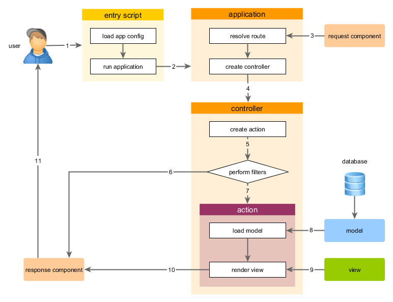

Запуск додатка
====================

 Після встановлення Yii, базовий додаток буде доступний або по URL `http://hostname/basic/web/index.php`, або по `http://hostname/index.php`, в залежності від налаштування Web сервера. Даний розділ - загальне введення в організацію коду, вбудований функціонал і опрацювання звернень додатком Yii.

> Інформація: Далі, в даному посібнику передбачається що Yii встановлений в теку `basic/web`, яка, в свою чергу, встановлена як коренева директорія в налаштуваннях Web сервера. В результаті, звернувшись по URL `http://hostname/index.php` ви отримаєте доступ до додатку, розміщенному в `basic/web`. Детальніше з процесом початкового налаштування можна ознайомитись в розділі [Встановлення Yii](start-installation.md).

Функціонал <a name="functionality"></a>
---------------

Вбудований шаблон простого додатку складається з чотирьох сторінок:

* домашня сторінка, відображається при переході по URL `http://hostname/index.php`
* "About" ("Про нас")
* на сторінці "Contact" знаходиться форма зворотнього зв’язку, на якій користувач може звернутися до розробника по e-mail
* на сторінці "Login" відображається форма авторизації. Спробуйте авторизуватись з логіном/паролем "admin/admin". Зверніть увагу на зміну розділу "Login" в головному меню на "Logout".

Ці сторінки використовують суміжний хедер (шапка сайта) і футер (підвал). В "шапці" знаходиться головне меню, за допомогою якого користувач переміщається по сайту. В "підвалі" - копірайт і загальна інформація.

В самій верхній частині вікна ви будете бачити системні повідомлення Yii - журнал, відлагоджувальну інформацію, повідомлення про помилки, запити до бази даних і т.п. Відображенням данної інформацію керує [вбудований відладчик](tool-debugger.md), він записує і відображає інформацію про хід виконання додатку.


Структура додатка Yii <a name="application-structure"></a>
---------------------

Нижще наведений перелік основних директорій і файлів вашого додатку (вважаєм, що додаток встановлений в директорію `basic`):

```
basic/                  кореневий каталог додатка
    composer.json       використовується Composer'ом, містить опис додатку
    config/             конфігураційні файли
        console.php     конфігурація консольного додатка
        web.php         конфігурація Web додатка
    commands/           містить класи консольних команд
    controllers/        контролери
    models/             моделі
    runtime/            файли, які генерує Yii під час виконання додатку (логи, кеш і т.п.)
    vendor/             містить пакунки Composer'а і, власне, сам фреймворк Yii
    views/              представлення додатку
    web/                коренева директорія Web додатку. Містить файли, доступні через Web
        assets/         скрипти, які використовуються додатком (js, css)
        index.php       місце входження в додаток Yii. З нього розпочинається виконання додатку
    yii                 скрипт виконання консольного додатку Yii
```

В цілому, додаток Yii можна розділити на дві категорії файлів: розміщенні в `basic/web` і розміщенні в інших директоріях. Перша категорія доступна через Web (наприклад, браузером), друга недоступна зовні та і не повинна бути так як містить службову інформацію.

В Yii реалізована схема проектування [модель-представлення-контролер (MVC)](http://http://uk.wikipedia.org/wiki/Model-View-Controller),
яка відповідає структурі директорій додатка. В директорії `models` знаходяться [Моделі](structure-models.md),
в `views` розміщені [Представлення](structure-views.md), а в каталозі `controllers` всі [Контролери](structure-controllers.md) додатка.

Діаграма нижче демонструє внутрішню будову додатка.


В кожному додатку Yii є місце входження в додаток, `web/index.php` це єдиний PHP-скрипт доступний для виконання через Web. Він отримує вхідний запит і створює екземпляр [додатку](structure-applications.md).
[Додаток](structure-applications.md) опрацьовує вхідні запити з допомогою [компонентів](concept-components.md) і відправляє запит контролеру. [Віджети](structure-widgets.md) використовуються у [Представленнях](structure-views.md) для побудови динамічних інтерфейсів сайта.


Життєвий цикл запиту користувача <a name="request-lifecycle"></a>
-----------------

На діаграмі показано як додаток опрацьовує запит.



1. Користувач звертається до [місця входження](structure-entry-scripts.md) `web/index.php`.
2. Скрипт завантажує конфігурацію [configuration](concept-configurations.md) і створює екземпляр [додатку](structure-applications.md) для наступного опрацювання запиту.
3. Додаток визначає [маршрут](runtime-routing.md) запиту за допомогою компонента додатка  [запит](runtime-requests.md).
4. Додаток створює екземпляр [контролера](structure-controllers.md) для виконання запиту.
5. Контролер, в свою чергу, створює [подію](structure-controllers.md) і накладає на неї фільтри.
6. Якщо хоч один фільтр поверне помилку - виконання додатку зупиняється.
7. Якщо всі фільтри пройдені - додаток виконується.
8. Подія завантажує модель даних. Скоріше за все із бази даних.
9. Подія генерує представлення, відображаючи в ньому дані (в т.ч. і отримані із моделі).
10. Згенерований вид додатку передається як компонент [відповідь](runtime-responses.md).
11. Компонент "відповідь" відправляє готовий результат роботи додатку браузеру користувача.

