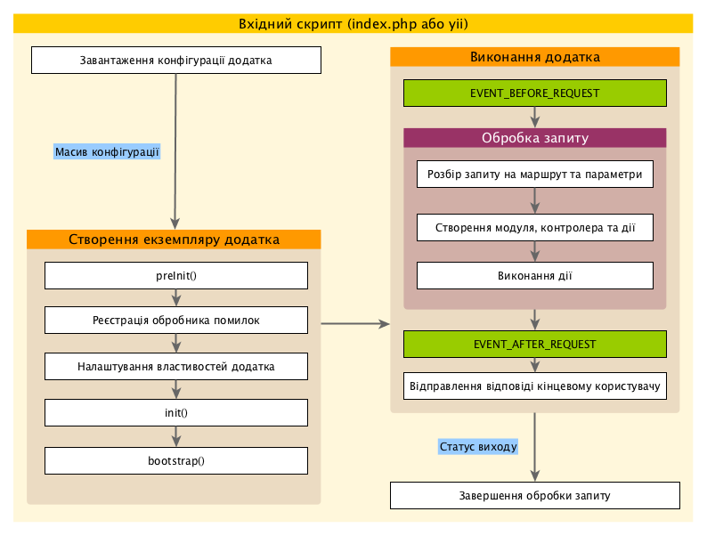

Додатки
=======

Додатки це об’єкти, які керують всією структурою і життєвим циклом прикладної системи Yii.
Кожна прикладна система Yii містить у собі один об’єкт додатка, який створюється у 
[вхідному скрипті](structure-entry-scripts.md) і глобально доступний через вираз `\Yii::$app`.

> Інформація: Термін "додаток", в залежності від контексту, в якому він використовується, може означати як об’єкт додатка, 
  так і прикладну систему додатка в цілому.

Існує два типи додатків: [[yii\web\Application|веб-додатки]] та [[yii\console\Application|консольні додатки]].
Як можна здогадатися із назв, перший тип, в основному, займається обробкою веб-запитів, а другий обробляє
запити консольних команд.


## Конфігурації додатка <span id="application-configurations"></span>

Коли [вхідний скрипт](structure-entry-scripts.md) створює додаток, він завантажить 
[конфігурацію](concept-configurations.md) та застосує її до додатка, наприклад:

```php
require(__DIR__ . '/../vendor/autoload.php');
require(__DIR__ . '/../vendor/yiisoft/yii2/Yii.php');

// завантаження конфігурації додатка
$config = require(__DIR__ . '/../config/web.php');

// створення екземпляру додатка і його налаштування
(new yii\web\Application($config))->run();
```

Як і звичайні [конфігурації](concept-configurations.md), конфігурації додатка вказують як саме
слід ініціалізувати властивості об’єктів додатка. Через те, що конфігурації додатків часто
є складними, вони зберігаються у декількох [конфігураційних файлах](concept-configurations.md#configuration-files),
наприклад, файл `web.php` у наведеному вище прикладі.


## Властивості додатка <span id="application-properties"></span>

Існує багато важливих властивостей додатка, які ви будете налаштовувати в конфігураціях додатка. 
Ці властивості, зазвичай, описують середовище, у якому працює додаток. Наприклад, 
додаток мусить знати яким чином завантажувати [контролери](structure-controllers.md), 
де зберігати тимчасові файли, і т. п. Нижче ми розглянемо дані властивості.


### Обов'язкові властивості <span id="required-properties"></span>

В кожному додатку, ви маєте налаштувати мінімум дві властивості: [[yii\base\Application::id|id]]
та [[yii\base\Application::basePath|basePath]].


#### [[yii\base\Application::id|id]] <span id="id"></span>

Властивість [[yii\base\Application::id|id]] є унікальним ідентифікатором додатка, який відрізняє його від решти інших додатків.
Здебільшого, це використовується всередині системи. Хоч і не є обов’язковим, але для кращої сумісності рекомендується 
використовувати буквено-цифрові символи при налаштуванні ідентифікатора додатка.


#### [[yii\base\Application::basePath|basePath]] <span id="basePath"></span>

Властивість [[yii\base\Application::basePath|basePath]] вказує на кореневу директорію додатка. Це директорія, 
яка містить весь код прикладної системи додатка. В цій директорії, зазвичай, знаходяться під-директорії `models`,
`views`, та `controllers`, які містять код, що відповідає шаблону проектування MVC.

Ви можете налаштувати властивість [[yii\base\Application::basePath|basePath]], вказавши прямий шлях до директорії 
або через [псевдонім шляху](concept-aliases.md). В обох випадках, вказана директорія має існувати, інакше буде отримано 
виключення. Шлях буде нормалізовано за допомогою виклику функції `realpath()`.

Властивість [[yii\base\Application::basePath|basePath]] часто використовується для отримання інших важливих шляхів 
(наприклад, шлях до директорії runtime). Саме з цієї причини, псевдонім шляху `@app` визначений представляти цей
шлях. Похідні шляхи потім можуть бути сформовані за допомогою цього псевдоніму шляху (наприклад, `@app/runtime` для
звертання до директорії runtime).


### Важливі властивості <span id="important-properties"></span>

Властивості, перелічені в даному підрозділі, частіш за все повинні бути визначені, тому що вони можуть
відрізнятися у різних додатках.


#### [[yii\base\Application::aliases|aliases]] <span id="aliases"></span>

Дана властивість дозволяє налаштувати вам набір [псевдонімів](concept-aliases.md) у рамках масиву.
Ключами масиву є імена псевдонімів, а значеннями - відповідні визначення шляхів.
Наприклад,

```php
[
    'aliases' => [
        '@name1' => 'path/to/path1',
        '@name2' => 'path/to/path2',
    ],
]
```

Ця властивість призначена для того, щоб ви мали змогу вказувати псевдоніми в рамках конфігурації додатка, 
а не викликаючи метод [[Yii::setAlias()]].


#### [[yii\base\Application::bootstrap|bootstrap]] <span id="bootstrap"></span>

Дана властивість є дуже зручною, вона дозволяє вказувати масив компонентів, які повинні бути виконані
у процесі [[yii\base\Application::bootstrap()|початкового завантаження]] додатка. Наприклад, якщо вам потрібен
[модуль](structure-modules.md), який виконує тонке налаштування [URL-правил](runtime-routing.md), 
ви можете вказати його ідентифікатор в якості елемента даної властивості.

Кожен з елементів даної властивості може вказуватись в одному із наступних форматів:

- ідентифікатор компонента додатка, що вказаний у [компонентах](#components);
- ідентифікатор модуля, що вказаний у [модулях](#modules);
- назва класу;
- масив конфігурації;
- анонімна функція, яка створює та повертає об’єкт компонента.

Наприклад,

```php
[
    'bootstrap' => [
        // ідентифікатор компонента додатка або модуля
        'demo',

        // назва класу
        'app\components\Profiler',

        // масив конфігурації
        [
            'class' => 'app\components\Profiler',
            'level' => 3,
        ],

        // анонімна функція
        function () {
            return new app\components\Profiler();
        }
    ],
]
```

> Інформація: Якщо ідентифікатор модуля збігається з ідентифікатором компонента додатка, перевага буде віддана компоненту додатка
  під час початкового завантаження. Якщо ж ви хочете використати модуль, вам потрібно визначити анонімну функцію, 
  як показано нижче:
> ```php
[
    function () {
        return Yii::$app->getModule('user');
    },
]
```


Під час початкового завантаження, буде створено екземпляр кожного компоненту. Якщо клас компонента реалізує
інтерфейс [[yii\base\BootstrapInterface]], то його метод [[yii\base\BootstrapInterface::bootstrap()|bootstrap()]]
буде також викликаний.

Ще одним практичним прикладом є конфігурація додатку в [базовому шаблоні проекту](start-installation.md),
у якій модулі `debug` та `gii` визначені як компоненти початкового завантаження, коли додаток знаходиться
в середовищі розробки:

```php
if (YII_ENV_DEV) {
    // налаштування конфігурації для середовища розробки ('dev')
    $config['bootstrap'][] = 'debug';
    $config['modules']['debug'] = 'yii\debug\Module';

    $config['bootstrap'][] = 'gii';
    $config['modules']['gii'] = 'yii\gii\Module';
}
```

> Примітка: Якщо вказувати велику кількість компонентів у `bootstrap` - це негативно позначиться на швидкодії
  додатка, оскільки для кожного запиту буде виконуватись один й той самий набір компонентів. Таким чином, потрібно
  розсудливо використовувати компоненти початкового завантаження.


#### [[yii\web\Application::catchAll|catchAll]] <span id="catchAll"></span>

Дана властивість підтримується тільки [[yii\web\Application|веб-додатками]]. Вона вказує на 
[дію контролера](structure-controllers.md), яка мусить обробляти всі вхідні запити від користувача. Переважно, 
це використовується, коли додаток знаходиться в режимі обслуговування і повинен обробити всі запити через одну дію.

Конфігурація є масивом, перший елемент якого вказує на маршрут дії. Решта елементів масиву у форматі ключ-значення
вказують на додаткові параметри, які мають бути передані дії. Наприклад,

```php
[
    'catchAll' => [
        'offline/notice',
        'param1' => 'value1',
        'param2' => 'value2',
    ],
]
```


#### [[yii\base\Application::components|components]] <span id="components"></span>

Дана властивість є найважливішою. Вона дозволяє вам зареєструвати список іменованих компонентів, так званих 
[компонентів додатку](structure-application-components.md), які ви можете використовувати в інших місцях. Наприклад,

```php
[
    'components' => [
        'cache' => [
            'class' => 'yii\caching\FileCache',
        ],
        'user' => [
            'identityClass' => 'app\models\User',
            'enableAutoLogin' => true,
        ],
    ],
]
```

Кожен компонент додатка визначений у форматі ключ-значення в масиві. Ключ являє собою ідентифікатор компонента, 
у той час як значення являє собою назву класу або [конфігурацію](concept-configurations.md).

Ви можете зареєструвати будь-який компонент у додатку, який потім буде доступний глобально 
за допомогою виразу `\Yii::$app->componentID`.

Більш детальна інформація наведена в розділі [Компоненти додатка](structure-application-components.md).


#### [[yii\base\Application::controllerMap|controllerMap]] <span id="controllerMap"></span>

Дана властивість дозволяє вам встановлювати відповідність між ідентифікатором контролера та його класом. За замовчуванням, 
Yii встановлює відповідність між ідентифікатором контролера та його класом згідно [домовленості](#controllerNamespace) 
(наприклад, ідентифікатор `post` буде відповідати класу `app\controllers\PostController`). За допомогою налаштування
даної властивості ви можете обійти домовленість для необхідних контролерів. У наведеному прикладі, `account` буде 
відповідати `app\controllers\UserController`, в той час, як `article` буде відповідати `app\controllers\PostController`.

```php
[
    'controllerMap' => [
        [
            'account' => 'app\controllers\UserController',
            'article' => [
                'class' => 'app\controllers\PostController',
                'enableCsrfValidation' => false,
            ],
        ],
    ],
]
```

Ключами масиву даної властивості є ідентифікатори контролерів, а значеннями є назви відповідних 
класів контролерів або [конфігурації](concept-configurations.md).


#### [[yii\base\Application::controllerNamespace|controllerNamespace]] <span id="controllerNamespace"></span>

Дана властивість вказує на простір імен за замовчуванням, в якому повинні знаходитись класи контролерів. За замовчуванням, 
це значення рівне `app\controllers`. Якщо ідентифікатор контролера є `post`, то, за домовленістю, відповідна назва класу 
контролера (без простору імен) буде `PostController`, а повна назва класу буде `app\controllers\PostController`.

Класи контролерів можуть також знаходитись у під-директоріях директорії, відповідно до їх простору імен.
Наприклад, ідентифікатору контролера `admin/post` відповідає повне ім’я класу контролера
`app\controllers\admin\PostController`.

Дуже важливо, щоб повне ім’я класу контролера могло бути використане [автозавантаженням](concept-autoloading.md)
і фактичний простір імен вашого контролера відповідав цій властивості. В іншому випадку, ви отримаєте помилку
із заголовком "Сторінка не знайдена" ("Page Not Found"), коли спробуєте отримати доступ до додатка.

У випадку, якщо ви хочете обійти домовленість, яку розглянуто вище, ви можете використовувати властивість 
[controllerMap](#controllerMap).


#### [[yii\base\Application::language|language]] <span id="language"></span>

Дана властивість вказує мову, якою додаток повинен відображати вміст кінцевому користувачу.
За замовчуванням значення даної властивості рівне `en`, що означає англійську мову. Необхідно налаштувати дану властивість,
якщо ваш додаток потребує підтримки декількох мов.

Значення даної властивості визначає кілька різних аспектів [інтернаціоналізації](tutorial-i18n.md), в тому числі 
переклади повідомлень, форматування дат, форматування чисел, і т. п. Наприклад, віджет [[yii\jui\DatePicker]] 
використовує значення даної властивості для визначення мови, на якій має бути зображений календар і який
формат дати повинен бути.

Рекомендується вказувати мову у рамках стандарту [IETF](http://en.wikipedia.org/wiki/IETF_language_tag).
Наприклад, для англійської мови використовується `en`, в той час як для англійської в США - `en-US`.

Більш детальна інформація про цю властивість може бути знайдена у розділі [Інтернаціоналізація](tutorial-i18n.md).


#### [[yii\base\Application::modules|modules]] <span id="modules"></span>

Дана властивість визначає [модулі](structure-modules.md), які містить додаток.

Значенням властивості є масив імен класів модулів або [конфігурацій](concept-configurations.md), а ключами цього масиву
виступають ідентифікатори модулів. Наприклад,

```php
[
    'modules' => [
        // модуль "booking" визначено класом модуля
        'booking' => 'app\modules\booking\BookingModule',

        // модуль "comment" визначено масивом конфігурації
        'comment' => [
            'class' => 'app\modules\comment\CommentModule',
            'db' => 'db',
        ],
    ],
]
```

Більш детальна інформація наведена у розділі [Модулі](structure-modules.md).


#### [[yii\base\Application::name|name]] <span id="name"></span>

Дана властивість вказує ім’я додатка, яке може бути відображене кінцевому користувачу. На відміну від властивості
[[yii\base\Application::id|id]], яка має бути унікальною, значення даної властивості потрібне в основному для
відображення і не повинно обов’язково бути унікальним.

Якщо ваш код не використовує дану властивість, то ви можете не налаштовувати її.


#### [[yii\base\Application::params|params]] <span id="params"></span>

Дана властивість визначає масив глобально доступних параметрів додатка. Замість того, щоб використовувати жорстко 
фіксовані числа і текстові рядки у вашому коді, краще оголосити їх параметрами додатка в одному місці і використовувати 
в необхідних місцях коду. Наприклад, ви можете визначити розмір мініатюр зображень як параметр наступним чином:

```php
[
    'params' => [
        'thumbnail.size' => [128, 128],
    ],
]
```

Потім, коли вам потрібно використати задані значення у вашому коді, ви можете зробити це наступним чином:

```php
$size = \Yii::$app->params['thumbnail.size'];
$width = \Yii::$app->params['thumbnail.size'][0];
```

Якщо пізніше вам знадобиться змінити розмір мініатюр зображень, то вам потрібно буде змінити це значення лише у
конфігураційному файлі додатка, не змінюючи будь-який залежний код.


#### [[yii\base\Application::sourceLanguage|sourceLanguage]] <span id="sourceLanguage"></span>

Дана властивість вказує мову, на якій написаний код додатка. За замовчуванням значення рівне `'en-US'`, 
що означає англійську мову (США). Ви повинні змінити дану властивість, якщо мовою текстового вмісту у вашому коді
є не англійська мова.

Аналогічно властивості [language](#language), ви повинні вказати дану властивість у рамках стандарту 
[IETF](http://en.wikipedia.org/wiki/IETF_language_tag). Наприклад, для англійської мови 
використовується `en`, в той час як для англійської в США - `en-US`.

Більш детальна інформація про цю властивість може бути знайдена у розділі [Інтернаціоналізація](tutorial-i18n.md).


#### [[yii\base\Application::timeZone|timeZone]] <span id="timeZone"></span>

Дана властивість надає альтернативний спосіб встановлення часової зони за замовчуванням у процесі роботи додатка.
Таким чином, вказуючи дану властивість, ви, по суті, викликаєте PHP-функцію 
[date_default_timezone_set()](http://php.net/manual/en/function.date-default-timezone-set.php). Наприклад,

```php
[
    // 'Europe/Kiev' для України
    'timeZone' => 'America/Los_Angeles',
]
```

#### [[yii\base\Application::version|version]] <span id="version"></span>

Дана властивість вказує версію додатка. За замовчуванням значення рівне `'1.0'`. Ви можете не змінювати
дану властивість, якщо ваш код не використовує її.


### Корисні властивості <span id="useful-properties"></span>

Властивості, які перераховані в даному підрозділі, не є часто змінюваними, оскільки їх значення за замовчуванням
відповідають загальноприйнятим домовленостям. Однак, ви можете їх налаштувати, якщо вам потрібно використовувати 
інші значення.


#### [[yii\base\Application::charset|charset]] <span id="charset"></span>

Властивість вказує кодування, яке використовує додаток. За замовчуванням значення рівне `'UTF-8'`,
яке має бути незмінним для більшості додатків, тільки якщо ви не працюєте із застарілою системою, яка використовує 
значний об’єм даних закодованих не в Unicode.


#### [[yii\base\Application::defaultRoute|defaultRoute]] <span id="defaultRoute"></span>

Властивість вказує [маршрут](runtime-routing.md), який повинен використовувати додаток, коли жодного не вказано у 
вхідному запиті. Маршрут може складатись із ідентифікатора модуля, ідентифікатора контролера і/або ідентифікатора дії.
Наприклад, `help`, `post/create` або `admin/post/create`. Якщо ідентифікатор дії не вказано, то буде використано значення
за замовчуванням, що вказане у [[yii\base\Controller::defaultAction]].

Для [[yii\web\Application|веб-додатків]] значення за замовчуванням даної властивості рівне `'site'`, яке означає
контролер `SiteController` і буде використовуватись його дія за замовчуванням. Таким чином, якщо ви спробуєте отримати доступ 
до додатка, не вказавши маршрут - буде відображено результат дії `app\controllers\SiteController::actionIndex()`.

Для [[yii\console\Application|консольних додатків]] значення за замовчуванням рівне `'help'`, яке означає,
що повинна використовуватись вбудована команда [[yii\console\controllers\HelpController::actionIndex()]].
Таким чином, якщо ви виконаєте команду `yii` без аргументів, вам буде відображена довідкова інформація.


#### [[yii\base\Application::extensions|extensions]] <span id="extensions"></span>

Дана властивість визначає перелік [розширень](structure-extensions.md), які встановлені і використовуються додатком. 
За замовчуванням значенням даної властивості буде масив, отриманий із файлу `@vendor/yiisoft/extensions.php`. 
Файл `extensions.php` генерується і підтримується автоматично, коли ви використовуєте 
[Composer](https://getcomposer.org) для встановлення розширень.
Таким чином, у більшості випадків, вам не потрібно налаштовувати дану властивість.

В особливих випадках, коли ви хочете керувати розширеннями власноруч, ви можете вказати дану властивість наступним чином:

```php
[
    'extensions' => [
        [
            'name' => 'extension name',
            'version' => 'version number',
            'bootstrap' => 'BootstrapClassName',  // не обов'язково; може бути також масив конфігурації
            'alias' => [  // не обов'язково
                '@alias1' => 'to/path1',
                '@alias2' => 'to/path2',
            ],
        ],

        // ... аналогічно для решти розширень ...

    ],
]
```

Як бачите, властивість є масивом специфікацій розширень. Кожне розширення вказано масивом, який складається з елементів
`name` і `version`. Якщо розширення має бути виконано в процесі [початкового завантаження](runtime-bootstrapping.md), 
то слід вказати елемент `bootstrap`, який може містити ім’я класу початкового завантаження або масив [конфігурації](concept-configurations.md).
Розширення також може визначати декілька [псевдонімів](concept-aliases.md).


#### [[yii\base\Application::layout|layout]] <span id="layout"></span>

Дана властивість визначає ім’я макету за замовчуванням, який мусить бути використаний при формуванні [представлення](structure-views.md).
Значення за замовчуванням рівне `'main'`, яке означає, що має бути використаний файл макету `main.php` з [директорії макетів](#layoutPath).
Якщо обидві властивості [директорія макетів](#layoutPath) та [директорія представлень](#viewPath) мають значення за замовчуванням,
то файл макету за замовчуванням може бути представлений псевдонімом шляху як `@app/views/layouts/main.php`.

Для заборони використання макету, ви можете вказати дану властивість як `false`, однак це є дуже рідкісним випадком.


#### [[yii\base\Application::layoutPath|layoutPath]] <span id="layoutPath"></span>

Дана властивість визначає шлях, де слід шукати макети. Значення за замовчуванням рівне `layouts`, 
що означає під-директорію у [директорії представлень](#viewPath). Якщо значення [директорії представлень](#viewPath) 
є значенням за замовчуванням, то директорія шаблонів за замовчуванням може бути представлена псевдонімом шляху як `@app/views/layouts`.

Ви можете налаштувати дану властивість як директорію або як [псевдонім шляху](concept-aliases.md).


#### [[yii\base\Application::runtimePath|runtimePath]] <span id="runtimePath"></span>

Дана властивість визначає шлях, де зберігаються тимчасові файли, такі як: файли журналів, кеш-файли. 
За замовчуванням це значення рівне директорії, яка представлена псевдонімом шляху `@app/runtime`.

Ви можете налаштувати дану властивість як директорію або як [псевдонім шляху](concept-aliases.md). Зверніть увагу, 
що дана директорія має бути доступна для запису процесом, який виконує додаток. Також директорія має 
бути захищена від доступу для кінцевих користувачів, оскільки файли, які зберігаються в ній, можуть містити важливу інформацію.

Для спрощення роботи з даною директорією, Yii надає попередньо визначений псевдонім шляху `@runtime`.


#### [[yii\base\Application::viewPath|viewPath]] <span id="viewPath"></span>

Дана властивість визначає базову директорію, де містяться всі файли представлень. Значення за замовчуванням являє 
собою псевдонім `@app/views`. Ви можете налаштувати дану властивість як директорію або як [псевдонім шляху](concept-aliases.md).


#### [[yii\base\Application::vendorPath|vendorPath]] <span id="vendorPath"></span>

Дана властивість визначає директорію сторонніх бібліотек, які використовуються і керуються за допомогою
[Composer](https://getcomposer.org). Вона містить всі сторонні бібліотеки, які використовуються додатком, 
включаючи сам фреймворк Yii. Значення за замовчуванням являє собою псевдонім `@app/vendor`.

Ви можете налаштувати дану властивість як директорію або як [псевдонім шляху](concept-aliases.md). 
При зміні даної властивості, переконайтесь, що ви також змінили відповідним чином налаштування Composer.

Для спрощення роботи з даною директорією, Yii надає попередньо визначений псевдонім шляху `@vendor`.


#### [[yii\console\Application::enableCoreCommands|enableCoreCommands]] <span id="enableCoreCommands"></span>

Дана властивість підтримується тільки [[yii\console\Application|консольними додатками]]. Вона вказує чи потрібно
використовувати вбудовані в Yii консольні команди. Значення за замовчуванням рівне `true`.


## Події додатка <span id="application-events"></span>

Додаток викликає декілька подій під час життєвого циклу обробки запиту. 
Ви можете приєднати обробники подій в конфігурації додатка наступним чином:

```php
[
    'on beforeRequest' => function ($event) {
        // ...
    },
]
```

Використання синтаксису `on eventName` детально описано у розділі
[Конфігурації](concept-configurations.md#configuration-format).

Іншим методом є приєднання обробників подій у процесі [початкового завантаження додатку](runtime-bootstrapping.md),
одразу після того, як буде створено екземпляр додатку. Наприклад:

```php
\Yii::$app->on(\yii\base\Application::EVENT_BEFORE_REQUEST, function ($event) {
    // ...
});
```

### [[yii\base\Application::EVENT_BEFORE_REQUEST|EVENT_BEFORE_REQUEST]] <span id="beforeRequest"></span>

Дана подія виникає *до* того, як додаток починає обробляти вхідний запит. Справжнє ім’я події - `beforeRequest`.

Коли виникає ця подія, екземпляр додатка вже сконфігурований і проініціалізований. Таким чином, це є коректним місцем
для додавання вашого коду за допомогою подій для перехоплення управління обробки запиту. Наприклад,
в обробнику події ви можете динамічно визначати властивість [[yii\base\Application::language]] в залежності від деяких параметрів.


### [[yii\base\Application::EVENT_AFTER_REQUEST|EVENT_AFTER_REQUEST]] <span id="afterRequest"></span>

Дана подія виникає *після* закінчення обробки запиту додатком, але *до* відправлення відповіді.
Справжнє ім’я події - `afterRequest`.

На момент виникнення даної події обробка запиту завершена і ви можете використати це для після-обробки запиту, 
з метою налаштування відповіді.

Зверніть увагу, що компонент [[yii\web\Response|response]] також викликає події в процесі відправлення даних кінцевому
користувачу. Ці події виникають *після* поточної події.


### [[yii\base\Application::EVENT_BEFORE_ACTION|EVENT_BEFORE_ACTION]] <span id="beforeAction"></span>

Подія виникає *до* виконання кожної [дії контролера](structure-controllers.md).
Справжнє ім’я події - `beforeAction`.

Параметр події є екземпляром [[yii\base\ActionEvent]]. Обробник події може встановлювати значення властивості
[[yii\base\ActionEvent::isValid]] рівним `false` для зупинки виконання дії.
Наприклад:

```php
[
    'on beforeAction' => function ($event) {
        if (деяка умова) {
            $event->isValid = false;
        } else {
        }
    },
]
```

Зверніть увагу на те, що така ж подія `beforeAction` викликається також [модулями](structure-modules.md) та 
[контролерами](structure-controllers.md). Об’єкти додатку є першими, хто ініціює дані події,
за ними модулі (якщо такі є), і в кінці - контролери. Якщо обробник події встановлює значення властивості
[[yii\base\ActionEvent::isValid]] рівним `false`, то всі наступні події НЕ будуть викликані.


### [[yii\base\Application::EVENT_AFTER_ACTION|EVENT_AFTER_ACTION]] <span id="afterAction"></span>

Ця подія виникає *після* виконання кожної [дії контролера](structure-controllers.md).
Справжнє ім’я події - `afterAction`.

Параметр події є екземпляром [[yii\base\ActionEvent]]. Через властивість [[yii\base\ActionEvent::result]]
обробник події може отримати доступ або змінити результат дії контролера.
Наприклад:

```php
[
    'on afterAction' => function ($event) {
        if (деяка умова) {
            // змінення $event->result
        } else {
        }
    },
]
```

Зверніть увагу на те, що така ж подія `afterAction` викликається також [модулями](structure-modules.md) та 
[контролерами](structure-controllers.md). Ці об’єкти ініціюють події у зворотньому порядку, порівнюючи з `beforeAction`.
Таким чином, контролери є першими, хто ініціює дану подію, далі йдуть модулі (якщо такі є), і врешті - об’єкти додатків.


## Життєвий цикл додатка <span id="application-lifecycle"></span>



Коли [вхідний скрипт](structure-entry-scripts.md) виконується для обробки запиту, додаток пройде наступний
життєвий цикл:

1. Вхідний скрипт завантажує конфігурацію додатка у якості масиву.
2. Вхідний скрипт створює новий екземпляр додатка:
  * Викликається метод [[yii\base\Application::preInit()|preInit()]], який налаштовує деякі життєво важливі властивості 
    додатка, як наприклад [[yii\base\Application::basePath|basePath]].
  * Реєструється [[yii\base\Application::errorHandler|обробник помилок]].
  * Налаштовуються властивості додатку.
  * Викликається метод [[yii\base\Application::init()|init()]], який далі викликає метод 
    [[yii\base\Application::bootstrap()|bootstrap()]] для початкового завантаження компонентів.
3. Вхідний скрипт викликає метод [[yii\base\Application::run()]] для запуску додатка:
  * Ініціюється подія [[yii\base\Application::EVENT_BEFORE_REQUEST|EVENT_BEFORE_REQUEST]].
  * Обробляється запит: розбір інформації запиту на [маршрут](runtime-routing.md) та відповідні параметри;
    створення об’єктів модуля, контролера та дії, згідно вказаного маршруту; виконання дії контролера.
  * Ініціюється подія [[yii\base\Application::EVENT_AFTER_REQUEST|EVENT_AFTER_REQUEST]].
  * Надсилається відповідь кінцевому користувачу.
4. Вхідний скрипт отримує значення статусу виходу із додатка та завершує обробку запиту.
