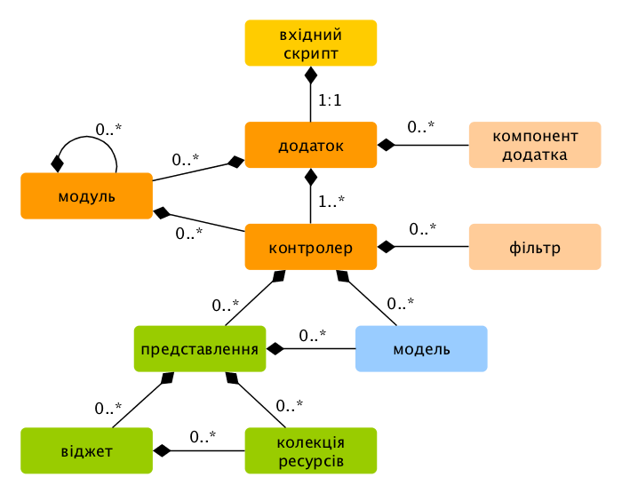

Огляд
=====

Додатки Yii організовані згідно архітектурного шаблону [Модель-Представлення-Контролер (MVC)](http://uk.wikipedia.org/wiki/Модель-вид-контролер).
[Моделі](structure-models.md) являють собою дані, бізнес-логіку та бізнес-правила; 
[представлення](structure-views.md) відповідають за відображення даних моделей;
[контролери](structure-controllers.md) приймають вхідні дані від користувача і перетворюють їх у команди для
[моделей](structure-models.md) та [представлень](structure-views.md).

Окрім MVC, Yii додаток також має наступні сутності:

* [вхідні скрипти](structure-entry-scripts.md): це PHP-скрипти, які доступні напряму кінцевому користувачу додатка.
  Вони відповідають за запуск циклу обробки запиту.
* [додатки](structure-applications.md): це глобально доступні об’єкти, які відповідають за коректну роботу різних 
  компонентів додатка і їх координацію для обробки запиту.
* [компоненти додатку](structure-application-components.md): це об’єкти, зареєстровані в додатку і які надають
  різноманітні можливості для обробки запитів.
* [модулі](structure-modules.md): це самодостатні пакунки, що включають в себе повністю всі ресурси для MVC.
  Додаток може бути організовано за допомогою декількох модулів.
* [фільтри](structure-filters.md): це код, який повинен бути виконаний до і після обробки запиту контролерами.
* [віджети](structure-widgets.md): це об’єкти, які можуть бути вбудованими у [представлення](structure-views.md).
  Вони можуть містити логіку контролера і можуть бути повторно використаними у різних представленнях.

На наступній діаграмі наведена структурна схема додатку:

