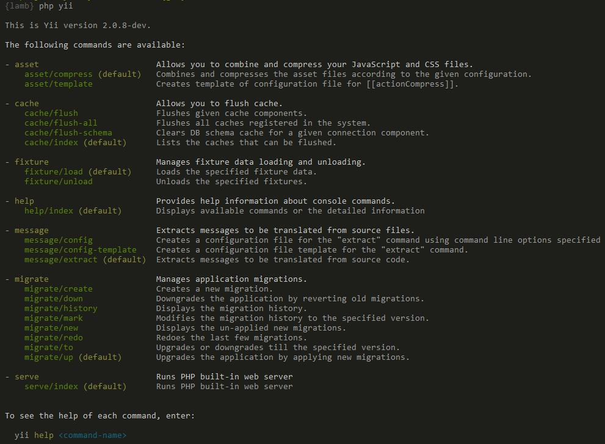

Консольні додатки
=================

Окрім багатьох можливостей для побудови веб-додатків, Yii також має повноцінну підтримку консольних додатків,
які в основному використовуються для реалізації фонових або супроводжувальних задач, які необхідно виконати для веб-сайту.

Структура консольного додатка дуже подібна до структури веб-додатка Yii. Він складається з одного
або декількох класів [[yii\console\Controller]], які у середовищі консолі часто називають "командами".
Кожний контролер може також мати одну або декілька дій, так само як і веб-контролери.

Обидва шаблони проекту вже мають консольний додаток у комплекті.
Ви можете запустити його, викликавши скрипт `yii`, який розміщений у базовій директорії додатка.
Це дасть вам перелік доступних команд, коли ви запускаєте його без будь-яких додаткових параметрів:



Як видно на знімку екрану, Yii має вже визначений набір команд, які є доступними "з коробки":

- [[yii\console\controllers\AssetController|AssetController]] - Дозволяє вам комбінувати та стискати ваші файли JavaScript і CSS.
  Ви можете дізнатись більше про цю команду у розділі [Ресурси](structure-assets.md#using-the-asset-command).
- [[yii\console\controllers\CacheController|CacheController]] - Дозволяє вам оновити кеш додатка.
- [[yii\console\controllers\FixtureController|FixtureController]] - Керує завантаженням та вивантаженням даних фікстур для цілей тестування.
  Ця команда описана більш детально у [розділі тестування про фікстури](test-fixtures.md#managing-fixtures).
- [[yii\console\controllers\HelpController|HelpController]] - Надає довідкову інформацію про консольні команди, ця команда використовується за замовчуванням
  та виводить те, що ви побачили у вищенаведеному виводі.
- [[yii\console\controllers\MessageController|MessageController]] - Здобуває повідомлення для перекладу з файлів коду.
  Щоб дізнатись більше про цю команду, будь ласка, зверніться до розділу [Інтернаціоналізація](tutorial-i18n.md#message-command).
- [[yii\console\controllers\MigrateController|MigrateController]] - Управляє міграціями додатка.
  Міграції баз даних описані більш детально у розділі про [міграції баз даних](db-migrations.md).


Використання <span id="usage"></span>
------------

Для виконання дії консольного контролера використовуйте наступний синтаксис:

```
yii <route> [--option1=value1 --option2=value2 ... argument1 argument2 ...]
```

У вищенаведеному прикладі, `<route>` означає маршрут до дії контролера. Опції будуть заповнювати
властивості класу, а аргументи є параметрами для методу дії.

Наприклад, дія [[yii\console\controllers\MigrateController::actionUp()|MigrateController::actionUp()]]
з властивістю [[yii\console\controllers\MigrateController::$migrationTable|MigrateController::$migrationTable]], що має значення `migrations`,
та обмеженням у 5 міграцій може бути викликана так:

```
yii migrate/up 5 --migrationTable=migrations
```

> Note: Коли використовуєте символ `*` в консолі, не забувайте замикати його в лапки, як `"*"`, для запобігання його інтерпретування як
> спецсимволу shell-оболонки, який заміщується іменами файлів поточної директорії.


Вхідний скрипт <span id="entry-script"></span>
--------------

Вхідний скрипт консольного додатку є еквівалентним до файлу початкового завантаження `index.php` для веб-додатків.
Консольний вхідний скрипт, як правило, називається `yii`, та розміщений у базовій директорії вашого додатку.
Він містить код подібний до наступного:

```php
#!/usr/bin/env php
<?php
/**
 * Yii console bootstrap file.
 */

defined('YII_DEBUG') or define('YII_DEBUG', true);

require __DIR__ . '/vendor/autoload.php';
require __DIR__ . '/vendor/yiisoft/yii2/Yii.php';

$config = require __DIR__ . '/config/console.php';

$application = new yii\console\Application($config);
$exitCode = $application->run();
exit($exitCode);
```

Цей скрипт буде створено як частину вашого додатку; ви можете вільно змінювати його для відповідності вашим потребам. Значення константи `YII_DEBUG` може бути встановлено у `false`,
якщо ви не хочете бачити стек трасування при помилці, і/або якщо ви хочете підвищити загальну швидкодію. І в базовому, і в розширеному шаблонах
проекту у вхідному скрипті консольного додатку за замовчуванням включено режим налагодження для забезпечення більш дружнього до розробника середовища.

Конфігурація <span id="configuration"></span>
------------

Як видно у вищенаведеному коді, консольний додаток використовує свій власний файл конфігурації з іменем `console.php`. У цьому файлі
ви можете налаштовувати різні [компоненти додатка](structure-application-components.md) та властивості для консольного додатка зокрема.

Якщо ваш веб-додаток та консольний додаток мають багато спільних параметрів конфігурації з однаковими значеннями, ви можете відокремити
спільні частини в окремий файл та включити цей файл до обох конфігурацій додатків (веб- та консольного).
Ви можете побачити приклад цього у "розширеному" шаблоні проекту.

> Tip: Іноді, існує необхідність виконувати консольну команду, використовуючи конфігурацію додатка, яка
відрізняється від заданої у вхідному скрипті. Наприклад, якщо ви хочете використати команду `yii migrate` для
оновлення ваших тестових баз даних, які налаштовані кожна в окремому наборі тестів. Для динамічної зміни
конфігурації просто вкажіть потрібний файл конфігурації додатка
за допомогою опції `appconfig`, коли виконуєте команду:
```bash
yii <route> --appconfig=path/to/config.php ...
```


Створення власних консольних команд <span id="create-command"></span>
-----------------------------------

### Консольні контролер та дія

Консольна команда визначена класом контролера успадкованого від [[yii\console\Controller]]. У класі контролера
визначаються одна або більше дій, які відповідають під-командам контролера. Всередині кожної дії міститься код, який реалізує відповідні завдання для окремої під-команди.

При виконанні команди необхідно вказати маршрут до дії контролера. Наприклад,
маршрут `migrate/create` викликає під-команду, яка відповідає методу дії
[[yii\console\controllers\MigrateController::actionCreate()|MigrateController::actionCreate()]].
Якщо маршрут, запропонований при виконанні, не містить ідентифікатора дії, то буде виконана стандартна дія (так само як у веб-контролері).

### Опції

Через перевизначення методу [[yii\console\Controller::options()]] ви можете визначити опції, які будуть доступними
для консольної команди (controller/actionID). Метод повинен повертати перелік публічних властивостей класу контролера.
При виконанні команди можна задати значення опції, використовуючи синтаксис `--OptionName=OptionValue`.
Це призначить значення `OptionValue` властивості `OptionName` класу контролера.

Якщо значення за замовчуванням для опції є масивом і ви задаєте цю опцію під час виконання команди,
то значення опції буде перетворене у масив розділенням вхідного текстового рядка за комами.

### Псевдоніми опцій

Починаючи із версії 2.0.8, консольна команда надає метод [[yii\console\Controller::optionAliases()]] 
для створення псевдонімів для опцій.

Щоб визначити псевдонім, потрібно перевизначити метод [[yii\console\Controller::optionAliases()]]
у вашому контролері, наприклад:

```php
namespace app\commands;

use yii\console\Controller;

class HelloController extends Controller
{
    public $message;
    
    public function options($actionID)
    {
        return ['message'];
    }
    
    public function optionAliases()
    {
        return ['m' => 'message'];
    }
    
    public function actionIndex()
    {
        echo $message . "\n";
    }
}
```

Тепер ви зможете використовувати наступний синтакс для запуску команди:

```
./yii hello -m=hola
```

### Аргументи

Окрім опцій, команда також може приймати аргументи. Аргументи будуть передані як параметри до методу дії
відповідно до запитуваної під-команди. Перший аргумент відповідає першому параметру, другий
відповідає другому і т. д. Якщо при виклику команди надано не достатньо аргументів, то відповідним параметрам
будуть призначені типові значення, якщо попередньо визначені. Якщо типове значення не визначено і не передано значення під час виконання, то команда буде завершена з помилкою.

Ви можете використовувати вказівку типу `array` для позначення аргументу, з яким потрібно обходитись як з масивом.
Масив буде згенерований розділенням вхідного текстового рядку за комами.

Наступний приклад показує як оголошувати аргументи:

```php
class ExampleController extends \yii\console\Controller
{
    // Команда "yii example/create test" викличе "actionCreate('test')"
    public function actionCreate($name) { ... }

    // Команда "yii example/index city" викличе "actionIndex('city', 'name')"
    // Команда "yii example/index city id" викличе "actionIndex('city', 'id')"
    public function actionIndex($category, $order = 'name') { ... }

    // Команда "yii example/add test" викличе "actionAdd(['test'])"
    // Команда "yii example/add test1,test2" викличе "actionAdd(['test1', 'test2'])"
    public function actionAdd(array $name) { ... }
}
```


### Код виходу

Використання кодів виходу є найкращою практикою для розробки консольного додатку. Прийнято, якщо команда повертає `0`, це означає, що
все добре. Якщо команда повертає число більше за нуль, це вважається показником помилки. Повернуте число буде кодом
помилки, яке потенційно може використовуватись для пошуку деталей про помилку.
Наприклад, число `1`, як правило, може означати невідому помилку, а усі коди вище можуть бути зарезервовані для специфічних випадків: помилки вводу, відсутні файли і так далі.

Для того, щоб ваша консольна команда повертала код виходу, просто поверніть ціле число з методу дії
контролера:

```php
public function actionIndex()
{
    if (/* деяка проблема */) {
        echo "A problem occurred!\n";
        return 1;
    }
    // щось виконується
    return 0;
}
```

Є декілька попередньо визначених констант, які ви можете використовувати:

- `Controller::EXIT_CODE_NORMAL` зі значенням `0`;
- `Controller::EXIT_CODE_ERROR` зі значенням `1`.

Хорошою практикою є визначення значущих констант для вашого контролера у випадку, якщо ви маєте більше типів помилок.

### Форматування та кольори

Консоль Yii підтримує форматований вивід, який автоматично стане не форматованим, якщо він не підтримується
терміналом, в якому виконується команда.

Виводити форматовані текстові рядки просто. Ось як вивести деякий жирний текст:

```php
$this->stdout("Hello?\n", Console::BOLD);
```

Якщо необхідно побудувати текстовий рядок, динамічно комбінуючи декілька стилів, то найкраще використовувати `ansiFormat`:

```php
$name = $this->ansiFormat('Alex', Console::FG_YELLOW);
echo "Hello, my name is $name.";
```
