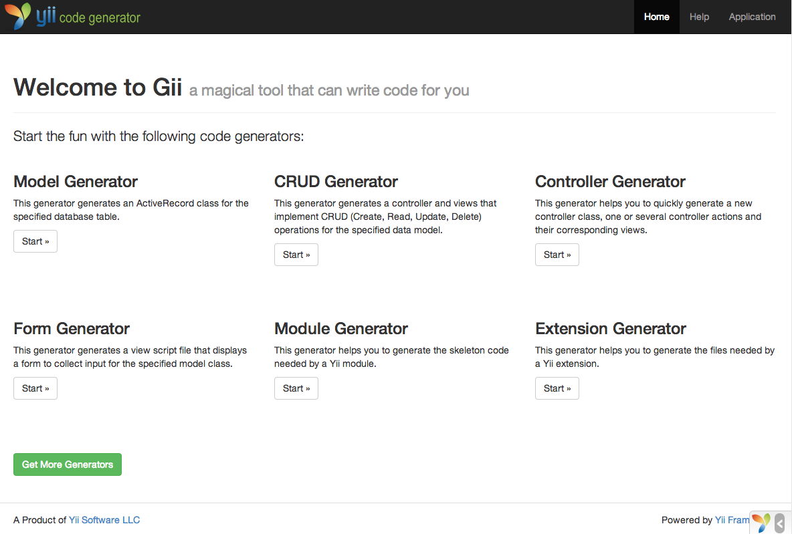
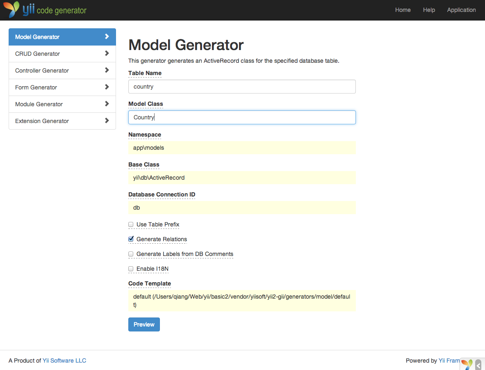
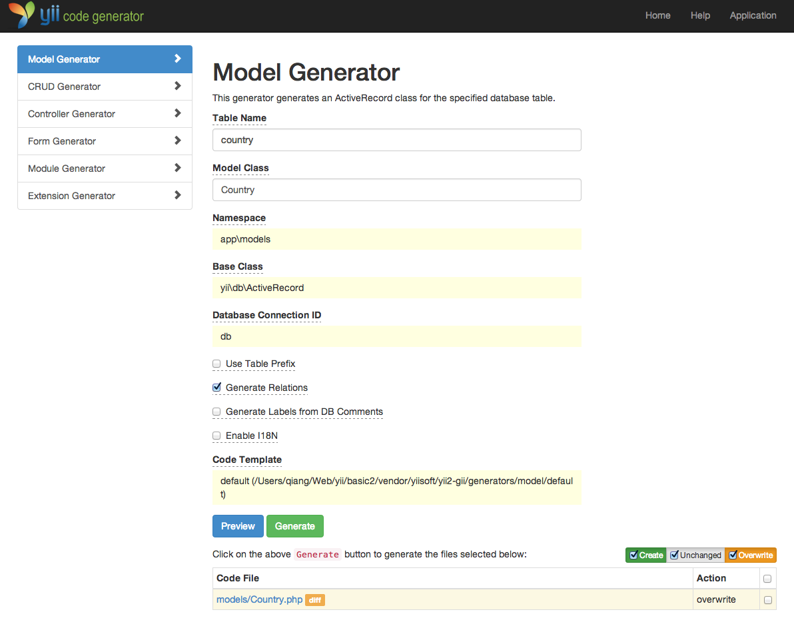
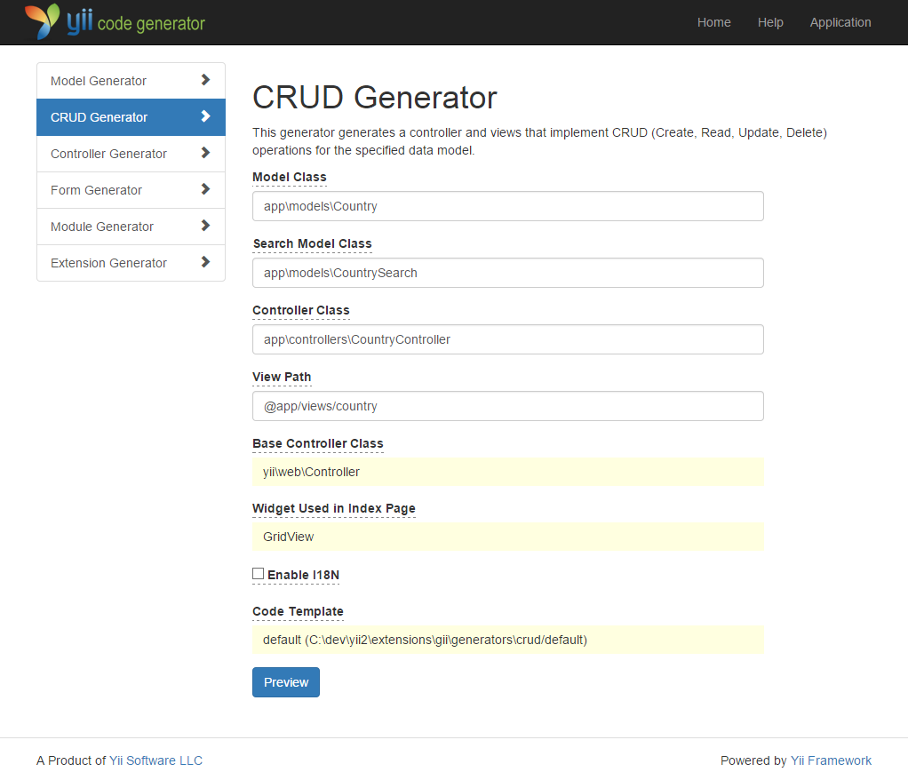
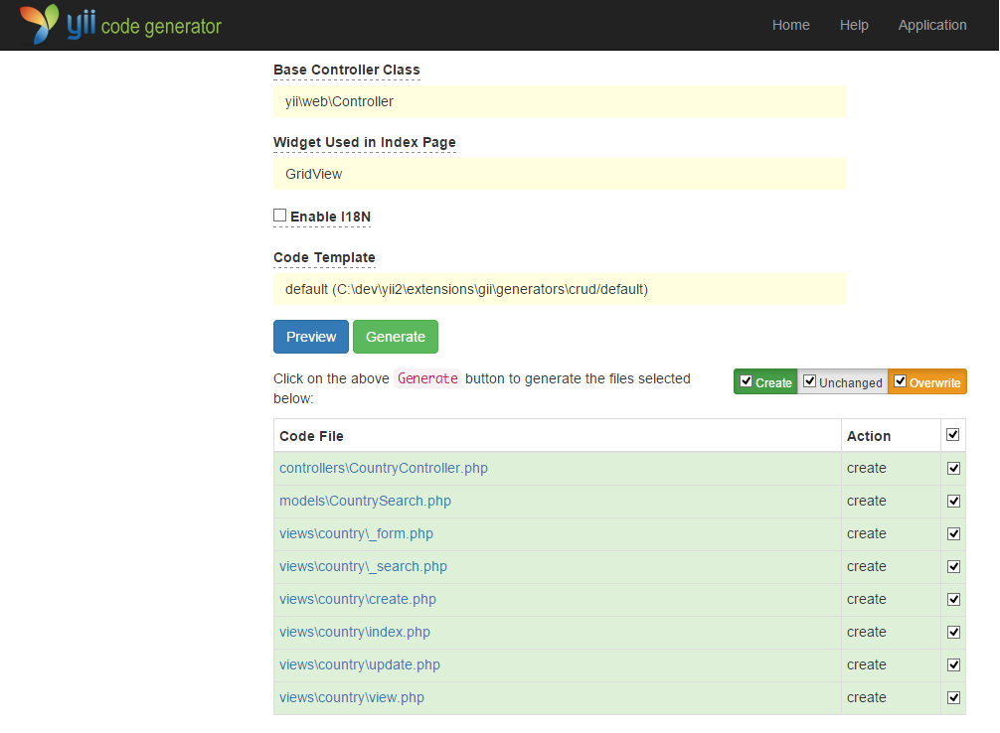
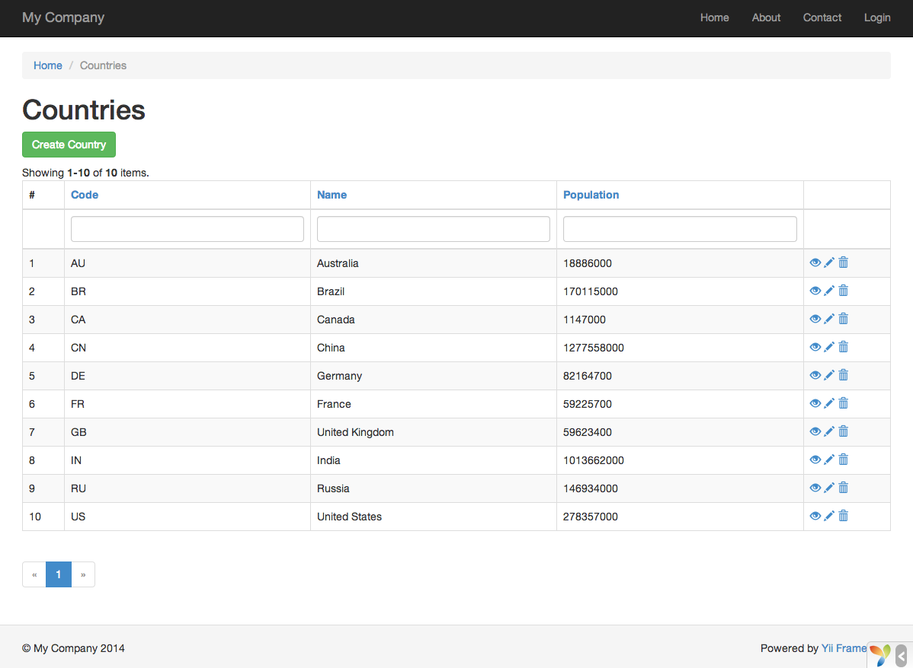
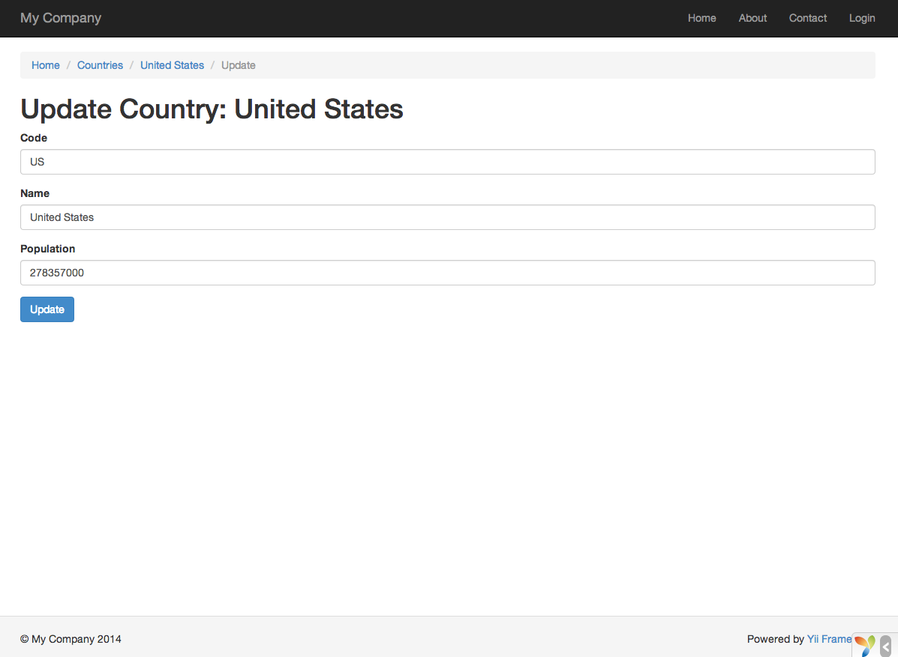

Gii yordamida kodlarni generatsiya qilish
=========================================

Ushbu bo'limda veb-saytlarning ayrim keng tarqalgan imkoniyatlarini amalga oshiruvchi kodni avtomatik generatsiya qilish
uchun [Gii](https://www.yiiframework.com/extension/yiisoft/yii2-gii/doc/guide)dan qanday foydalanish tasvirlanadi.
Gii yordamida kodni avtomatik generatsiya qilish shunchaki Gii veb-sahifalarida ko'rsatilgan yo'riqnomalarga muvofiq
to'g'ri ma'lumotlarni kiritishdan iborat.

Ushbu qo'llanma davomida siz quyidagilarni qanday bajarishni o'rganasiz:

* ilovangizda Gii ni yoqish,
* Gii yordamida Active Record klassini generatsiya qilish,
* Gii yordamida ma'lumotlar ombori jadvali uchun CRUD amallarini amalga oshiruvchi kodni generatsiya qilish,
* Gii tomonidan generatsiya qilingan kodni moslashtirish.


Gii ni ishga tushirish <span id="starting-gii"></span>
----------------------

[Gii](https://www.yiiframework.com/extension/yiisoft/yii2-gii/doc/guide) Yii tarkibida [modul](structure-modules.md)
sifatida taqdim etiladi. Gii ni ilovaning [[yii\base\Application::modules|modules]] xossasida sozlash orqali yoqishingiz
mumkin. Ilovani qanday yaratganingizga qarab, quyidagi kod `config/web.php` sozlamalar faylida allaqachon mavjud
bo'lishi mumkin:

```php
$config = [ ... ];

if (YII_ENV_DEV) {
    $config['bootstrap'][] = 'gii';
    $config['modules']['gii'] = [
        'class' => 'yii\gii\Module',
    ];
}
```

Yuqoridagi sozlamaga ko'ra, [ishlab chiqish muhitida](concept-configurations.md#environment-constants) ilova `gii`
nomli modulni o'z ichiga olishi kerak, bu modul [[yii\gii\Module]] klassiga mansub.

Ilovangizning `web/index.php` [kirish skriptini](structure-entry-scripts.md) tekshirsangiz, quyidagi qatorni topasiz,
u aslida `YII_ENV_DEV` ni `true` ga tenglashtiradi.

```php
defined('YII_ENV') or define('YII_ENV', 'dev');
```

Shu qator tufayli ilovangiz ishlab chiqish rejimida bo'ladi va yuqoridagi sozlamaga ko'ra Gii allaqachon yoqilgan
bo'ladi. Endi Gii ga quyidagi URL orqali kirishingiz mumkin:

```
https://hostname/index.php?r=gii
```

> Note: Agar Gii ga localhost dan boshqa kompyuterdan kirayotgan bo'lsangiz, xavfsizlik maqsadida kirish sukut bo'yicha
> rad etiladi. Ruxsat etilgan IP-manzillarni qo'shish uchun Gii ni quyidagicha sozlashingiz mumkin:
>
```php
'gii' => [
    'class' => 'yii\gii\Module',
    'allowedIPs' => ['127.0.0.1', '::1', '192.168.0.*', '192.168.178.20'] // ehtiyojlaringizga moslashtiring
],
```




Active Record klassini generatsiya qilish <span id="generating-ar"></span>
-----------------------------------------

Gii yordamida Active Record klassini generatsiya qilish uchun "Model Generator"ni tanlang (Gii bosh sahifasidagi
havolani bosing). Keyin formani quyidagicha to'ldiring:

* Table Name: `country`
* Model Class: `Country`



Keyin "Preview" tugmasini bosing. Natijada yaratiladigan klass fayllari ro'yxatida `models/Country.php` ko'rsatilganini
ko'rasiz. Uning tarkibini ko'rib chiqish uchun klass fayli nomini bosishingiz mumkin.

Gii dan foydalanishda, agar xuddi shunday fayl allaqachon yaratilgan bo'lsa va uning ustiga yozmoqchi bo'lsangiz,
generatsiya qilinadigan kod bilan mavjud versiya o'rtasidagi farqlarni ko'rish uchun fayl nomi yonidagi `diff` tugmasini
bosing.



Mavjud fayl ustiga yozayotganda "overwrite" yonidagi katakchani belgilang va keyin "Generate" tugmasini bosing.
Yangi fayl yaratayotgan bo'lsangiz, shunchaki "Generate"ni bosishingiz mumkin.

Shundan so'ng kod muvaffaqiyatli generatsiya qilinganini bildiruvchi tasdiqlash sahifasini ko'rasiz. Agar mavjud fayl
bo'lgan bo'lsa, uning yangi generatsiya qilingan kod bilan ustiga yozilgani haqidagi xabarni ham ko'rasiz.


CRUD kodini generatsiya qilish <span id="generating-crud"></span>
------------------------------

CRUD — bu Create, Read, Update va Delete so'zlarining qisqartmasi bo'lib, ko'pchilik veb-saytlarda ma'lumotlar bilan
bajariladigan to'rtta keng tarqalgan vazifani ifodalaydi. Gii yordamida CRUD funksionalligini yaratish uchun
"CRUD Generator"ni tanlang (Gii bosh sahifasidagi havolani bosing). "country" misoli uchun hosil bo'lgan formani
quyidagicha to'ldiring:

* Model Class: `app\models\Country`
* Search Model Class: `app\models\CountrySearch`
* Controller Class: `app\controllers\CountryController`



Keyin "Preview" tugmasini bosing. Quyida ko'rsatilganidek, generatsiya qilinadigan fayllar ro'yxatini ko'rasiz.



Agar avval `controllers/CountryController.php` va `views/country/index.php` fayllarini (qo'llanmaning ma'lumotlar
ombori bo'limida) yaratgan bo'lsangiz, ularni almashtirish uchun "overwrite" katakchasini belgilang. (Avvalgi versiyalar
to'liq CRUD qo'llab-quvvatlashiga ega emas edi.)


Keling, sinab ko'raylik <span id="trying-it-out"></span>
-----------------------

U qanday ishlashini ko'rish uchun brauzeringizda quyidagi URL ga o'ting:

```
https://hostname/index.php?r=country%2Findex
```

Siz ma'lumotlar ombori jadvalidagi davlatlarni ko'rsatuvchi ma'lumotlar to'rini ko'rasiz. To'rni saralashingiz yoki
ustun sarlavhalariga filtr shartlarini kiritib, uni filtrlashingiz mumkin.

To'rda ko'rsatilgan har bir davlat uchun uning batafsil ma'lumotlarini ko'rish, uni yangilash yoki o'chirishni
tanlashingiz mumkin. Shuningdek, yangi davlat yaratish formasini ochish uchun to'rning yuqorisidagi "Create Country"
tugmasini bosishingiz mumkin.





Quyida, agar bu imkoniyatlar qanday amalga oshirilganini o'rganmoqchi bo'lsangiz yoki ularni moslashtirmoqchi
bo'lsangiz, Gii tomonidan generatsiya qilingan fayllar ro'yxati keltirilgan:

* Kontrollyor: `controllers/CountryController.php`
* Modellar: `models/Country.php` va `models/CountrySearch.php`
* Ko'rinishlar: `views/country/*.php`

> Info: Gii yuqori darajada moslashtiriladigan va kengaytiriladigan kod generatsiya qilish vositasi sifatida
> ishlab chiqilgan. Undan oqilona foydalanish ilovangizni ishlab chiqish tezligini sezilarli darajada oshirishi mumkin.
> Batafsil ma'lumot uchun [Gii](https://www.yiiframework.com/extension/yiisoft/yii2-gii/doc/guide) bo'limiga qarang.


Xulosa <span id="summary"></span>
------

Ushbu bo'limda siz ma'lumotlar ombori jadvalida saqlanadigan kontent uchun to'liq CRUD funksionalligini amalga
oshiruvchi kodni Gii yordamida qanday generatsiya qilishni o'rgandingiz.
