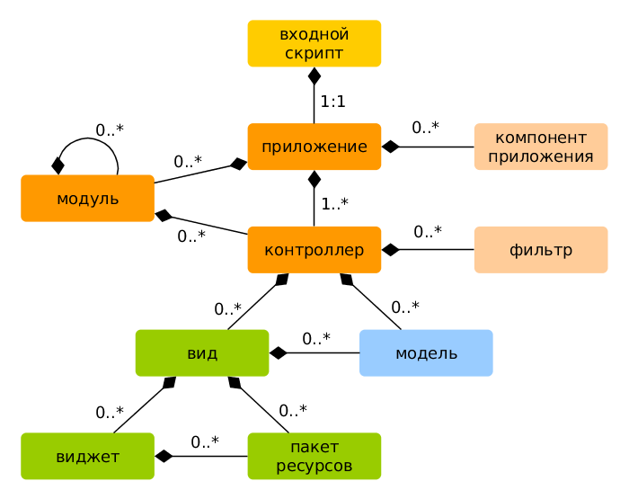
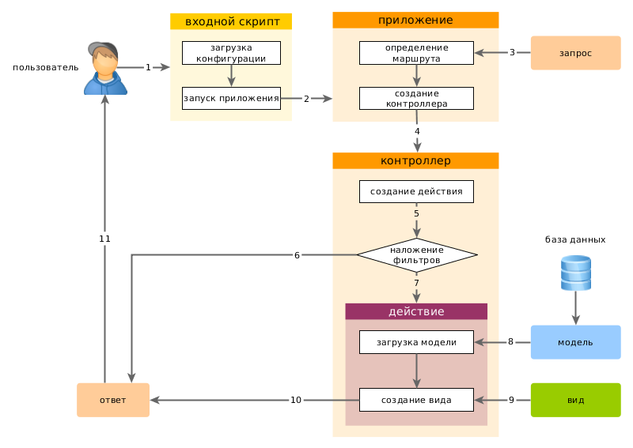

Ilovani ishga tushirish
====================

`https://hostname/basic/web/index.php` o'rnatganingizdan so'ng, asosiy dastur `https://hostname/basic/web/index.php` URL manzilida yoki `https://hostname/index.php` orqali Veb-server sozlamalariga qarab mavjud bo'ladi. Ushbu bo'lim - kodni tashkil qilishning umumiy ta'rifi, o'rnatilgan funksionallik va murojaatlar bilan ishlash. 

> Info: Ushbu qo'llanmada Yii `basic/web` katalogiga o'rnatilganini inobatga oladi va u o'z navbatida veb-server sozlamalaridagi ildiz katalogi sifatida o'rnatiladi. Natijada `https://hostname/index.php` URL manziliga kirish orqali `basic/web` joylashgan ilovaga kirishingiz mumkin. Boshlang'ich konfiguratsiya jarayonida batafsil ma'lumotni [Yii-ni o'rnatish bo'limida](start-installation.md) topishingiz mumkin.

Freymvorkdan farqli o'laroq, dastur o'rnatilgandan so'ng, u sizniki bolib qoladi. Siz o`zingizni kodingizni o'zingiz xohlagan tarzda o'zgartirishingiz mumkin. 

Funksionallik <span id="functionality"></span>
---------------

Oddiy dastur uchun o'rnatilgan shablon to'rtta sahifadan iborat:

* `https://hostname/index.php` URL manziliga `https://hostname/index.php` ko'rsatiladigan asosiy sahifa 
* "About" ("Biz haqimizda") sahifasi
* "Kontakt" sahifasida qayta aloqa shakli joylashgan ushbu shakl orqali u dasturchiga murojaat qilishi mumkin 
* "Kirish" sahifasida avtorizatsiya shakl ko'rsatiladi. Foydalanuvchi nomi / parol bilan "login / admin" bilan tizimga kirishingiz mumkin. Asosiy menyu "Login" menyusi "Logout" menyusiga o`zgarishiga etibor bering. 

Ushbu sahifalar Sayt ustuni va Sayt pastini ishlatadi. "Header" da foydalanuvchining sayt orqali o'tadigan asosiy menyusi. "Saytning pastki qismida" da - mualliflik huquqi va umumiy ma'lumot joylashgan.

Oynaning eng quyi qismida tizim xabarlarini Yii - log, disk raskadrovka ma'lumotlarini, xato xabarlarini, ma'lumotlar bazasi so'rovlarini va boshqalarni ko'rasiz. Ushbu ma'lumotlarning chiqishi [ichki xotira nazoratchisi](https://github.com/yiisoft/yii2-debug/blob/master/docs/guide/README.md) tomonidan nazorat qilinadi, u dasturni bajarish jarayoni haqidagi ma'lumotni qayd qiladi va ko'rsatadi. 

Veb-ilovaga qo'shimcha ravishda, ilovaning asosiy katalogida joylashgan `yii` deb nomlangan konsoli script mavjud. Ushbu skript fon vazifalarni bajarish va dasturni saqlash uchun ishlatilishi mumkin. Bularning barchasi [Konsol buyruqlari](tutorial-console.md) bo'limida yozib o`tilgan.

Yii web-ilovasi tuzilmasi <span id="application-structure"></span>
---------------------

Quyidagida veb-ilovaning tuzilmasi asosiy kataloglari va fayllari ro'yxati berilgan (ilovaning `basic` katalogga o'rnatilgan deb hisoblaymiz): 

```
basic/                  ilovaning ildiz katalogi
    composer.json       Composer ishlatadigan fayl
    config/             Sozlamalar (konfiguratsion) fayl
        console.php     Konsol ilovasining sozlamalari
        web.php         Veb-ilovasining sozlamalari
    commands/           konsol ilovalarining klasslari joylashgan
    controllers/        nazoratchilar
    models/             modellar
    runtime/            Ish jarayonida yii yasaydigan fayllar loglar va boshqa fayllar
    vendor/             Composer paketlarini tashkil qilib Yii ni o`z ichiga oladi
    views/              Web-ilovaning ko`rinish faylari
    web/                Web-ilovaning ildiz katalogi,Veb-dan olish mumkin bo`lgan faylarni tashkil etadi.
        assets/         Ilova orqali ishlatiladigan scriptlar (js, css)
        index.php       Yii ga kirish joyi. Yii ishlashni boshlaydi
    yii                 Konsol buyruqlarini ishlatadigan Yii scripti
```

Umuman olganda, Yii ilovasini ikki `basic/web` faylga bo'lish mumkin: `basic/web` joylashgan faylar va boshqa kataloglarda joylashgan faylar. Birinchisi `(basic/web)` internet orqali kirganda ochilishi kerak, ikkinchisi internet orqali ko'rinishi kerak bo'lmagan faylar, chunki ular ish faylari.

Yii-da [MVC-arxetekturasi](https://ru.wikipedia.org/wiki/Model-View-Controller) asosida faylar va kataloglar joylashgan. [models](structure-models.md)katalogida Modellar mavjud , [Ko'rishlar](structure-views.md) ko'rinishlarda joylashgan va barcha dastur [Nazoratchilar](structure-controllers.md) katalogida. 
 
Quyidagi diagrammada dasturning ichki tuzilmasi ko'rsatilgan. 



Har bir dasturda Yii [ilovaga](structure-applications.md) kirish nuqtasi bor, web/index.php - web/index.php ishlash uchun mavjud bo'lgan yagona PHP skriptidir. Kiruvchi so'rovni qabul qiladi va [ilovani bittasini](structure-applications.md) yaratadi. [Ilova komponentlardan](concept-components.md) foydalangan holda qabul qilingan so'rovlarni bajaradi va controllerlarga so'rov yuboradi. [Vidjetlar](structure-views.md) ko'rinishda dinamik sayt interfeyslarini yaratish uchun ishlatiladi.

Foydalanuvchi so'rovining ishlash tartibi <span id="request-lifecycle"></span>
-----------------

Diagrammada dasturning so'rovni qanday qabul qilib ishlashini ko'rsatadi. 



1. Foydalanuvchi web-ilovaning  [kirish nuqtasiga](structure-entry-scripts.md) `web/index.php` ga murojat qilmoqda.
2. Dastur [sozlamalarni](concept-configurations.md) yuklamoqda  va so'rovni qabul qilish uchun [web-ilovadan](structure-applications.md) nusxa yaratmoqda.
3. Dastur [yo'nalishni](runtime-routing.md) aniqlashtirib [so'rovni](runtime-requests.md) qabul qilishni boshlaydi.
4. Dastur ilova nusxasini yaratmoqda so'rovni qabul qilish uchun [nazortchi](structure-controllers.md) chaqirilmoqda.
5. Nazoratchi esa o`z novbatida [amalni](structure-controllers.md) yaratadi va unga filtrlarni ishlatadi.
6. Filtrdan birortasi ham ishtan chiqsa amalgacha so'rov bormaydi.
7. Agar hamma filterlar javob qaytarsa so'rov amalga borib javob qaytaradi.
8. Amal model ma'lumotlarini yuklaydi. Ma'lumotlar omborini ishlatishi ham mumin.
9. Amal ko'rinish ma'lumotlarini chiqarib beradi (shuningdek modeldan ham).
10. Shakilangan ma'lumot esa ilovaga [javob](runtime-responses.md) komponentni tariqasida qaytariladi.
11. "javob" komponentni esa foydalanuvchi browseriga javob qaytaradi.

