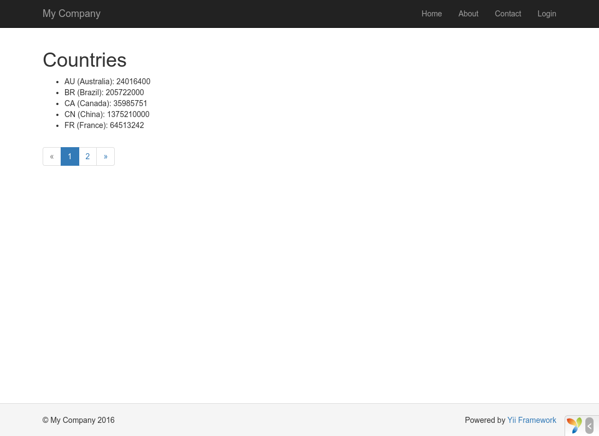

Làm việc với CSDL
======================

Phần này sẽ hướng dẫn làm thế nào để tạo mới trang có chức năng hiển thị dữ liệu các thành phố (country) và được lấy
từ bảng `country` nằm trong cơ sở dữ liệu. Để thực hành tốt bài hướng dẫn, bạn cần cấu hình các kết nối tới CSDL,
tạo class [Active Record](db-active-record.md), taọ một [action](structure-controllers.md),
và tạo mới [view](structure-views.md).

Tóm tắt những nội dung chính:

* Cấu hình kết nối tới CSDL
* Đinh nghĩa lớp Active Record
* Sử dụng lớp Active Record để truy vấn dữ liệu
* Hiển thị và phân trang dữ liệu trên view

Lưu ý để thực hiện được bài hướng dẫn này, bạn cần có kiến thức về CSDL.
Riêng ở phần này, bạn cần có kiến thức về tạo mới CSDL, và làm thế nào để thực thi các câu lệnh SQL sử dụng công cụ ở phía client.


Chuẩn bị <span id="preparing-database"></span>
----------------------

Đầu tiên, bạn cần tạo mới CSDL tên là `yii2basic`, từ bây giờ bạn sẽ dùng CSDL này để lấy dữ liệu.
Yii hỗ trợ nhiều CSDL trong ứng dụng, bạn có thể dùng những CSDL như SQLite, MySQL, PostgreSQL, MSSQL hoặc Oracle. Để cho đơn giản, 
MySQL sẽ được dùng trong bài hướng dẫn này.

Tiếp đến, tạo mới bảng vào CSDL tên là `country` , đồng thời chèn thêm dữ liệu. You may run the following SQL statements to do so:

```sql
CREATE TABLE `country` (
  `code` CHAR(2) NOT NULL PRIMARY KEY,
  `name` CHAR(52) NOT NULL,
  `population` INT(11) NOT NULL DEFAULT '0'
) ENGINE=InnoDB DEFAULT CHARSET=utf8;

INSERT INTO `country` VALUES ('AU','Australia',24016400);
INSERT INTO `country` VALUES ('BR','Brazil',205722000);
INSERT INTO `country` VALUES ('CA','Canada',35985751);
INSERT INTO `country` VALUES ('CN','China',1375210000);
INSERT INTO `country` VALUES ('DE','Germany',81459000);
INSERT INTO `country` VALUES ('FR','France',64513242);
INSERT INTO `country` VALUES ('GB','United Kingdom',65097000);
INSERT INTO `country` VALUES ('IN','India',1285400000);
INSERT INTO `country` VALUES ('RU','Russia',146519759);
INSERT INTO `country` VALUES ('US','United States',322976000);
```

Đến đây, bạn có CSDL là `yii2basic`, có chứa bảng `country` có 3 cột và 10 trường dữ liệu.

Cấu hình kết nối tới CSDL <span id="configuring-db-connection"></span>
---------------------------

Trước tiên, hãy chắc chắn rằng bạn đã cài 2 gói PHP [PDO](http://www.php.net/manual/en/book.pdo.php) và
PDO driver dành cho các CSDL mà đang sử dụng(ví dụ `pdo_mysql` cho MySQL). Đối với các CSDL quan hệ thì những gói này 
cần phải có.

Sau khi những yêu cầu trên được cài đặt, mở file `config/db.php` và thay đổi các tham số chính xác tới CSDL. Mặc định,
file sẽ có những đoạn code sau:

```php
<?php

return [
    'class' => 'yii\db\Connection',
    'dsn' => 'mysql:host=localhost;dbname=yii2basic',
    'username' => 'root',
    'password' => '',
    'charset' => 'utf8',
];
```

File `config/db.php` là file điển hình dành cho cấu hình ứng dụng [configuration](concept-configurations.md). Các tham số được mô tả trong file
cần thiết để tạo mới và khởi tạo các thể hiện [[yii\db\Connection]] và thực hiện các câu lệnh truy vấn

Các thông tin cấu hình về CSDL ở trên được truy cập qua ứng dụng qua câu lệnh `Yii::$app->db`.

> Lưu ý: File `config/db.php` sẽ chứa các thông tin chính trong việc cấu hình ứng dụng `config/web.php`, 
  Những thông tin làm thế nào để [ứng dụng](structure-applications.md) cần được khởi tạo.
  Bạn có thể tham khảo thêm trong phần [cấu hình ứng dụng](concept-configurations.md) .


Tạo mới class Active Record <span id="creating-active-record"></span>
-------------------------

Để thể hiện và thao tác với bảng dữ liệu `country`, ta tạo mới class[Active Record](db-active-record.md)-
tên là `Country`, và lưu vào file `models/Country.php`.

```php
<?php

namespace app\models;

use yii\db\ActiveRecord;

class Country extends ActiveRecord
{
}
```

Lớp `Country` được kế thừa từ [[yii\db\ActiveRecord]]. Bạn không cần viết bất kỳ đoạn mã nào vào phần này! Chỉ với đoạn mã trên, 
Yii sẽ biết được tên bảng từ tên của lớp tương ứng. 

> Info: Nếu tên lớp không trùng với tên trong bảng dữ liệu, bạn có thể
ghi đè phương thức [[yii\db\ActiveRecord::tableName()]] để miêu tả rõ ràng về tên bảng dữ liệu.

Dùng lớp `Country`, bạn sẽ dễ dàng hơn trong việc thao tác với bảng `country`, ví dụ:

```php
use app\models\Country;

// lấy danh sách tử bảng country và sắp xếp theo thuộc tính "name"
$countries = Country::find()->orderBy('name')->all();

// lấy dữ liệu có khóa là "US"
$country = Country::findOne('US');

// in kết quả "United States"
echo $country->name;

// thay đổi tên country thành "U.S.A." và lưu vào csdl
$country->name = 'U.S.A.';
$country->save();
```

> Lưu ý: Active Record khá là mạnh cho việc truy cập csdl theo hướng lập trình hướng đối tượng.
Bạn có thể xem thêm ở mục [Active Record](db-active-record.md). Cách khác, bạn có thể thao tác với csdl ở mức độ đơn giản hơn bằng việc truy cập qua đối tượng [Data Access Objects](db-dao.md).


Tạo hành động (action) <span id="creating-action"></span>
------------------

Để hiển thị dữ liệu country tới người dùng, bạn cần tạo mới hành động. Thay vì đặt các hành động ở `site`
controller, giống như đã làm ở phần trước, thì tạo controller mới có ý nghĩa hơn
đặc biệt liên quan tới dữ liệu về coutry. Tên controller là `CountryController`, và tạo mới
hành động `index` ở trong đó, bạn có thể tham khảo ở phần dưới.

```php
<?php

namespace app\controllers;

use yii\web\Controller;
use yii\data\Pagination;
use app\models\Country;

class CountryController extends Controller
{
    public function actionIndex()
    {
        $query = Country::find();

        $pagination = new Pagination([
            'defaultPageSize' => 5,
            'totalCount' => $query->count(),
        ]);

        $countries = $query->orderBy('name')
            ->offset($pagination->offset)
            ->limit($pagination->limit)
            ->all();

        return $this->render('index', [
            'countries' => $countries,
            'pagination' => $pagination,
        ]);
    }
}
```

Lưu nội dung đoạn mã trên vào file `controllers/CountryController.php`.

Hành động `index` sẽ gọi các phương thức `Country::find()`. Đây là phương thức nằm ở Active Record nhằm xây dựng câu lệnh truy vấn và lấy tất cả dữ liệu trong bảng `country`.
Để hạn chế số lượng dữ liệu mỗi khi gửi yêu cầu, đối tượng [[yii\data\Pagination]] sẽ phân trang dữ liệu.
 Mục đích khi dùng đối tượng `Pagination` là:

* Thiết lập điều kiện `offset` và `limit` cho câu lệnh mỗi khi  lấy liệu ra (mỗi lần chỉ hiển thị 5 kết quả).
* Dữ liệu được nhúng vào view để hiển thị số trang và bao gồm danh sách các button, sẽ được giải thích ở phần sau.

Xem những dòng cuối, hành động `index` sẽ đổ ra view có tên là `index`, đồng thời gửi dữ liệu về country và thông tin về phân trang.


Tạo View <span id="creating-view"></span>
---------------

Trong thư mục `views`, bước một tạo thư mục con là `country`. Thư mực này được dùng để giữ những view được đổ ra
từ controller `country`. Trong thư mục `views/country`, tạo mới file tên là `index.php`
và chứa đoạn mã sau:

```php
<?php
use yii\helpers\Html;
use yii\widgets\LinkPager;
?>
<h1>Countries</h1>
<ul>
<?php foreach ($countries as $country): ?>
    <li>
        <?= Html::encode("{$country->name} ({$country->code})") ?>:
        <?= $country->population ?>
    </li>
<?php endforeach; ?>
</ul>

<?= LinkPager::widget(['pagination' => $pagination]) ?>
```

View trên có 2 phần liên quan tới hiển thị dữ liệu về country. Phần đầu tiên, cung cấp danh sách country và in ra dưới dạng danh sách .
Phần tiếp, một widget [[yii\widgets\LinkPager]] được sinh ra và dùng các thông tin truyển từ action xuống để phân trang.
Đối tượng  `LinkPager` là một widget có chức năng hiển thị danh sách các button. Mỗi khi click vào mỗi button này sẻ cập nhật lại dữ liệu country
ở mỗi trang tương ứng.


Xem demo <span id="trying-it-out"></span>
-------------

Truy cập vào Url sau và xem kết quả:

```
http://hostname/index.php?r=country/index
```



Hãy xem, bạn sẽ thấy một trang hiển thị 4 country. Phần dưới danh sách các country, bạn sẽ thấy các nút phân trang.
Nếu bạn click vào button "2", bạn sẽ thấy 5 country khác trong CSDL: trang thứ 2 trong CSDL country.
Bạn để ý rằng URL trong trình duyệt cũng thay đổi.

```
http://hostname/index.php?r=country/index&page=2
```

Trong luồng xử lý này, đối tượng [[yii\data\Pagination|Pagination]] sẽ cung cấp tất cả những hàm cần thiết cho việc phân trang:

* Khởi tạo, đối tượng [[yii\data\Pagination|Pagination]] hiển thị ở trang đầu tiên , điều này được thực hiện câu lệnh truy vấn SELECT từ country
  với mệnh đề `LIMIT 5 OFFSET 0`. Như kết quả trên, 5 country đầu tiên sẽ lấy ra và hiển thị.
* Widget [[yii\widgets\LinkPager|LinkPager]] sẽ tạo các buttons cùng với các URL( liên kết)
  được tạo bởi phương thức [[yii\data\Pagination::createUrl()|Pagination]]. Các URL sẽ chứa tham số `page`, page sẽtương ứng với số trang khác nhau trong CSDL country.
* Nếu bạn click vào button "2",  route `country/index` được gọi và đồng thời route sẽ được gắn và giữ.
  Đối tượng [[yii\data\Pagination|Pagination]] đọc số trang từ tham số `page` từ Url và thiết lập trang trang hiện tại là 2.
  Việc truy vấn dữ liệu country tương tự như mệnh đề `LIMIT 5 OFFSET 5` và trả về tiếp 5 country để hiển thị


Tổng kết <span id="summary"></span>
-------

Bài hướng dẫn này, giúp bạn tìm hiểu và làm việc với CSDL. Bạn cũng được tìm hiều đối tượng [[yii\data\Pagination]] và [[yii\widgets\LinkPager]]. giúp cho việc
lấy và hiển thì dữ liệu trên trang. 

Trong phần tới, bạn sẽ được tìm hiểu về công cụ generate code khá mạnh, được gọi là [Gii](tool-gii.md),
giúp bạn nhanh chóng thực hiện một số tính năng tương tự, những hoạt động thao tác với các bảng trong CSDL như Tạo-Xem-Cập nhật-Xóa (CRUD)
. Trong thực tế, những mã nguồn được viết có thể tự động generate trong Yii sử dụng công cụ Gii.
