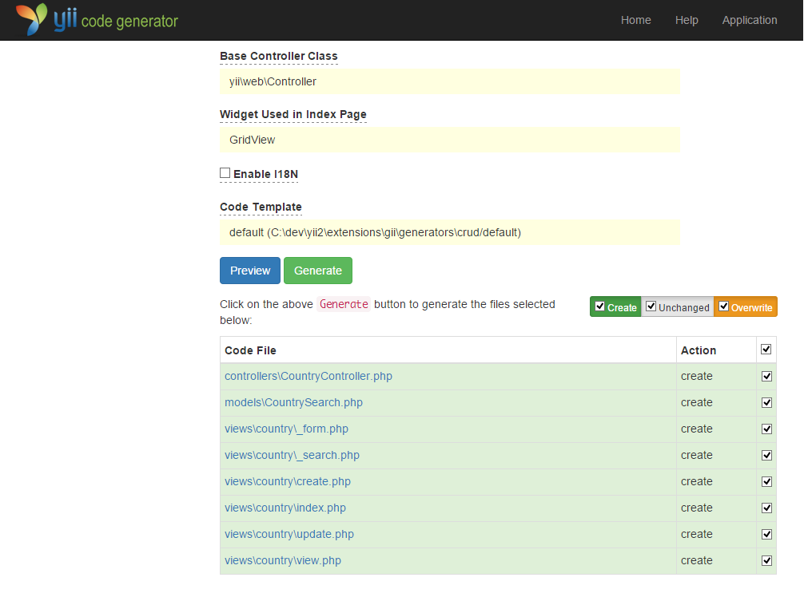

Sử dụng Gii để sinh code
========================

Trong phần này sẽ hướng dẫn sử dụng [Gii](tool-gii.md) để tự động sinh code, những mã nguồn tương tự với Web site
. Sử dụng Gii để tự động tạo mã nguồn thật đơn giản, bạn chỉ việc nhập thông tin đúng theo các hướng dẫn hiển thị trên các trang Web Gii và mã 
nguỗn sẽ được sinh tự động.

Nội dung chính trong phần này:

* Nhúng Gii vào ứng dụng
* Dùng Gii để sinh Active Record
* Dùng Gii để sinh các mã nguồn CRUD cho các bảng CSDL
* Thay đổi các đoạn mã được sinh ra bởi Gii


Bắt đầu với Gii <span id="starting-gii"></span>
------------

Yii cung cấp [Gii](tool-gii.md) như một [module](structure-modules.md). Bạn có thể nhúng Gii
bằng việc cấu hình các thuộc tính của ứng dụng ở phần [[yii\base\Application::modules|modules]] . Tùy thuộc vào ứng dụng của bạn, bạn có thể nhìn thấy được những đoạn mã sau được cung cấp trong file cấu hình `config/web.php`:

```php
$config = [ ... ];

if (YII_ENV_DEV) {
    $config['bootstrap'][] = 'gii';
    $config['modules']['gii'] = [
        'class' => 'yii\gii\Module',
    ];
}
```

Phần cấu hình trên được đề cập ở mục [Môi trường phát triển](concept-configurations.md#environment-constants),
ứng dụng bao gồm module tên là `gii`, nằm ở lớp [[yii\gii\Module]].

Nếu bạn xem qua file [entry script](structure-entry-scripts.md) `web/index.php` trong ứng dụng của bạn, bạn sẽ thấy dòng sau, 
Điều này chủ yếu thiết lập tham số `YII_ENV_DEV` có giá trị `true`.

```php
defined('YII_ENV') or define('YII_ENV', 'dev');
```

Dựa vào dòng này, ứng dụng sẽ được thiết lập ở chế độ phát triển, và sẵn sàng nhúng Gii vào ứng dụng, ở mỗi cấu hình trên.
Bây giờ bạn có thể truy cập Gii qua đường dẫn:

```
http://hostname/index.php?r=gii
```

> Lưu ý: Nếu bạn muốn truy cập Gii không chỉ từ localhost mà còn từ các máy khác, mặc định các truy cập sẽ bị từ chối
> để đảm bảo sự an toàn hơn. Bạn có thể cấu hình Gii bằng việc thêm địa chỉ IP được phép gọi như sau,
>
```php
'gii' => [
    'class' => 'yii\gii\Module',
    'allowedIPs' => ['127.0.0.1', '::1', '192.168.0.*', '192.168.178.20'] // thêm những địa chỉ ip
],
```


Sinh các lớp Active Record <span id="generating-ar"></span>
---------------------------------

Để dùng gii cho việc sinh các lớp Active Record, chọn "Model Generator" (bằng việc click vào link trên trang chính của Gii). Và điền các thông tin vào form như sau:

* Tên bảng: `country`
* Tên lớp: `Country`


Tiếp đến, nhấn vào nút "Preview". Bạn sẽ thấy class `models/Country.php` ở danh sách các class được tạo ra. Bạn phải chọn vào tên class để xem nội dung.

Khi sử dụng Gii, nếu bạn đã tạo file tương tự và cần được ghi đè lên,nhấp vào nút diff bên cạnh tên tập tin để thấy sự khác biệt giữa các mã được tạo ra và các phiên bản hiện tại.


Khi bạn muốn ghi đè vào file đã có, kiểm tra tiếp ở ô "overwrite" và click vào nút "Generate". Nếu bạn tạo mới file, bạn chỉ việc click vào nút "Generate". 

Tiếp theo, bạn sẽ thấy
một trang xác nhận cho thấy các mã đã được tạo thành công. Nếu đã tồn tại file, bạn cũng sẽ thấy một thông báo rằng nó đã được ghi đè bằng các mã mới được tạo ra.


Sinh các mã nguồn CRUD <span id="generating-crud"></span>
--------------------

CRUD là chuẩn cho việc Tạo mới (Create), Xem (Read), Cập nhật (Update), và Xóa (Delete), representing the four common tasks taken with data on most Web sites. To create CRUD functionality using Gii, select the "CRUD Generator" (bằng việc nhấn vào). Ví dụ với bảng "country", điền các thông tin vào form như sau:

* Lớp Model: `app\models\Country`
* Lớp Search Model: `app\models\CountrySearch`
* Lớp Controller: `app\controllers\CountryController`


Tiếp đến, chọn vào nút "Preview". Bạn sẽ thấy một danh sách các tập tin được tạo ra, như hình dưới.



Nếu bạn đã tạo các file `controllers/CountryController.php` và
`views/country/index.php` trước đó (trong phần hướng dẫn về CSDL), kiểm tra nút "overwrite" để thay thế file đó. (Các phiên bản trước không hỗ trợ để sinh CRUD.)


Xem kết quả <span id="trying-it-out"></span>
-------------

Xem kết quả, dùng trình duyệt truy cập vào đường dẫn sau:

```
http://hostname/index.php?r=country/index
```

Bạn sẽ thấy dữ liệu bảng được hiển thị chứa các thông tin trong CSDL country. Bạn có thể sắp xếp các bảng,
hoặc lọc nội dụng bằng việc nhập các điều kiện cần lọc ở phần đầu bảng.

Mỗi dữ liệu country được hiển thị trên bảng, bạn có thể chọn để xem chi tiết, cập nhật, hoặc xóa.
Bạn cũng có thể "tạo mới Country", click vào button ở phần trên cùng của bảng.


Danh sách các file sau được sinh bởi Gii, bạn có thể dùng trong ứng dụng, hoặc chỉnh sửa chúng:

* Controller: `controllers/CountryController.php`
* Models: `models/Country.php` and `models/CountrySearch.php`
* Views: `views/country/*.php`

> Thông tin: Công cụ Gii được xây dụng lên với việc phát triển ứng dụng nhanh và dễ mở rộng. Sử dụng nó một cách thích hợp
rất có thể đẩy nhanh tốc độ phát triển ứng dụng của bạn. Biết thêm thông tin, xem thêm ở phần [Gii](tool-gii.md).


Tổng kết <span id="summary"></span>
-------

Ở phần này, bạn đã học được cách sử dụng Gii để tạo ra mã thực hiện hoàn chỉnh
chức năng CRUD cho nội dung được lưu trữ trong một bảng cơ sở dữ liệu.
