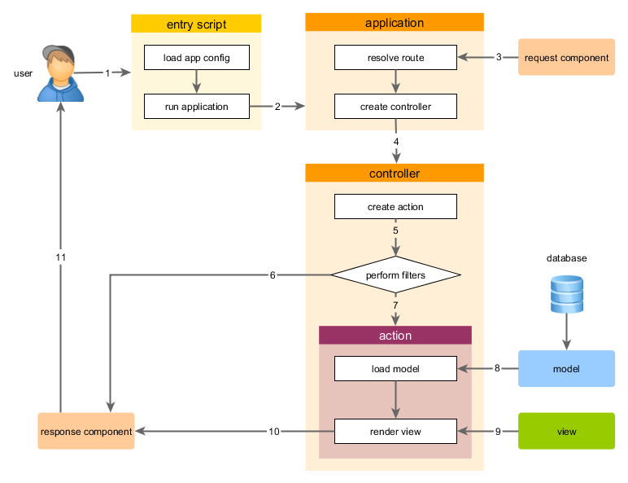

Chạy ứng dụng
====================

Sau khi cài đặt Yii, ứng dụng Yii của bạn đã được chạy, tùy thuộc vào cấu hình bạn có thể truy cập qua URL `https://hostname/basic/web/index.php`
hoặc `https://hostname/index.php`. Bài hướng dẫn này sẽ mô tả chức năng của ứng dụng và cách tổ chức code trong ứng dụng,
và làm thế nào để xử lý các yêu cầu của ứng dụng.

> Lưu ý: Để đơn giản, xuyên suốt các bài hướng dẫn "Getting Started" này, giả sử rằng chúng ta đã thiết lập `basic/web`
  như thư mục gốc trong máy chủ Web, và cấu hình URL dể truy cập vào ứng dụng của ban thành
  `https://hostname/index.php` hoặc điều tương tự. Tùy theo yêu cầu của bạn, bạn hãy điều chình 
  URLs sao cho phù hợp với ứng dụng.


Chức năng <span id="functionality"></span>
-------------

Mẫu ứng dụng *Basic Application* bao gồm 4 trang cơ bản:

* Trang chủ (homepage), được hiển thị khi bạn truy cập vào URL `https://hostname/index.php`,
* Trang "About",
* Trang "Contact", trang hiển thị form contact cho phép user liên hệ với bạn qua email,
* Trang "Login", trang hiển thị form login cho phép bạn có thể xác thực user. Hãy thử đăng nhập với
  thông tin "admin/admin", và bạn sẽ thấy tên "Login" ở menu chính thay đổi thành "Logout".

Những trang trên đều có cùng phần header và footer. Phần header chứa main menu bar cho phép điều hướng giữa các trang.

Ở dưới cùng của trình duyệt, bạn có thể thấy một thanh công cụ. Đây là một công cụ gỡ lỗi [debugger tool](tool-debugger.md) rất hữu ích
được cung cấp bởi Yii, bạn có thể ghi lại và hiển thị một lượng lớn các thông tin gỡ lỗi, 
chẳng hạn như thông tin đăng nhập, tình trạng phản ứng, các câu lệnh truy vấn cơ sở dữ liệu, và như vậy.

Ngoài ra, các ứng dụng web có các script từ dòng lệnh (console) tên là *yii*, được nằm ở ứng dụng cơ sở. 
Những script này có thể dùng chạy nền và bảo trì chức năng ứng dụng, thông tin mô tả thêm [Console Application Section](tutorial-console.md).


Cấu trúc ứng dụng (Application Structure) <span id="application-structure"></span>
---------------------

Những thư mục và tập tin quan trọng nhất của ứng dụng (giả sử thư mục gốc của ứng dụng tên là `basic`):

```
basic/                  Thư mục gốc ứng dụng
    composer.json       Tập tin cấu hình Composer, mô tả thông tin gói
    config/             Chứa các cấu hình ứng dụng và cấu hình khác
        console.php     thông tin cấu hình ứng dụng giao diện console
        web.php         thông tin cấu hình ứng dụng Web
    commands/           chứa các lớp lệnh console
    controllers/        Chứa các lớp điều khiển (controller)
    models/             Chứa các lớp model
    runtime/            chứa các file được sinh ra bởi Yii trong quá trình chạy, chẳng hạn như đăng nhập và file của bộ nhớ cache
    vendor/             chứa các gói cài đặt Composer Package, bao gồm cả Yii framework
    views/              chứa các file về view
    web/                Thư mục gốc ứng dụng Web, chứa các file truy cập Web
        assets/         chứa tập tin tài nguyên Yii (javascript và css)
        index.php       tập tin thực thi ứng dụng (hoặc bootstrap)
    yii                 Giao diện điều khiển lệnh script (Yii console)
```

Nói chung, những tập tin trong ứng dụng có thể chia thành hai loại: tập tin nằm trong thư mục `basic/web` và những tập
tin nằm ở thư mục khác. Trước dây có thể truy cập trực tiếp qua HTTP (chẳng hạn như một trình duyệt), tuy nhiên sau này không thể truy cập và không nên có.

Yii thực thi theo mẫu thiết kế [model-view-controller (MVC)](https://wikipedia.org/wiki/Model-view-controller),
Điều này được phản ánh trong cấu trúc đường dẫn ở trên. Thư mục `models` chứa tất cả [lớp dữ liệu (model)](structure-models.md),
còn thư mục `views` sẽ chứa tất cả [view scripts](structure-views.md), và thư mục `controllers` chứa tất cả
[lớp điều khiển (controller classes)](structure-controllers.md).

Biểu đồ sau đây cho thấy cấu trúc tĩnh của một ứng dụng:


Mỗi ứng dụng sẽ có một mục đầu vào (Entry Script) `web/index.php` như vậy việc truy cập vào ứng dụng Web chỉ được phép truy cập qua mục này.
Entry script tiếp nhận các request và tạo mới [ứng dụng (application)](structure-applications.md) để xử lý.
Các [ứng dụng](structure-applications.md) giải quyết các request cùng với các [thành phần (components)](concept-components.md),
và gửi các request tới các phần tử trong mô hình MVC. Các [Widgets](structure-widgets.md) sẽ được sử dụng ở [views](structure-views.md)
để đơn giản hơn việc xây dựng các giao diện phức tạp.


Chu trình xứ lý yêu cầu <span id="request-lifecycle"></span>
-----------------

Biểu đồ dưới đây cho thấy làm thế nào một ứng dụng để xử lý các yêu cầu:



1. User tạo yêu cầu (request) tới [mục script](structure-entry-scripts.md) `web/index.php`.
2. Entry script tải các [cấu hình (configuration)](concept-configurations.md) ứng dụng và tạo mới
   [ứng dụng](structure-applications.md) để khởi tạo để xử lý yêu cầu.
3. Ứng dụng lấy thông tin [route](runtime-routing.md) được yêu cầu cùng với những thành phần (component)
   cần xử lý các [request](runtime-requests.md).
4. Ứng dụng tạo mới [controller](structure-controllers.md) khởi tạo để xử lý yêu cầu.
5. Bộ điều khiển (controller) tạo mới các [action (hành động)](structure-controllers.md) khởi tạo và thực hiện các bộ lọc cho các hành động.
6. Nếu bất kỳ bộ lọc nào bị lỗi, action sẽ bị hủy.
7. Nếu bất kỳ bộ đạt, action sẽ được thực thi.
8. Action sẽ tải dữ liệu từ data model, có thể từ CSDL.
9. Action sẽ tạo mới View, đồng thời cung cấp dữ liệu cho nó .
10. Kết quả việc tạo mới view sẽ trả vê một thành phần ứng dụng [response](runtime-responses.md) .
11. Thành phần response gửi kết quả đến trình duyệt của người dùng và hiển thị kết quả.

