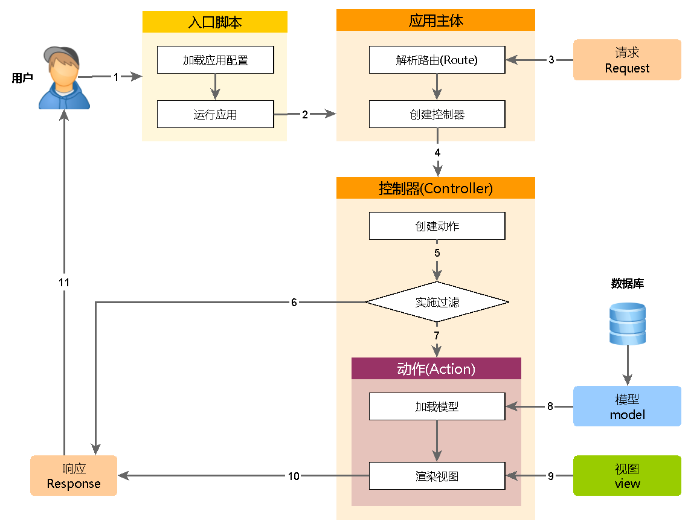

运行机制概述
========

每一次 Yii 应用开始处理 HTTP 请求时，它都会进行一个近似的流程。

1. 用户提交指向 [入口脚本](structure-entry-scripts.md) `web/index.php` 的请求。
2. 入口脚本会加载 [配置数组](concept-configurations.md) 并创建一个
   [应用](structure-applications.md) 实例用于处理该请求。
3. 应用会通过 [request（请求）](runtime-requests.md) 应用组件解析被请求的 [路由](runtime-routing.md)。
4. 应用创建一个 [controller（控制器）](structure-controllers.md) 实例具体处理请求。
5. 控制器会创建一个 [action（动作）](structure-controllers.md) 实例并为该动作执行相关的 Filters（访问过滤器）。
6. 如果任何一个过滤器验证失败，该动作会被取消。
7. 如果全部的过滤器都通过，该动作就会被执行。
8. 动作会加载一个数据模型，一般是从数据库中加载。
9. 动作会渲染一个 View（视图），并为其提供所需的数据模型。
10. 渲染得到的结果会返回给 [response（响应）](runtime-responses.md) 应用组件。
11. 响应组件会把渲染结果发回给用户的浏览器。

下面的示意图展示了应用是如何处理一个请求的。

在这个版块中，我们会更加详细地描述某些步骤的具体运作。
