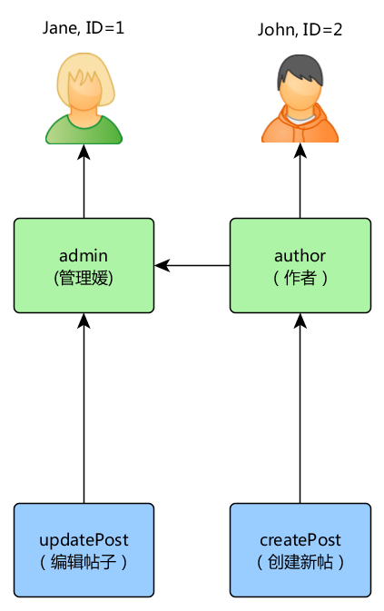
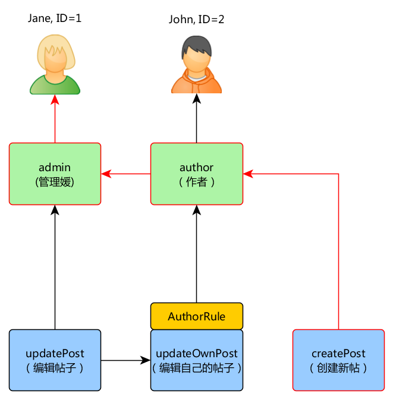
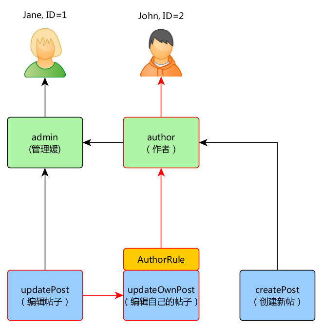
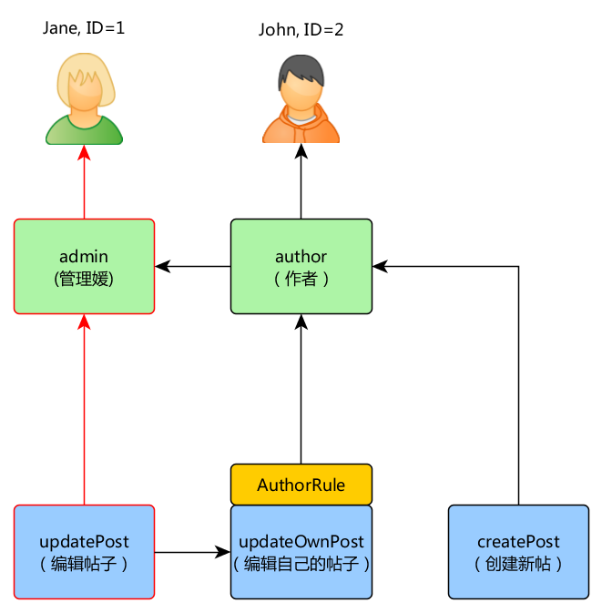

授权
=============

授权是指验证用户是否允许做某件事的过程。Yii提供两种授权方法：
存取控制过滤器（ACF）和基于角色的存取控制（RBAC）。


## 存取控制过滤器 <span id="access-control-filter"></span>

存取控制过滤器（ACF）是一种通过 [[yii\filters\AccessControl]] 类来实现的简单授权方法，
非常适用于仅需要简单的存取控制的应用。正如其名称所指，ACF 是一种动作过滤器
[filter](structure-filters.md)，可在控制器或者模块中使用。当一个用户请求一个动作时，
ACF会检查 [[yii\filters\AccessControl::rules|access rules]] 列表，判断该用户是否允许执
行所请求的动作。

下述代码展示如何在 `site` 控制器中使用 ACF：

```php
use yii\web\Controller;
use yii\filters\AccessControl;

class SiteController extends Controller
{
    public function behaviors()
    {
        return [
            'access' => [
                'class' => AccessControl::class,
                'only' => ['login', 'logout', 'signup'],
                'rules' => [
                    [
                        'allow' => true,
                        'actions' => ['login', 'signup'],
                        'roles' => ['?'],
                    ],
                    [
                        'allow' => true,
                        'actions' => ['logout'],
                        'roles' => ['@'],
                    ],
                ],
            ],
        ];
    }
    // ...
}
```

上面的代码中 ACF 以行为 (behavior) 的形式附加到 `site` 控制器。
这就是很典型的使用行动过滤器的方法。 `only` 选项指明 ACF 应当只
对 `login`， `logout` 和 `signup` 方法起作用。所有其它的 `site` 
控制器中的方法不受存取控制的限制。 `rules` 选项列出了 [[yii\filters\AccessRule|存取规则 (access rules)]]，解读如下：

- 允许所有访客（还未经认证的用户）执行 `login` 和 `signup` 动作。 
  `roles` 选项包含的问号 `?` 是一个特殊的标识，代表”访客用户”。
- 允许已认证用户执行 `logout` 动作。`@`是另一个特殊标识，
  代表”已认证用户”。

ACF 自顶向下逐一检查存取规则，直到找到一个与当前
欲执行的动作相符的规则。 然后该匹配规则中的 `allow` 
选项的值用于判定该用户是否获得授权。如果没有找到匹配的规则，
意味着该用户没有获得授权。（译者注： `only` 中没有列出的动作，将无条件获得授权）

当 ACF 判定一个用户没有获得执行当前动作的授权时，它的默认处理是：

* 如果该用户是访客，将调用 [[yii\web\User::loginRequired()]] 将用户的浏览器重定向到登录页面。
* 如果该用户是已认证用户，将抛出一个 [[yii\web\ForbiddenHttpException]] 异常。

你可以通过配置 [[yii\filters\AccessControl::denyCallback]] 属性定制该行为：

```php
[
    'class' => AccessControl::class,
    ...
    'denyCallback' => function ($rule, $action) {
        throw new \Exception('You are not allowed to access this page');
    }
]
```

[[yii\filters\AccessRule|Access rules]] 支持很多的选项。下列是所支持选项的总览。
你可以派生 [[yii\filters\AccessRule]] 来创建自定义的存取规则类。

 * [[yii\filters\AccessRule::allow|allow]]： 指定该规则是 "允许" 还是 "拒绝" 。（译者注：true是允许，false是拒绝）

 * [[yii\filters\AccessRule::actions|actions]]：指定该规则用于匹配哪些动作。
   它的值应该是动作方法的ID数组。匹配比较是大小写敏感的。如果该选项为空，或者不使用该选项，
   意味着当前规则适用于所有的动作。

 * [[yii\filters\AccessRule::controllers|controllers]]：指定该规则用于匹配哪些控制器。
   它的值应为控制器ID数组。匹配比较是大小写敏感的。如果该选项为空，或者不使用该选项，
   则意味着当前规则适用于所有的动作。（译者注：这个选项一般是在控制器的自定义父类中使用才有意义）

 * [[yii\filters\AccessRule::roles|roles]]：指定该规则用于匹配哪些用户角色。
   系统自带两个特殊的角色，通过 [[yii\web\User::isGuest]] 来判断：

     - `?`： 用于匹配访客用户 （未经认证）
     - `@`： 用于匹配已认证用户

   使用其他角色名时，将触发调用 [[yii\web\User::can()]]，这时要求 RBAC 的支持 （在下一节中阐述）。
   如果该选项为空或者不使用该选项，意味着该规则适用于所有角色。

 * [[yii\filters\AccessRule::roleParams|roleParams]]：指定将传递给 [[yii\web\User::can()]] 的参数。
   请参阅下面描述RBAC规则的部分，了解如何使用它。 如果此选项为空或未设置，则不传递任何参数。
   
 * [[yii\filters\AccessRule::ips|ips]]：指定该规则用于匹配哪些 [[yii\web\Request::userIP|客户端IP地址]] 。
   IP 地址可在其末尾包含通配符 `*` 以匹配一批前缀相同的IP地址。
   例如，`192.168.*` 匹配所有 `192.168.` 段的IP地址。
   如果该选项为空或者不使用该选项，意味着该规则适用于所有角色。

 * [[yii\filters\AccessRule::verbs|verbs]]：指定该规则用于匹配哪种请求方法（例如`GET`，`POST`）。
   这里的匹配大小写不敏感。

 * [[yii\filters\AccessRule::matchCallback|matchCallback]]：指定一个PHP回调函数用于
   判定该规则是否满足条件。（译者注：此处的回调函数是匿名函数）

 * [[yii\filters\AccessRule::denyCallback|denyCallback]]: 指定一个PHP回调函数，
   当这个规则不满足条件时该函数会被调用。（译者注：此处的回调函数是匿名函数）

以下例子展示了如何使用 `matchCallback` 选项，
可使你设计任意的访问权限检查逻辑：

```php
use yii\filters\AccessControl;

class SiteController extends Controller
{
    public function behaviors()
    {
        return [
            'access' => [
                'class' => AccessControl::class,
                'only' => ['special-callback'],
                'rules' => [
                    [
                        'actions' => ['special-callback'],
                        'allow' => true,
                        'matchCallback' => function ($rule, $action) {
                            return date('d-m') === '31-10';
                        }
                    ],
                ],
            ],
        ];
    }

    // 匹配的回调函数被调用了！这个页面只有每年的10月31号能访问（译者注：原文在这里说该方法是回调函数不确切，读者不要和 `matchCallback` 的值即匿名的回调函数混淆理解）。
    public function actionSpecialCallback()
    {
        return $this->render('happy-halloween');
    }
}
```


## 基于角色的存取控制 （RBAC） <span id="rbac"></span>

基于角色的存取控制 （RBAC） 提供了一个简单而强大的集中式存取控制机制。
详细的关于 RBAC 和诸多传统的存取控制方案对比的详情，请参阅
[Wikipedia](https://zh.wikipedia.org/wiki/%E4%BB%A5%E8%A7%92%E8%89%B2%E7%82%BA%E5%9F%BA%E7%A4%8E%E7%9A%84%E5%AD%98%E5%8F%96%E6%8E%A7%E5%88%B6)。

Yii 实现了通用的分层的 RBAC，遵循的模型是 [NIST RBAC model](https://csrc.nist.gov/CSRC/media/Publications/conference-paper/1992/10/13/role-based-access-controls/documents/ferraiolo-kuhn-92.pdf).
它通过 [[yii\rbac\ManagerInterface|authManager]] [application component](structure-application-components.md) 提供 RBAC 功能。

使用 RBAC 涉及到两部分工作。第一部分是建立授权数据，
而第二部分是使用这些授权数据在需要的地方执行检查。

为方便后面的讲述，这里先介绍一些 RBAC 的基本概念。


### 基本概念 <span id="basic-concepts"></span>

角色是 *权限* 的集合 （例如：建贴、改贴）。一个角色
可以指派给一个或者多个用户。要检查某用户是否有一个特定的权限，
系统会检查该包含该权限的角色是否指派给了该用户。

可以用一个规则 *rule* 与一个角色或者权限关联。一个规则用一段代码代表，
规则的执行是在检查一个用户是否满足这个角色或者权限时进行的。例如，"改帖" 的权限
可以使用一个检查该用户是否是帖子的创建者的规则。权限检查中，如果该用户
不是帖子创建者，那么他（她）将被认为不具有 "改帖"的权限。

角色和权限都可以按层次组织。特定情况下，一个角色可能由其他角色或权限构成，
而权限又由其他的权限构成。Yii 实现了所谓的 *局部顺序* 的层次结构，包含更多的特定的 *树* 的层次。
一个角色可以包含一个权限，反之则不行。（译者注：可理解为角色在上方，权限在下方，从上到下如果碰到权限那么再往下不能出现角色）


### 配置 RBAC <span id="configuring-rbac"></span>

在开始定义授权数据和执行存取检查之前，需要先配置应用组件 [[yii\base\Application::authManager|authManager]] 。 
Yii 提供了两套授权管理器： [[yii\rbac\PhpManager]] 
和 [[yii\rbac\DbManager]]。前者使用 PHP 脚本存放授权数据，
而后者使用数据库存放授权数据。 如果你的应用不要求大量的动态角色和权限管理，
你可以考虑使用前者。


#### 使用 `PhpManager` <span id="using-php-manager"></span>

以下代码展示使用 [[yii\rbac\PhpManager]] 时如何在应用配置文件中配置 `authManager`：

```php
return [
    // ...
    'components' => [
        'authManager' => [
            'class' => 'yii\rbac\PhpManager',
        ],
        // ...
    ],
];
```

现在可以通过 `\Yii::$app->authManager` 访问 `authManager` 。

[[yii\rbac\PhpManager]] 默认将 RBAC 数据保存在 `@app/rbac` 目录下的文件中。
如果权限层次数据在运行时会被修改，需确保WEB服务器进程对该目录和其中的文件有写权限。


#### 使用 `DbManager` <span id="using-db-manager"></span>

以下代码展示使用 [[yii\rbac\DbManager]] 时如何在应用配置文件中配置 `authManager`：

```php
return [
    // ...
    'components' => [
        'authManager' => [
            'class' => 'yii\rbac\DbManager',
            // uncomment if you want to cache RBAC items hierarchy
            // 'cache' => 'cache',
        ],
        // ...
    ],
];
```
> Note: 如果您使用的是 yii2-basic-app 模板，则有一个 `config/console.php` 配置文件，其中
  `authManager` 需要另外声明在 `config/web.php`。
> 在 yii2-advanced-app 的情况下，`authManager` 只能在 `common/config/main.php` 中声明一次。

`DbManager` 使用4个数据库表存放它的数据：

- [[yii\rbac\DbManager::$itemTable|itemTable]]： 该表存放授权条目（译者注：即角色和权限）。默认表名为 "auth_item" 。
- [[yii\rbac\DbManager::$itemChildTable|itemChildTable]]： 该表存放授权条目的层次关系。默认表名为 "auth_item_child"。
- [[yii\rbac\DbManager::$assignmentTable|assignmentTable]]： 该表存放授权条目对用户的指派情况。默认表名为 "auth_assignment"。
- [[yii\rbac\DbManager::$ruleTable|ruleTable]]： 该表存放规则。默认表名为 "auth_rule"。

继续之前，你需要在数据库中创建这些表。你可以使用存放在 `@yii/rbac/migrations` 目录中的数据库迁移文件来做这件事（译者注：根据本人经验，最好是将授权数据初始化命令也写到这个 RBAC 数据库迁移文件中）：

`yii migrate --migrationPath=@yii/rbac/migrations`

阅读 [Separated Migrations](db-migrations.md#separated-migrations)
部分中有关处理来自不同名称空间的迁移的更多信息。

现在可以通过 `\Yii::$app->authManager` 访问 `authManager` 。


### 建立授权数据 <span id="generating-rbac-data"></span>

所有授权数据相关的任务如下：

- 定义角色和权限；
- 建立角色和权限的关系；
- 定义规则；
- 将规则与角色和权限作关联；
- 指派角色给用户。

根据授权灵活性要求，上述任务可以通过不同的方式完成。
如果您的权限层次结构仅由开发人员更改，则可以使用迁移或控制台命令。
Migration pro 是可以与其他迁移一起执行的。
控制台命令 pro 是您可以很好地了解代码中的层次结构，
而不是分散在多个迁移中。

无论哪种方式，最终都会得到以下 RBAC 层次结构：



如果您需要动态形成权限层次结构，则需要 UI 或控制台命令。 用于构建层次结构的
API 本身不会有所不同。

#### 使用迁移（Using migrations）

您可以使用 [migrations](db-migrations.md)
通过 `authManager` 提供的 API 初始化和修改层次结构。

使用 `./yii migrate/create init_rbac` 创建新迁移，然后实现创建层次结构：

```php
<?php
use yii\db\Migration;

class m170124_084304_init_rbac extends Migration
{
    public function up()
    {
        $auth = Yii::$app->authManager;

        // 添加 "createPost" 权限
        $createPost = $auth->createPermission('createPost');
        $createPost->description = 'Create a post';
        $auth->add($createPost);

        // 添加 "updatePost" 权限
        $updatePost = $auth->createPermission('updatePost');
        $updatePost->description = 'Update post';
        $auth->add($updatePost);

        // 添加 "author" 角色并赋予 "createPost" 权限
        $author = $auth->createRole('author');
        $auth->add($author);
        $auth->addChild($author, $createPost);

        // 添加 "admin" 角色并赋予 "updatePost" 
		// 和 "author" 权限
        $admin = $auth->createRole('admin');
        $auth->add($admin);
        $auth->addChild($admin, $updatePost);
        $auth->addChild($admin, $author);

        // 为用户指派角色。其中 1 和 2 是由 IdentityInterface::getId() 返回的id
        // 通常在你的 User 模型中实现这个函数。
        $auth->assign($author, 2);
        $auth->assign($admin, 1);
    }
    
    public function down()
    {
        $auth = Yii::$app->authManager;

        $auth->removeAll();
    }
}
```

> 如果您不想硬编码哪些用户具有某些角色，请不要在迁移中使用 `->assign()` 调用。
  相反，请创建UI或控制台命令来管理分配。

迁移可以通过 `yii migrate` 使用。

### 使用控制台命令（Using console command）

如果您的权限层次根本没有改变，并且您拥有固定数量的用户，
则可以创建一个[控制台命令](tutorial-console.md#create-command)，它将通过
`authManager` 提供的 API 初始化授权数据一次：

```php
<?php
namespace app\commands;

use Yii;
use yii\console\Controller;

class RbacController extends Controller
{
    public function actionInit()
    {
        $auth = Yii::$app->authManager;
        $auth->removeAll();

        // 添加 "createPost" 权限
        $createPost = $auth->createPermission('createPost');
        $createPost->description = 'Create a post';
        $auth->add($createPost);

        // 添加 "updatePost" 权限
        $updatePost = $auth->createPermission('updatePost');
        $updatePost->description = 'Update post';
        $auth->add($updatePost);

        // 添加 "author" 角色并赋予 "createPost" 权限
        $author = $auth->createRole('author');
        $auth->add($author);
        $auth->addChild($author, $createPost);

        // 添加 "admin" 角色并赋予 "updatePost" 
		// 和 "author" 权限
        $admin = $auth->createRole('admin');
        $auth->add($admin);
        $auth->addChild($admin, $updatePost);
        $auth->addChild($admin, $author);

        // 为用户指派角色。其中 1 和 2 是由 IdentityInterface::getId() 返回的id
        // 通常在你的 User 模型中实现这个函数。
        $auth->assign($author, 2);
        $auth->assign($admin, 1);
    }
}
```

> Note: 如果您使用高级模板，则需要将 `RbacController` 放在 `console/controllers` 目录中，
  并将命名空间更改为 `console/controllers`。

上面的命令可以通过以下方式从控制台执行：

```
yii rbac/init
```

> 如果您不想硬编码用户具有某些角色，请不要将 `->assign()` 调用放入命令中。
  相反，请创建UI或控制台命令来管理分配。

## 为用户分配角色（Assigning roles to users）

作者可以创建帖子，管理员可以更新帖子并可以做一切作者都能做的。

如果您的应用程序允许用户注册，则需要为这些新用户分配一次角色。
例如，为了让所有注册用户成为高级项目模板中的作者，您需要修改 `frontend\models\SignupForm::signup()`，
如下所示：

```php
public function signup()
{
    if ($this->validate()) {
        $user = new User();
        $user->username = $this->username;
        $user->email = $this->email;
        $user->setPassword($this->password);
        $user->generateAuthKey();
        $user->save(false);

        // 增加了以下三行：
        $auth = \Yii::$app->authManager;
        $authorRole = $auth->getRole('author');
        $auth->assign($authorRole, $user->getId());

        return $user;
    }

    return null;
}
```

对于需要动态更新授权数据的复杂访问控制的应用程序，可能需要使用
`authManager` 提供的 API 来开发特殊的用户界面（即管理面板）。


### 使用规则 (Rules) <span id="using-rules"></span>

如前所述，规则给角色和权限增加额外的约束条件。规则是 [[yii\rbac\Rule]] 的派生类。
它需要实现 [[yii\rbac\Rule::execute()|execute()]] 方法。在之前我们创建的层次结构中，作者不能编辑自己的帖子，我们来修正这个问题。
首先我们需要一个规则来认证当前用户是帖子的作者：

```php
namespace app\rbac;

use yii\rbac\Rule;
use app\models\Post;

/**
 * 检查 authorID 是否和通过参数传进来的 user 参数相符
 */
class AuthorRule extends Rule
{
    public $name = 'isAuthor';

    /**
     * @param string|integer $user 用户 ID.
     * @param Item $item 该规则相关的角色或者权限
     * @param array $params 传给 ManagerInterface::checkAccess() 的参数
     * @return boolean 代表该规则相关的角色或者权限是否被允许
     */
    public function execute($user, $item, $params)
    {
        return isset($params['post']) ? $params['post']->createdBy == $user : false;
    }
}
```

上述规则检查 `post` 是否是 `$user` 创建的。我们还要在之前的命令中
创建一个特别的权限 `updateOwnPost` ：

```php
$auth = Yii::$app->authManager;

// 添加规则
$rule = new \app\rbac\AuthorRule;
$auth->add($rule);

// 添加 "updateOwnPost" 权限并与规则关联
$updateOwnPost = $auth->createPermission('updateOwnPost');
$updateOwnPost->description = 'Update own post';
$updateOwnPost->ruleName = $rule->name;
$auth->add($updateOwnPost);

// "updateOwnPost" 权限将由 "updatePost" 权限使用
$auth->addChild($updateOwnPost, $updatePost);

// 允许 "author" 更新自己的帖子
$auth->addChild($author, $updateOwnPost);
```

现在我们得到如下层次结构:


### 存取检查 <span id="access-check"></span>

授权数据准备好后，存取检查简单到只需要一个方法调用 [[yii\rbac\ManagerInterface::checkAccess()]]。
因为大多数存取检查都是针对当前用户而言，为方便起见， Yii 提供了一个快捷方法
[[yii\web\User::can()]]，可以如下例所示来使用：

```php
if (\Yii::$app->user->can('createPost')) {
    // 建贴
}
```

如果当前用户是 `ID=1` 的 Jane ，我们从图中的 `createPost` 开始，并试图到达 `Jane` 。 （译者注：参照图中红色路线所示的建贴授权流程）



为了检查某用户是否能更新帖子，我们需要传递一个额外的参数，该参数是 `AuthorRule` 要用的：

```php
if (\Yii::$app->user->can('updatePost', ['post' => $post])) {
    // 更新帖子
}
```

下图所示为当前用户是 John 时所发生的事情：




我们从图中的 `updatePost` 开始，经过 `updateOwnPost`。为通过检查，`Authorrule` 
规则的 `execute()` 方法应当返回 `true` 。该方法从 `can()` 方法调用接收到 `$params` 参数，
因此它的值是 `['post' => $post]` 。如果一切顺利，我们会达到指派给 John 的 `author` 角色。

对于 Jane 来说则更简单，因为她是管理员：



在您的控制器内部有几种实现授权的方式。
如果您希望细化权限来分开添加和删除的访问权限，那么您需要检查每个操作的访问权限。
您可以在每个操作方法中使用上述条件，或使用 [[yii\filters\AccessControl]]：

```php
public function behaviors()
{
    return [
        'access' => [
            'class' => AccessControl::class,
            'rules' => [
                [
                    'allow' => true,
                    'actions' => ['index'],
                    'roles' => ['managePost'],
                ],
                [
                    'allow' => true,
                    'actions' => ['view'],
                    'roles' => ['viewPost'],
                ],
                [
                    'allow' => true,
                    'actions' => ['create'],
                    'roles' => ['createPost'],
                ],
                [
                    'allow' => true,
                    'actions' => ['update'],
                    'roles' => ['updatePost'],
                ],
                [
                    'allow' => true,
                    'actions' => ['delete'],
                    'roles' => ['deletePost'],
                ],
            ],
        ],
    ];
}
```

如果所有的CRUD操作都是一起管理的，那么使用 `managePost` 这样的单一权限并且在
[[yii\web\Controller::beforeAction()]] 中检查它是个好主意。

在上面的例子中，没有参数与指定的访问动作的角色一起传递，但是在
`updatePost` 权限的情况下，我们需要传递 `post` 参数才能正常工作。
您可以通过在访问规则中指定 [[yii\filters\AccessRule::roleParams|roleParams]] 将参数传递给
[[yii\web\User::can()]]：

```php
[
    'allow' => true,
    'actions' => ['update'],
    'roles' => ['updatePost'],
    'roleParams' => function() {
        return ['post' => Post::findOne(['id' => Yii::$app->request->get('id')])];
    },
],
```

在上面的例子中，[[yii\filters\AccessRule::roleParams|roleParams]] 是一个 Closure，
将在检查访问规则时进行评估，因此模型只会在需要时加载。
如果创建角色参数是一个简单的操作，那么您可以指定一个数组，如下所示：

```php
[
    'allow' => true,
    'actions' => ['update'],
    'roles' => ['updatePost'],
    'roleParams' => ['postId' => Yii::$app->request->get('id')];
],
```

### 使用默认角色 <span id="using-default-roles"></span>

所谓默认角色就是 *隐式* 地指派给 *所有* 用户的角色。不需要调用 
[[yii\rbac\ManagerInterface::assign()]] 方法做显示指派，并且授权数据中不包含指派信息。

默认角色通常与一个规则关联，用以检查该角色是否符合被检查的用户。

默认角色常常用于已经确立了一些角色的指派关系的应用（译者注：指派关系指的是应用业务逻辑层面，
并非指授权数据的结构）。比如，一个应用的 user 表中有一个 `group` 字段，代表用户属于哪个特权组。
如果每个特权组可以映射到 RBAC 的角色，你就可以采用默认角色自动地为每个用户指派一个 RBAC 角色。
让我们用一个例子展示如何做到这一点。

假设在 user 表中，你有一个 `group` 字段，用 1 代表管理员组，用 2 表示作者组。
你规划两个 RBAC 角色 `admin` 和 `author` 分别对应这两个组的权限。
你可以这样设置 RBAC 数据，


```php
namespace app\rbac;

use Yii;
use yii\rbac\Rule;

/**
 * 检查是否匹配用户的组
 */
class UserGroupRule extends Rule
{
    public $name = 'userGroup';

    public function execute($user, $item, $params)
    {
        if (!Yii::$app->user->isGuest) {
            $group = Yii::$app->user->identity->group;
            if ($item->name === 'admin') {
                return $group == 1;
            } elseif ($item->name === 'author') {
                return $group == 1 || $group == 2;
            }
        }
        return false;
    }
}
```

然后按 [in the previous section](#generating-rbac-data) 中的说明创建自己的 command/migration：

```php
$auth = Yii::$app->authManager;

$rule = new \app\rbac\UserGroupRule;
$auth->add($rule);

$author = $auth->createRole('author');
$author->ruleName = $rule->name;
$auth->add($author);
// ... 添加$author角色的子项部分代码 ... （译者注：省略部分参照之前的控制台命令）

$admin = $auth->createRole('admin');
$admin->ruleName = $rule->name;
$auth->add($admin);
$auth->addChild($admin, $author);
// ... 添加$admin角色的子项部分代码 ... （译者注：省略部分参照之前的控制台命令）
```

注意，在上述代码中，因为 "author" 作为 "admin" 的子角色，当你实现这个规则的 `execute()` 方法时， 
你也需要遵从这个层次结构。这就是为何当角色名为 "author" 的情况下（译者注：`$item->name`就是角色名）， 
`execute()` 方法在组为 1 或者 2 时均要返回 true 
（意思是用户属于 "admin" 或者 "author" 组 ）。

接下来，在配置 `authManager` 时指定 [[yii\rbac\BaseManager::$defaultRoles]] 选项（译者注：在应用配置文件中的组件部分配置）：

```php
return [
    // ...
    'components' => [
        'authManager' => [
            'class' => 'yii\rbac\PhpManager',
            'defaultRoles' => ['admin', 'author'],
        ],
        // ...
    ],
];
```

现在如果你执行一个存取权限检查， 判定该规则时， `admin` 和 `author` 
两个角色都将会检查。如果规则返回 true ，意思是角色符合当前用户。基于上述规则
的实现，意味着如果某用户的 `group` 值为 1 ， `admin` 角色将赋予该用户，
如果 `group` 值是 2 则将赋予 `author` 角色。
