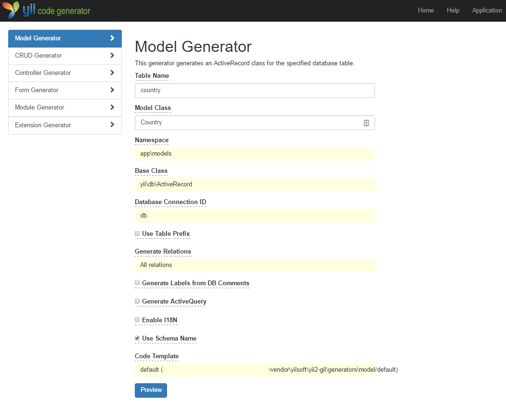
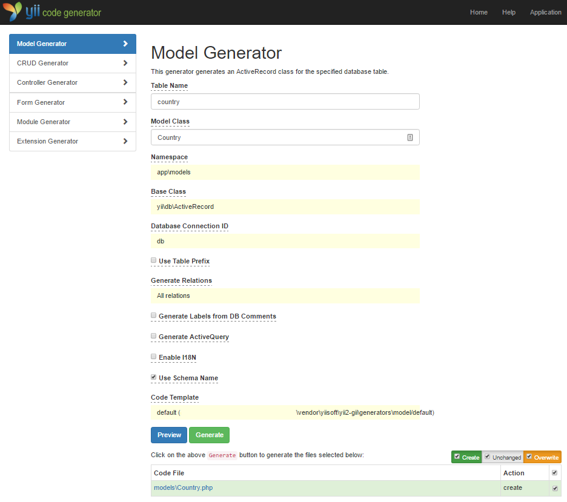
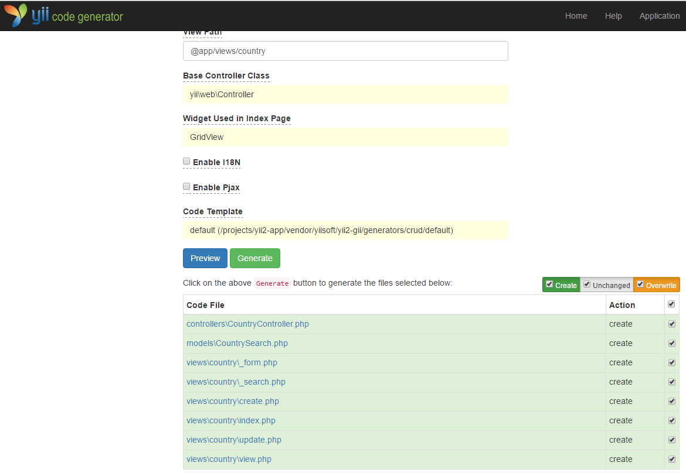

使用 Gii 生成代码
========================

本章将介绍如何使用 [Gii](tool-gii.md) 去自动生成 Web 站点常用功能的代码。使用 Gii 生成代码非常简单，
只要按照 Gii 页面上的介绍输入正确的信息即可。

贯穿本章节，你将会学到：

* 在你的应用中开启 Gii
* 使用 Gii 去生成活动记录类
* 使用 Gii 去生成数据表操作的增查改删（CRUD）代码
* 自定义 Gii 生成的代码


开始 Gii <span id="starting-gii"></span>
------------

[Gii](tool-gii.md) 是 Yii 中的一个[模块](structure-modules.md)。
可以通过配置应用的 [[yii\base\Application::modules|modules]] 属性开启它。通常来讲在 `config/web.php` 文件中会有以下配置代码：

```php
$config = [ ... ];

if (YII_ENV_DEV) {
    $config['bootstrap'][] = 'gii';
    $config['modules']['gii'] = [
        'class' => 'yii\gii\Module',
    ];
}
```

这段配置表明，如果当前是[开发环境](concept-configurations.md#environment-constants)，
应用会包含 `gii` 模块，模块类是 [[yii\gii\Module]]。

如果你检查应用的[入口脚本](structure-entry-scripts.md) `web/index.php`，
将看到这行代码将 `YII_ENV_DEV` 设为 true：

```php
defined('YII_ENV') or define('YII_ENV', 'dev');
```

鉴于这行代码的定义，应用处于开发模式下，按照上面的配置会打开 Gii 模块。你可以直接通过 URL 访问 Gii：

```
https://hostname/index.php?r=gii
```

> Info: 如果你通过本机以外的机器访问 Gii，请求会被出于安全原因拒绝。
> 你可以配置 Gii 为其添加允许访问的 IP 地址：
>
```php
'gii' => [
    'class' => 'yii\gii\Module',
    'allowedIPs' => ['127.0.0.1', '::1', '192.168.0.*', '192.168.178.20'] // 按需调整这里
],
```


生成活动记录类 <span id="generating-ar"></span>
---------------------------------

选择 “Model Generator” （点击 Gii 首页的链接）去生成活动记录类。并像这样填写表单：

* Table Name: `country`
* Model Class: `Country`



然后点击 “Preview” 按钮。你会看到 `models/Country.php` 被列在将要生成的文件列表中。可以点击文件名预览内容。

如果你已经创建过同样的文件，使用 Gii 会覆写它，
点击文件名旁边的 `diff` 能查看现有文件与将要
生成的文件的内容区别。



想要覆写已存在文件，选中 “overwrite” 下的复选框然后点击 “Generator”。如果是新文件，只点击 “Generator” 就好。

接下来你会看到一个包含已生成文件的说明页面。如果生成过程中覆写过文件，
还会有一条信息说明代码是重新生成覆盖的。


生成 CRUD 代码 <span id="generating-crud"></span>
--------------------

CRUD 代表增，查，改，删操作，这是绝大多数 Web 站点常用的数据处理方式。选择 Gii 中的 “CRUD Generator” （点击 Gii 首页的链接）去创建 CRUD 功能。本例 “country” 中需要这样填写表单：

* Model Class: `app\models\Country`
* Search Model Class: `app\models\CountrySearch`
* Controller Class: `app\controllers\CountryController`


然后点击 “Preview” 按钮。你会看到下述将要生成的文件列表。



如果你之前创建过 `controllers/CountryController.php` 和 `views/country/index.php` 文件（在指南的使用数据库章节），
选中 “overwrite” 下的复选框覆写它们（之前的文件没能全部支持 CRUD）。


试运行 <span id="trying-it-out"></span>
-------------

用浏览器访问下面的 URL 查看生成代码的运行：

```
https://hostname/index.php?r=country/index
```

可以看到一个栅格显示着从数据表中读取的国家数据。支持在列头对数据进行排序，
输入筛选条件进行筛选。

可以浏览详情，编辑，或删除栅格中的每个国家。
还可以点击栅格上方的 “Create Country” 按钮通过表单创建新国家。


下面列出由 Gii 生成的文件，以便你研习功能和实现，
或修改它们。

* 控制器：`controllers/CountryController.php`
* 模型：`models/Country.php` 和 `models/CountrySearch.php`
* 视图：`views/country/*.php`

> Info: Gii 被设计成高度可定制和可扩展的代码生成工具。
  使用它可以大幅提高应用开发速度。
  请参考 [Gii](tool-gii.md) 章节了解更多内容。


总结 <span id="summary"></span>
-------

本章学习了如何使用 Gii 去生成为数据表中
数据实现完整 CRUD 功能的代码。
