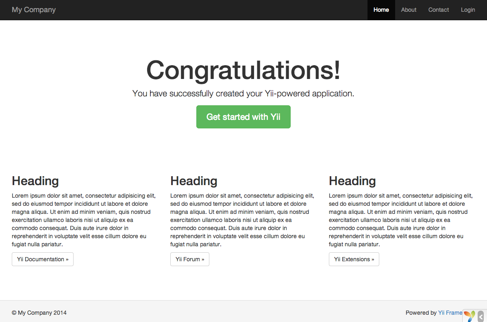

安装 Yii
==============

你可以通过两种方式安装 Yii：使用 [Composer](https://getcomposer.org/) 或下载一个归档文件。
推荐使用前者，这样只需执行一条简单的命令就可以安装新的[扩展](structure-extensions.md)或更新 Yii 了。

标准安装完Yii之后，框架和一个项目模板两者都下载并安装好了。
一个项目模板是实现了一些基本特性的一个 可行的Yii项目，比如登录，联系表单，等等。
它的代码是以推荐的方式组织的。因此，它能够适合作为你项目的一个好的起点。

在本章节和以后的章节，我们将会介绍如何去安装Yii和所谓的*基本的应用程序模板*和如何去实现这个模板上的新特性。
Yii当然也提供了其它模板叫
[高级的应用程序模板](https://github.com/yiisoft/yii2-app-advanced/blob/master/docs/guide-zh-CN/README.md)，
它是更好应用于在一个团队开发环境中去开发多层级的应用程序。

> Info: 这个基本的应用程序模板是适合于开发90%的Web应用程序。
  它不同于高级的应用程序模板主要地在如何使它们的代码是有组织的。
  如果你是刚接触Yii，我们强烈建议你坚持使用简单并有足够的功能的基础的应用程序模板。


通过 Composer 安装 <span id="installing-via-composer"></span>
-----------------------

### 安装 Composer

如果还没有安装 Composer，你可以按 [getcomposer.org](https://getcomposer.org/download/) 中的方法安装。
在 Linux 和 Mac OS X 中可以运行如下命令：

```bash
curl -sS https://getcomposer.org/installer | php
mv composer.phar /usr/local/bin/composer
```

在 Windows 中，你需要下载并运行 [Composer-Setup.exe](https://getcomposer.org/Composer-Setup.exe)。

如果遇到任何问题或者想更深入地学习 Composer，
请参考 [Composer 文档](https://getcomposer.org/doc/)。
如果你已经安装有 Composer 请确保使用的是最新版本，
你可以用 `composer self-update` 命令更新 Composer 为最新版本。

在本指南中，所有 composer 命令都假定您已经安装了[全局](https://getcomposer.org/doc/00-intro.md#globally) 的 composer，
这样它可以作为 `composer` 命令。如果您在本地目录中使用 `composer.phar`，
则必须相应地调整示例命令。

如果您之前已安装 Composer，请确保使用最新版本。
您可以通过运行 `composer self-update` 来更新Composer。

> Note: 在安装 Yii 期间，Composer 需要从 Github API 请求很多信息。
> 请求的数量取决于您的应用程序所依赖的数量，
> 并可能大于 **Github API 速率限制**。如果达到此限制，Composer 可能会要求您提供 Github 登录凭据以获取
> Github API 访问令牌。在快速连接上，您可能比 Composer 能够处理的时间早，
> 因此我们建议您在安装 Yii 之前配置访问令牌。
> 有关如何执行此操作的说明，请参阅
> [Composer documentation about Github API tokens](https://getcomposer.org/doc/articles/troubleshooting.md#api-rate-limit-and-oauth-tokens)。

### 安装 Yii <span id="installing-from-composer"></span>

安装 Composer 后，您可以通过在 Web 可访问的文件夹下运行以下命令来
安装Yii应用程序模板：

```bash
composer create-project --prefer-dist yiisoft/yii2-app-basic basic
```

这将在一个名为 `basic` 的目录中安装Yii应用程序模板的最新稳定版本。
如果需要，您可以选择不同的目录名称。

> Info: 如果 `composer create-project` 命令失败，您也可以参考
> [Composer 文档的疑难解答](https://getcomposer.org/doc/articles/troubleshooting.md)
> 部分中的常见错误。修复错误后，
> 您可以通过在 `basic` 目录内运行 `composer update` 来恢复中止安装。

> Tip: 如果你想安装 Yii 的最新开发版本，可以使用以下命令代替，
> 它添加了一个 [stability 选项](https://getcomposer.org/doc/04-schema.md#minimum-stability)：
>
> ```bash
> composer create-project --prefer-dist --stability=dev yiisoft/yii2-app-basic basic
> ```
>
> 请注意，Yii的开发版本不应该用于生产，因为它可能会破坏您的运行代码。


通过归档文件安装 <span id="installing-from-archive-file"></span>
--------------

通过归档文件安装 Yii 包括三个步骤：

1. 从 [yiiframework.com](https://www.yiiframework.com/download/) 下载归档文件。
2. 将下载的文件解压缩到 Web 访问的文件夹中。
3. 修改 `config/web.php` 文件，给 `cookieValidationKey` 配置项
   添加一个密钥（若你通过 Composer 安装，则此步骤会自动完成）：

   ```php
   // !!! 在下面插入一段密钥（若为空） - 以供 cookie validation 的需要
   'cookieValidationKey' => '在此处输入你的密钥',
   ```


其他安装方式 <span id="other-installation-options"></span>
----------

上文介绍了两种安装 Yii 的方法，
安装的同时也会创建一个立即可用的 Web 应用程序。
这个方法对大多数的大或者小的项目是一个不错的起点。如果你正好开始学习Yii，这是特别适合的。

但是其他的安装方式也存在：

* 如果你只想安装核心框架，然后从零开始构建整个属于你自己的应用程序模版，
  可以参考[从头构建自定义模版](tutorial-start-from-scratch.md)一节的介绍。
* 如果你要开发一个更复杂的应用，可以更好地适用于团队开发环境的，
  你可以考虑安装[高级应用模版](https://github.com/yiisoft/yii2-app-advanced/blob/master/docs/guide-zh-CN/README.md)。


安装 Assets <span id="installing-assets"></span>
-----------

Yii依靠 [Bower](https://bower.io/) 和/或 [NPM](https://www.npmjs.com/) 软件包来安装 asset（CSS 和 JavaScript）库。
它使用Composer来获取这些库，允许 PHP 和 CSS/JavaScript 包版本同时解析。
这可以通过使用 [asset-packagist.org](https://asset-packagist.org) 或 [composer asset plugin](https://github.com/fxpio/composer-asset-plugin) 来实现。
有关更多详细信息，请参阅 [Assets 文档](structure-assets.md)。

您可能希望通过本地 Bower/NPM 客户端管理您的 assets，使用 CDN 或完全避免 assets 的安装。
为了防止通过 Composer 安装 assets，请将以下几行添加到您的 'composer.json' 中：

```json
"replace": {
    "bower-asset/jquery": ">=1.11.0",
    "bower-asset/inputmask": ">=3.2.0",
    "bower-asset/punycode": ">=1.3.0",
    "bower-asset/yii2-pjax": ">=2.0.0"
},
```

> Note: 在通过 Composer 绕过 assets 安装的情况下，您负责 assets 的安装和解决版本冲突。
> 准备来自不同扩展名的 assets 文件之间的可能不一致。


验证安装的结果 <span id="verifying-installation"></span>
------------

当安装完成之后，
或配置你的Web服务器(看下面的文章)或使用[内置Web Server](https://www.php.net/manual/zh/features.commandline.webserver.php)，
当在项目 `web` 目录下可以通过下面的命令:
 
```bash
php yii serve
```

> Note: 默认情况下Https-server将监听8080。可是如果这个端口已经使用或者你想通过这个方式运行多个应用程序，你可以指定使用哪些端口。
只加上 --port 参数：

```bash
php yii serve --port=8888
```

安装完成后，就可以使用浏览器通过如下 URL 访问刚安装完的 Yii 应用了：

```
http://localhost:8080/
```



你应该可以在浏览器中看到如上所示的 “Congratulations!” 页面。如果没有，
请通过以下任意一种方式，检查当前 PHP 环境是否满足 Yii 最基本需求：

* 复制 `/requirements.php` 到 `/web/requirements.php`，然后通过浏览器访问 URL `http://localhost/requirements.php`
* 执行如下命令：

  ```
  cd basic
  php requirements.php
  ```

你需要配置好 PHP 安装环境，使其符合 Yii 的最小需求。主要是需要 PHP 5.4 或 以上版本。
如果应用需要用到数据库，那还要安装 [PDO PHP 扩展](https://www.php.net/manual/zh/pdo.installation.php) 
和相应的数据库驱动（例如访问 MySQL 数据库所需的 `pdo_mysql`）。


配置 Web 服务器 <span id="configuring-web-servers"></span>
-----------------------

> Tip: 如果你现在只是要试用 Yii 而不是将其部署到生产环境中，
  本小节可以跳过。

通过上述方法安装的应用程序在 Windows，Max OS X，
Linux 中的 [Apache HTTP 服务器](https://httpd.apache.org/)
或 [Nginx HTTP 服务器](https://nginx.org/)且PHP版本为5.4或更高都可以直接运行。
Yii 2.0 也兼容 Facebook 公司的 [HHVM](https://hhvm.com/)，
由于 HHVM 和标准 PHP 在边界案例上有些地方略有不同，在使用 HHVM 时需稍作处理。

在生产环境的服务器上，你可能会想配置服务器让应用程序可以通过
URL `https://www.example.com/index.php` 访问而不是 `https://www.example.com/basic/web/index.php`。
这种配置需要将 Web 服务器的文档根目录(document root)指向 `basic/web` 目录。
可能你还会想隐藏掉 URL 中的 `index.php`，具体细节在 [URL 解析和生成](runtime-url-handling.md)一章中有介绍，
你将学到如何配置 Apache 或 Nginx 服务器实现这些目标。

> Info: 将 `basic/web` 设置为文档根目录(document root)，可以防止终端用户访问 `basic/web` 相邻目录中
的私有应用代码和敏感数据文件。
禁止对其他目录的访问是一个不错的安全改进。

> Info: 如果你的应用程序将来要运行在共享虚拟主机环境中，
没有修改其 Web 服务器配置的权限，你依然可以通过调整应用的结构来提升安全性。
详情请参考[共享主机环境](tutorial-shared-hosting.md) 一章。

> Info: 如果您在反向代理后面运行Yii应用程序，
> 则可能需要在请求组件中配置 [Trusted proxies and headers](runtime-requests.md#trusted-proxies)。

### 推荐使用的 Apache 配置 <span id="recommended-apache-configuration"></span>

在 Apache 的 `httpd.conf` 文件或在一个虚拟主机配置文件中使用如下配置。
注意，你应该将 `path/to/basic/web` 替换为实际的 `basic/web` 目录。

```
# 设置文档根目录为 "basic/web"
DocumentRoot "path/to/basic/web"

<Directory "path/to/basic/web">
    # 开启 mod_rewrite 用于美化 URL 功能的支持（译注：对应 pretty URL 选项）
    RewriteEngine on
    # 如果请求的是真实存在的文件或目录，直接访问
    RewriteCond %{REQUEST_FILENAME} !-f
    RewriteCond %{REQUEST_FILENAME} !-d
    # 如果请求的不是真实文件或目录，分发请求至 index.php
    RewriteRule . index.php

    # if $showScriptName is false in UrlManager, do not allow accessing URLs with script name
    RewriteRule ^index.php/ - [L,R=404]
    
    # ...其它设置...
</Directory>
```


### 推荐使用的 Nginx 配置 <span id="recommended-nginx-configuration"></span>

为了使用 [Nginx](https://www.nginx.com/resources/wiki/)，你应该已经将 PHP 安装为 [FPM SAPI](https://www.php.net/manual/zh/install.fpm.php) 了。
你可以使用如下 Nginx 配置，将 `path/to/basic/web` 替换为实际的 `basic/web` 目录，
`mysite.local` 替换为实际的主机名以提供服务。

```nginx
server {
    charset utf-8;
    client_max_body_size 128M;

    listen 80; ## listen for ipv4
    #listen [::]:80 default_server ipv6only=on; ## listen for ipv6

    server_name mysite.test;
    root        /path/to/basic/web;
    index       index.php;

    access_log  /path/to/basic/log/access.log;
    error_log   /path/to/basic/log/error.log;

    location / {
        # Redirect everything that isn't a real file to index.php
        try_files $uri $uri/ /index.php$is_args$args;
    }

    # uncomment to avoid processing of calls to non-existing static files by Yii
    #location ~ \.(js|css|png|jpg|gif|swf|ico|pdf|mov|fla|zip|rar)$ {
    #    try_files $uri =404;
    #}
    #error_page 404 /404.html;

    # deny accessing php files for the /assets directory
    location ~ ^/assets/.*\.php$ {
        deny all;
    }
    
    location ~ \.php$ {
        include fastcgi_params;
        fastcgi_param SCRIPT_FILENAME $document_root$fastcgi_script_name;
        fastcgi_pass 127.0.0.1:9000;
        #fastcgi_pass unix:/var/run/php5-fpm.sock;
        try_files $uri =404;
    }

    location ~* /\. {
        deny all;
    }
}
```

使用该配置时，你还应该在 `php.ini` 文件中设置 `cgi.fix_pathinfo=0` ，
能避免掉很多不必要的 `stat()` 系统调用。

还要注意当运行一个 HTTPS 服务器时，需要添加 `fastcgi_param HTTPS on;` 一行，
这样 Yii 才能正确地判断连接是否安全。
