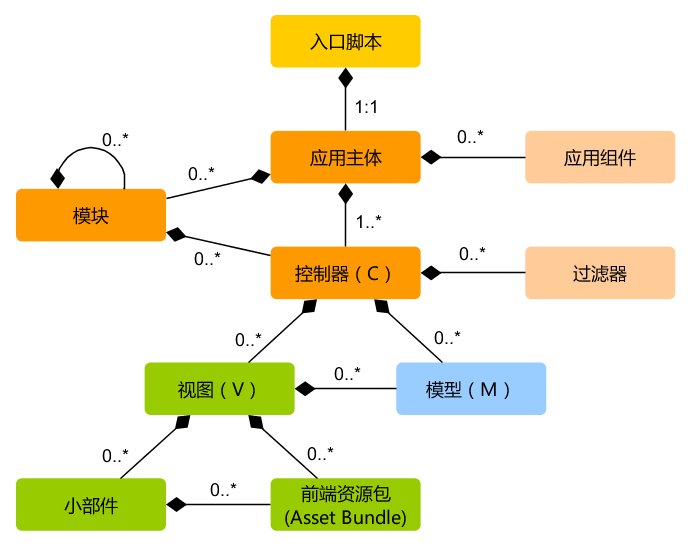

运行应用
====================

安装 Yii 后，就有了一个可运行的 Yii 应用，
根据配置的不同，可以通过 `https://hostname/basic/web/index.php` 或 `https://hostname/index.php` 访问。
本章节将介绍应用的内建功能，如何组织代码，
以及一般情况下应用如何处理请求。

> Info: 为简单起见，在整个“入门”板块都假定你已经把
  `basic/web` 设为 Web 服务器根目录并配置完毕，
  你访问应用的地址会是 `https://hostname/index.php` 或类似的。
  请按需调整 URL。

注意项目模板和框架完全不同，安装完之后全都归你了。你可以根据你的需要自由的添加或删除代码和
修改全部的。


功能 <span id="functionality"></span>
-------------

一个安装完的基本应用包含四页：

* 主页，当你访问 `https://hostname/index.php` 时显示,
* “About”页，
* “Contact”页， 显示一个联系表单，允许终端用户通过 Email 联系你，
* “Login”页， 显示一个登录表单，用来验证终端用户。试着用“admin/admin”登录，
  你可以看到当前是登录状态，已经可以“退出登录”了。

这些页面使用同一个头部和尾部。
头部包含了一个可以在不同页面间切换的导航栏。

在浏览器底部可以看到一个工具栏。这是 Yii 提供的很有用的[调试工具](tool-debugger.md)，
可以记录并显示大量的调试信息，例如日志信息，响应状态，数据库查询等等。

除了 web 应用程序，还有一个控制台脚本叫 `yii` ,它位于应用程序根目录。
它可以用于程序的后台运行和维护任务，在[控制台应用程序章节](tutorial-console.md)
中描述。


应用结构 <span id="application-structure"></span>
---------------------

应用中最重要的目录和文件（假设应用根目录是 `basic`）：

```
basic/                  应用根目录
    composer.json       Composer 配置文件, 描述包信息
    config/             包含应用配置及其它配置
        console.php     控制台应用配置信息
        web.php         Web 应用配置信息
    commands/           包含控制台命令类
    controllers/        包含控制器类
    models/             包含模型类
    runtime/            包含 Yii 在运行时生成的文件，例如日志和缓存文件
    vendor/             包含已经安装的 Composer 包，包括 Yii 框架自身
    views/              包含视图文件
    web/                Web 应用根目录，包含 Web 入口文件
        assets/         包含 Yii 发布的资源文件（javascript 和 css）
        index.php       应用入口文件
    yii                 Yii 控制台命令执行脚本
```

一般来说，应用中的文件可被分为两类：在 `basic/web` 下的和在其它目录下的。
前者可以直接通过 HTTP 访问（例如浏览器），后者不能也不应该被直接访问。

Yii 实现了[模型-视图-控制器 (MVC)](https://wikipedia.org/wiki/Model-view-controller)设计模式，这点在上述目录结构中也得以体现。
`models` 目录包含了所有[模型类](structure-models.md)，
`views` 目录包含了所有[视图脚本](structure-views.md)，
`controllers` 目录包含了所有[控制器类](structure-controllers.md)。

以下图表展示了一个应用的静态结构：



每个应用都有一个入口脚本 `web/index.php`，这是整个应用中唯一可以访问的 PHP 脚本。
入口脚本接受一个 Web 请求并创建[应用](structure-application.md)实例去处理它。 
[应用](structure-applications.md)在它的[组件](concept-components.md)辅助下解析请求，
并分派请求至 MVC 元素。[视图](structure-views.md)使用[小部件](structure-widgets.md)
去创建复杂和动态的用户界面。


请求生命周期 <span id="request-lifecycle"></span>
-----------------

以下图表展示了一个应用如何处理请求：


1. 用户向[入口脚本](structure-entry-scripts.md) `web/index.php` 发起请求。
2. 入口脚本加载应用[配置](concept-configurations.md)并创建一个[应用](structure-applications.md)
   实例去处理请求。
3. 应用通过[请求](runtime-request.md)组件解析请求的
   [路由](runtime-routing.md)。
4. 应用创建一个[控制器](structure-controllers.md)实例去处理请求。
5. 控制器创建一个[动作](structure-controllers.md)实例并针对操作执行过滤器。
6. 如果任何一个过滤器返回失败，则动作取消。
7. 如果所有过滤器都通过，动作将被执行。
8. 动作会加载一个数据模型，或许是来自数据库。
9. 动作会渲染一个视图，把数据模型提供给它。
10. 渲染结果返回给[响应](runtime-responses.md)组件。
11. 响应组件发送渲染结果给用户浏览器。

