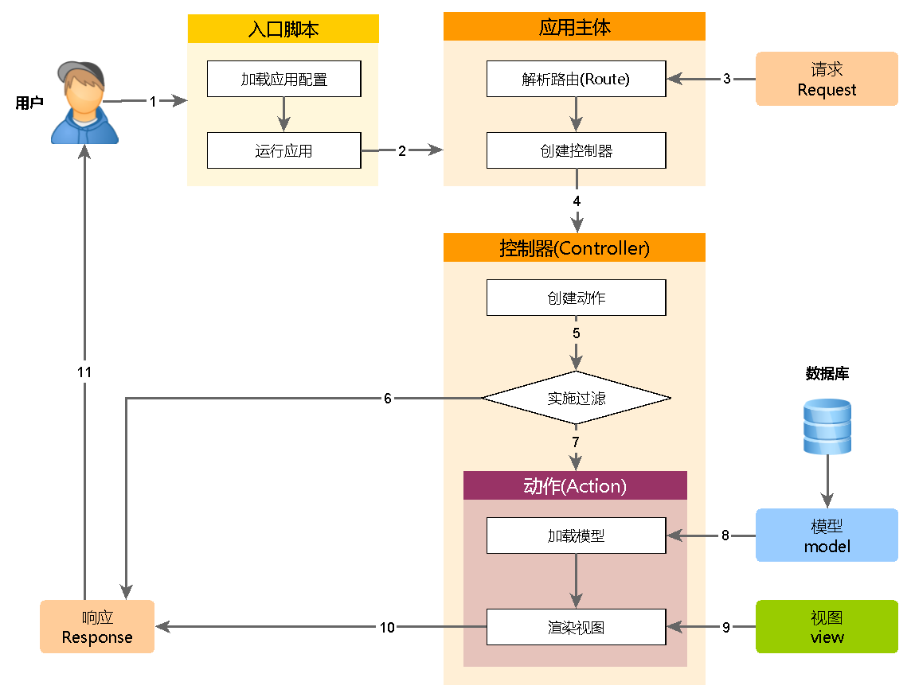

应用主体
============

应用主体是管理 Yii 应用系统整体结构和生命周期的对象。
每个Yii应用系统只能包含一个应用主体，应用主体在 
[入口脚本](structure-entry-scripts.md) 中创建并能通过表达式 `\Yii::$app` 全局范围内访问。

> Info: 当我们说"一个应用"，它可能是一个应用主体对象，也可能是一个应用系统，
  是根据上下文来决定[译：中文为避免歧义，Application翻译为应用主体]。

Yii有两种应用主体: [[yii\web\Application|网页应用主体]] and
[[yii\console\Application|控制台应用主体]]， 
如名称所示，前者主要处理网页请求，后者处理控制台请求。


## 应用主体配置 <span id="application-configurations"></span>

如下所示，当 [入口脚本](structure-entry-scripts.md) 创建了一个应用主体，
它会加载一个 [配置](concept-configurations.md) 文件并传给应用主体。

```php
require __DIR__ . '/../vendor/autoload.php';
require __DIR__ . '/../vendor/yiisoft/yii2/Yii.php';

// 加载应用主体配置
$config = require __DIR__ . '/../config/web.php';

// 实例化应用主体、配置应用主体
(new yii\web\Application($config))->run();
```

类似其他 [配置](concept-configurations.md) 文件, 
应用主体配置文件标明如何设置应用对象初始属性。
由于应用主体配置比较复杂，一般保存在多个类似如上web.php的 
[配置文件](concept-configurations.md#configuration-files) 当中。


## 应用主体属性 <span id="application-properties"></span>

应用主体配置文件中有许多重要的属性要配置，这些属性指定应用主体的运行环境。
比如，应用主体需要知道如何加载 [控制器](structure-controllers.md) ，
临时文件保存到哪儿等等。
以下我们简述这些属性。


### 必要属性 <span id="required-properties"></span>

在一个应用中，至少要配置2个属性: 
[[yii\base\Application::id|id]] 和 [[yii\base\Application::basePath|basePath]]。


#### [[yii\base\Application::id|id]] <span id="id"></span>

[[yii\base\Application::id|id]] 属性用来区分其他应用的唯一标识ID。主要给程序使用。
为了方便协作，最好使用数字作为应用主体ID，
但不强制要求为数字。


#### [[yii\base\Application::basePath|basePath]] <span id="basePath"></span>

[[yii\base\Application::basePath|basePath]] 指定该应用的根目录。
根目录包含应用系统所有受保护的源代码。
在根目录下可以看到对应MVC设计模式的`models`,
`views`, `controllers`等子目录。

可以使用路径或 [路径别名](concept-aliases.md) 来在配置 [[yii\base\Application::basePath|basePath]] 属性。
两种格式所对应的目录都必须存在，否则系统会抛出一个异常。 
系统会使用 `realpath()` 函数规范化配置的路径.

[[yii\base\Application::basePath|basePath]] 属性经常用于派生一些其他重要路径（如runtime路径），
因此，系统预定义 `@app` 代表这个路径。
派生路径可以通过这个别名组成（如`@app/runtime`代表runtime的路径）。


### 重要属性 <span id="important-properties"></span>

本小节所描述的属性通常需要设置，
因为不同的应用属性不同。


#### [[yii\base\Application::aliases|aliases]] <span id="aliases"></span>

该属性允许你用一个数组定义多个 [别名](concept-aliases.md)。
数组的key为别名名称，值为对应的路径。
例如：

```php
[
    'aliases' => [
        '@name1' => 'path/to/path1',
        '@name2' => 'path/to/path2',
    ],
]
```

使用这个属性来定义别名，
代替 [[Yii::setAlias()]] 方法来设置。


#### [[yii\base\Application::bootstrap|bootstrap]] <span id="bootstrap"></span>

这个属性很实用，它允许你用数组指定启动阶段 [[yii\base\Application::bootstrap()|bootstrapping process]] 需要运行的组件。
比如，如果你希望一个 [模块](structure-modules.md) 
自定义 [URL 规则](runtime-url-handling.md)，
你可以将模块ID加入到bootstrap数组中。

属性中的每个组件需要指定以下一项:

- 应用 [组件](#components) ID.
- [模块](#modules) ID.
- 类名.
- 配置数组.
- 创建并返回一个组件的无名称函数.

例如：

```php
[
    'bootstrap' => [
        // 应用组件ID或模块ID
        'demo',

        // 类名
        'app\components\Profiler',

        // 配置数组
        [
            'class' => 'app\components\Profiler',
            'level' => 3,
        ],

        // 匿名函数
        function () {
            return new app\components\Profiler();
        }
    ],
]
```

> Info: 如果模块 ID 和应用组件 ID 同名，优先使用应用组件 ID，
> 如果你想用模块 ID，
> 可以使用如下无名称函数返回模块 ID。
> 
> ```php
> [
>     function () {
>         return Yii::$app->getModule('user');
>     },
> ]
> ```


在启动阶段，每个组件都会实例化。如果组件类实现接口 
[[yii\base\BootstrapInterface]],也会调用 
[[yii\base\BootstrapInterface::bootstrap()|bootstrap()]] 方法。

举一个实际的例子，[Basic Application Template](start-installation.md) 
应用主体配置中，
开发环境下会在启动阶段运行 `debug` 和 `gii` 模块。

```php
if (YII_ENV_DEV) {
    // configuration adjustments for 'dev' environment
    $config['bootstrap'][] = 'debug';
    $config['modules']['debug'] = 'yii\debug\Module';

    $config['bootstrap'][] = 'gii';
    $config['modules']['gii'] = 'yii\gii\Module';
}
```

> 注: 启动太多的组件会降低系统性能，因为每次请求都需要重新运行启动组件，
> 因此谨慎配置启动组件。


#### [[yii\web\Application::catchAll|catchAll]] <span id="catchAll"></span>

该属性仅 [[yii\web\Application|Web applications]] 网页应用支持。
它指定一个要处理所有用户请求的 [控制器方法](structure-controllers.md)，
通常在维护模式下使用，同一个方法处理所有用户请求。

该配置为一个数组，第一项指定动作的路由，剩下的数组项(key-value 成对)指定传递给动作的参数，
例如：

```php
[
    'catchAll' => [
        'offline/notice',
        'param1' => 'value1',
        'param2' => 'value2',
    ],
]
```

> Info: 当开启这个属性时，开发环境下的调试面板将不能工作。

#### [[yii\base\Application::components|components]] <span id="components"></span>

这是最重要的属性，它允许你注册多个在其他地方使用的 [应用组件](#structure-application-components.md). 
例如

```php
[
    'components' => [
        'cache' => [
            'class' => 'yii\caching\FileCache',
        ],
        'user' => [
            'identityClass' => 'app\models\User',
            'enableAutoLogin' => true,
        ],
    ],
]
```

每一个应用组件指定一个key-value对的数组，key代表组件ID，
value代表组件类名或 [配置](concept-configurations.md)。

在应用中可以任意注册组件，并可以通过表达式 
`\Yii::$app->ComponentID` 全局访问。

详情请阅读 [应用组件](structure-application-components.md) 一节.


#### [[yii\base\Application::controllerMap|controllerMap]] <span id="controllerMap"></span>

该属性允许你指定一个控制器ID到任意控制器类。
Yii遵循一个默认的 [规则](#controllerNamespace) 指定控制器ID到任意控制器类（如`post`对应`app\controllers\PostController`）。
通过配置这个属性，可以打破这个默认规则，在下面的例子中，
`account`对应到`app\controllers\UserController`，
`article` 对应到 `app\controllers\PostController`。

```php
[
    'controllerMap' => [
        'account' => 'app\controllers\UserController',
        'article' => [
            'class' => 'app\controllers\PostController',
            'enableCsrfValidation' => false,
        ],
    ],
]
```

数组的键代表控制器ID，
数组的值代表对应的类名。


#### [[yii\base\Application::controllerNamespace|controllerNamespace]] <span id="controllerNamespace"></span>

该属性指定控制器类默认的命名空间，默认为`app\controllers`。
比如控制器ID为 `post` 默认对应 `PostController` （不带命名空间），
类全名为 `app\controllers\PostController`。

控制器类文件可能放在这个命名空间对应目录的子目录下，
例如，控制器ID `admin/post` 对应的控制器类全名为 
`app\controllers\admin\PostController`。

控制器类全面能被 [自动加载](concept-autoloading.md)，
这点是非常重要的，控制器类的实际命名空间对应这个属性，
否则，访问时你会收到"Page Not Found"[译：页面找不到]。

如果你想打破上述的规则，
可以配置 [controllerMap](#controllerMap) 属性。


#### [[yii\base\Application::language|language]] <span id="language"></span>

该属性指定应用展示给终端用户的语言，
默认为 `en` 标识英文。
如果需要之前其他语言可以配置该属性。

该属性影响各种 [国际化](tutorial-i18n.md) ，
包括信息翻译、日期格式、数字格式等。
例如 [[yii\jui\DatePicker]] 小部件会根据该属性
展示对应语言的日历以及日期格式。

推荐遵循 [IETF language tag](http://en.wikipedia.org/wiki/IETF_language_tag) 来设置语言，
例如 `en` 代表英文， `en-US` 代表英文(美国).

该属性的更多信息可参考 [国际化](tutorial-i18n.md) 一节.


#### [[yii\base\Application::modules|modules]] <span id="modules"></span>

该属性指定应用所包含的 [模块](structure-modules.md)。

该属性使用数组包含多个模块类 [配置](concept-configurations.md)，数组的键为模块ID，
例：

```php
[
    'modules' => [
        // "booking" 模块以及对应的类
        'booking' => 'app\modules\booking\BookingModule',

        // "comment" 模块以及对应的配置数组
        'comment' => [
            'class' => 'app\modules\comment\CommentModule',
            'db' => 'db',
        ],
    ],
]
```

更多详情请参考 [模块](structure-modules.md) 一节。


#### [[yii\base\Application::name|name]] <span id="name"></span>

该属性指定你可能想展示给终端用户的应用名称，
不同于需要唯一性的 [[yii\base\Application::id|id]] 属性，
该属性可以不唯一，该属性用于显示应用的用途。

如果其他地方的代码没有用到，可以不配置该属性。


#### [[yii\base\Application::params|params]] <span id="params"></span>

该属性为一个数组，指定可以全局访问的参数，
代替程序中硬编码的数字和字符，
应用中的参数定义到一个单独的文件并随时可以访问是一个好习惯。
例如用参数定义缩略图的长宽如下：

```php
[
    'params' => [
        'thumbnail.size' => [128, 128],
    ],
]
```

然后简单的使用如下代码即可获取到你需要的长宽参数：

```php
$size = \Yii::$app->params['thumbnail.size'];
$width = \Yii::$app->params['thumbnail.size'][0];
```

以后想修改缩略图长宽，
只需要修改该参数而不需要相关的代码。


#### [[yii\base\Application::sourceLanguage|sourceLanguage]] <span id="sourceLanguage"></span>

该属性指定应用代码的语言，默认为 `'en-US'` 标识英文（美国），
如果应用不是英文请修改该属性。

和 [语言](#language) 属性类似，配置该属性需遵循 
[IETF language tag](http://en.wikipedia.org/wiki/IETF_language_tag).
例如 `en` 代表英文， `en-US` 代表英文(美国)。

该属性的更多信息可参考 [国际化](tutorial-i18n.md) 一节.


#### [[yii\base\Application::timeZone|timeZone]] <span id="timeZone"></span>

该属性提供一种方式修改PHP运行环境中的默认时区，配置该属性本质上就是调用PHP函数
[date_default_timezone_set()](http://php.net/manual/en/function.date-default-timezone-set.php)，
例如：

```php
[
    'timeZone' => 'America/Los_Angeles',
]
```


#### [[yii\base\Application::version|version]] <span id="version"></span>

该属性指定应用的版本，默认为`'1.0'`，
其他代码不使用的话可以不配置。


### 实用属性 <span id="useful-properties"></span>

本小节描述的属性不经常设置，通常使用系统默认值。
如果你想改变默认值，可以配置这些属性。


#### [[yii\base\Application::charset|charset]] <span id="charset"></span>

该属性指定应用使用的字符集，默认值为 `'UTF-8'`，
绝大部分应用都在使用，除非已有的系统大量使用非unicode数据才需要更改该属性。


#### [[yii\base\Application::defaultRoute|defaultRoute]] <span id="defaultRoute"></span>

该属性指定未配置的请求的响应 [路由](runtime-routing.md) 规则，
路由规则可能包含模块ID，控制器ID，动作ID。
例如`help`, `post/create`, `admin/post/create`，如果动作ID没有指定，
会使用[[yii\base\Controller::defaultAction]]中指定的默认值。

对于 [[yii\web\Application|Web applications]] 网页应用，
默认值为 `'site'` 对应 `SiteController` 控制器，并使用默认的动作。
因此你不带路由的访问应用，默认会显示 `app\controllers\SiteController::actionIndex()` 的结果。

对于 [[yii\console\Application|console applications]] 控制台应用，
默认值为 `'help'` 对应 [[yii\console\controllers\HelpController::actionIndex()]]。
因此，如果执行的命令不带参数，默认会显示帮助信息。


#### [[yii\base\Application::extensions|extensions]] <span id="extensions"></span>

该属性用数组列表指定应用安装和使用的 [扩展](structure-extensions.md)，
默认使用`@vendor/yiisoft/extensions.php`文件返回的数组。
当你使用 [Composer](https://getcomposer.org) 安装扩展，`extensions.php` 会被自动生成和维护更新。
所以大多数情况下，不需要配置该属性。

特殊情况下你想自己手动维护扩展，可以参照如下配置该属性：

```php
[
    'extensions' => [
        [
            'name' => 'extension name',
            'version' => 'version number',
            'bootstrap' => 'BootstrapClassName',  // 可选配，可为配置数组
            'alias' => [  // 可选配
                '@alias1' => 'to/path1',
                '@alias2' => 'to/path2',
            ],
        ],

        // ... 更多像上面的扩展 ...

    ],
]
```

如上所示，该属性包含一个扩展定义数组，每个扩展为一个包含 `name` 和 `version` 项的数组。
如果扩展要在 [引导启动](runtime-bootstrapping.md) 阶段运行，
需要配置 `bootstrap`以及对应的引导启动类名或 [configuration](concept-configurations.md) 数组。
扩展也可以定义 [别名](concept-aliases.md)


#### [[yii\base\Application::layout|layout]] <span id="layout"></span>

该属性指定渲染 [视图](structure-views.md) 默认使用的布局名字，
默认值为 `'main'` 对应[布局路径](#layoutPath)下的 `main.php` 文件，
如果 [布局路径](#layoutPath) 和 [视图路径](#viewPath) 都是默认值，
默认布局文件可以使用路径别名`@app/views/layouts/main.php`

如果不想设置默认布局文件，可以设置该属性为 `false`，这种做法比较罕见。


#### [[yii\base\Application::layoutPath|layoutPath]] <span id="layoutPath"></span>

该属性指定查找布局文件的路径，默认值为 [视图路径](#viewPath) 下的 `layouts` 子目录。
如果 [视图路径](#viewPath) 使用默认值，
默认的布局路径别名为`@app/views/layouts`。

该属性需要配置成一个目录或 路径 [别名](concept-aliases.md)。


#### [[yii\base\Application::runtimePath|runtimePath]] <span id="runtimePath"></span>

该属性指定临时文件如日志文件、缓存文件等保存路径，
默认值为带别名的 `@app/runtime`。

可以配置该属性为一个目录或者路径 [别名](concept-aliases.md)，
注意应用运行时有对该路径的写入权限，
以及终端用户不能访问该路径因为临时文件可能包含一些敏感信息。

为了简化访问该路径，Yii预定义别名 `@runtime` 代表该路径。


#### [[yii\base\Application::viewPath|viewPath]] <span id="viewPath"></span>

该路径指定视图文件的根目录，默认值为带别名的 `@app/views`，
可以配置它为一个目录或者路径 [别名](concept-aliases.md).


#### [[yii\base\Application::vendorPath|vendorPath]] <span id="vendorPath"></span>

该属性指定 [Composer](https://getcomposer.org) 管理的供应商路径，
该路径包含应用使用的包括Yii框架在内的所有第三方库。
默认值为带别名的 `@app/vendor` 。

可以配置它为一个目录或者路径 [别名](concept-aliases.md)，
当你修改时，务必修改对应的 Composer 配置。

为了简化访问该路径，Yii 预定义别名 `@vendor` 代表该路径。


#### [[yii\console\Application::enableCoreCommands|enableCoreCommands]] <span id="enableCoreCommands"></span>

该属性仅 [[yii\console\Application|console applications]] 控制台应用支持， 
用来指定是否启用 Yii 中的核心命令，默认值为 `true`。


## 应用事件 <span id="application-events"></span>

应用在处理请求过程中会触发事件，可以在配置文件配置事件处理代码，
如下所示：

```php
[
    'on beforeRequest' => function ($event) {
        // ...
    },
]
```

`on eventName` 语法的用法在 [Configurations](concept-configurations.md#configuration-format) 
一节有详细描述.

另外，在应用主体实例化后，你可以在 [引导启动](runtime-bootstrapping.md) 阶段附加事件处理代码，
例如：

```php
\Yii::$app->on(\yii\base\Application::EVENT_BEFORE_REQUEST, function ($event) {
    // ...
});
```

### [[yii\base\Application::EVENT_BEFORE_REQUEST|EVENT_BEFORE_REQUEST]] <span id="beforeRequest"></span>

该事件在应用处理请求*before*之前，实际的事件名为 `beforeRequest`。

在事件触发前，应用主体已经实例化并配置好了，
所以通过事件机制将你的代码嵌入到请求处理过程中非常不错。
例如在事件处理中根据某些参数动态设置 [[yii\base\Application::language]] 语言属性。


### [[yii\base\Application::EVENT_AFTER_REQUEST|EVENT_AFTER_REQUEST]] <span id="afterRequest"></span>

该事件在应用处理请求 *after* 之后但在返回响应 *before* 之前触发，
实际的事件名为 `afterRequest`。

该事件触发时，请求已经被处理完，
可以做一些请求后处理或自定义响应。

注意 [[yii\web\Response|response]] 组件在发送响应给终端用户时也会触发一些事件，
这些事件都在本事件 *after* 之后触发。


### [[yii\base\Application::EVENT_BEFORE_ACTION|EVENT_BEFORE_ACTION]] <span id="beforeAction"></span>

该事件在每个 [控制器动作](structure-controllers.md) 运行*before*之前会被触发，
实际的事件名为 `beforeAction`.

事件的参数为一个 [[yii\base\ActionEvent]] 实例，
事件处理中可以设置[[yii\base\ActionEvent::isValid]] 为 `false` 停止运行后续动作，
例如：

```php
[
    'on beforeAction' => function ($event) {
        if (some condition) {
            $event->isValid = false;
        } else {
        }
    },
]
```

注意 [模块](structure-modules.md) 和 [控制器](structure-controllers.md) 都会触发 `beforeAction` 事件。
应用主体对象首先触发该事件，然后模块触发（如果存在模块），最后控制器触发。
任何一个事件处理中设置 [[yii\base\ActionEvent::isValid]] 
设置为 `false` 会停止触发后面的事件。


### [[yii\base\Application::EVENT_AFTER_ACTION|EVENT_AFTER_ACTION]] <span id="afterAction"></span>

该事件在每个 [控制器动作](structure-controllers.md) 运行*after*之后会被触发，
实际的事件名为 `afterAction`.

该事件的参数为 [[yii\base\ActionEvent]] 实例，
通过 [[yii\base\ActionEvent::result]] 属性，
事件处理可以访问和修改动作的结果。例如：

```php
[
    'on afterAction' => function ($event) {
        if (some condition) {
            // 修改 $event->result
        } else {
        }
    },
]
```

注意 [模块](structure-modules.md) 和 
[控制器](structure-controllers.md) 都会触发 `afterAction` 事件。
这些对象的触发顺序和 `beforeAction` 相反，也就是说，
控制器最先触发，然后是模块（如果有模块），最后为应用主体。


## 应用主体生命周期 <span id="application-lifecycle"></span>



当运行 [入口脚本](structure-entry-scripts.md) 处理请求时，
应用主体会经历以下生命周期:

1. 入口脚本加载应用主体配置数组。
2. 入口脚本创建一个应用主体实例：
  * 调用 [[yii\base\Application::preInit()|preInit()]] 配置几个高级别应用主体属性，
    比如 [[yii\base\Application::basePath|basePath]]。
  * 注册 [[yii\base\Application::errorHandler|error handler]] 错误处理方法.
  * 配置应用主体属性.
  * 调用 [[yii\base\Application::init()|init()]] 初始化，该函数会调用 [[yii\base\Application::bootstrap()|bootstrap()]] 
    运行引导启动组件.
3. 入口脚本调用 [[yii\base\Application::run()]] 运行应用主体:
  * 触发 [[yii\base\Application::EVENT_BEFORE_REQUEST|EVENT_BEFORE_REQUEST]] 事件。
  * 处理请求：解析请求 [路由](runtime-routing.md) 和相关参数；
    创建路由指定的模块、控制器和动作对应的类，并运行动作。
  * 触发 [[yii\base\Application::EVENT_AFTER_REQUEST|EVENT_AFTER_REQUEST]] 事件。
  * 发送响应到终端用户.
4. 入口脚本接收应用主体传来的退出状态并完成请求的处理。
