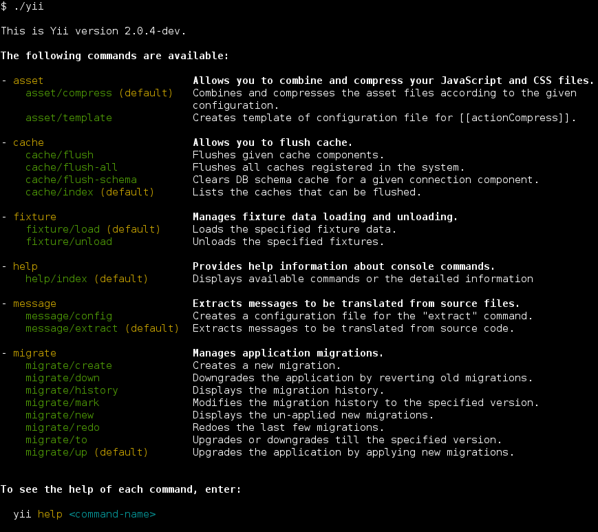

控制台命令
==========

除了用于构建 Web 应用程序的丰富功能，Yii 中也有一个拥有丰富功能的控制台，
它们主要用于创建网站后台处理的任务。

控制台应用程序的结构非常类似于 Yii 的一个 Web 应用程序。
它由一个或多个 [[yii\console\Controller]] 类组成，它们在控制台环境下通常被称为“命令”。
每个控制器还可以有一个或多个动作，就像 web 控制器。

两个项目模板（基础模版和高级模版）都有自己的控制台应用程序。
你可以通过运行 `yii` 脚本，在位于仓库的基本目录中运行它。
当你不带任何参数来运行它时，会给你一些可用的命令列表：



正如你在截图中看到，Yii 中已经定义了一组默认情况下可用的命令：

- [[yii\console\controllers\AssetController|AssetController]] - 允许合并和压缩你的 JavaScript 和 CSS 文件。
  在 [资源 - 使用 asset 命令](structure-assets.md#using-the-asset-command) 一节可获取更多信息。
- [[yii\console\controllers\CacheController|CacheController]] - 清除应用程序缓存。
- [[yii\console\controllers\FixtureController|FixtureController]] - 管理用于单元测试 fixture 的加载和卸载。
  这个命令的更多细节在 [Testing Section about Fixtures](test-fixtures.md#managing-fixtures).
- [[yii\console\controllers\HelpController|HelpController]] - 提供有关控制台命令的帮助信息，
  这是默认的命令并会打印上面截图所示的输出。
- [[yii\console\controllers\MessageController|MessageController]] - 从源文件提取翻译信息。
  要了解更多关于这个命令的用法，请参阅 [I18N 章节](tutorial-i18n.md#message-command).
- [[yii\console\controllers\MigrateController|MigrateController]] - 管理应用程序数据库迁移。
  在 [数据库迁移章节](db-migrations.md) 可获取更多信息。
- [[yii\console\controllers\ServeController|ServeController]] - Allows you run PHP built-in web server.


用法 <span id="usage"></span>
-----

你可以使用以下语法来执行控制台控制器动作：

```
yii <route> [--option1=value1 --option2=value2 ... argument1 argument2 ...]
```

以上，`<route>` 指的是控制器动作的路由。选项将填充类属性，
参数是动作方法的参数。

例如，将 [[yii\console\controllers\MigrateController::actionUp()|MigrateController::actionUp()]]
限制 5 个数据库迁移并将 [[yii\console\controllers\MigrateController::$migrationTable|MigrateController::$migrationTable]] 
设置为 `migrations` 应该这样调用：

```
yii migrate/up 5 --migrationTable=migrations
```

> Note: 当在控制台使用 `*` 时, 不要忘记像 `"*"` 一样用引号来引起来，
> 为了防止在 shell 中执行命令时被当成当前目录下的所有文件名。


入口脚本 <span id="entry-script"></span>
-------

控制台应用程序的入口脚本相当于用于 Web 应用程序的 `index.php` 入口文件。
控制台入口脚本通常被称为 `yii`，位于应用程序的根目录。
它包含了类似下面的代码：

```php
#!/usr/bin/env php
<?php
/**
 * Yii console bootstrap file.
 */

defined('YII_DEBUG') or define('YII_DEBUG', true);
defined('YII_ENV') or define('YII_ENV', 'dev');

require(__DIR__ . '/vendor/autoload.php');
require(__DIR__ . '/vendor/yiisoft/yii2/Yii.php');

$config = require(__DIR__ . '/config/console.php');

$application = new yii\console\Application($config);
$exitCode = $application->run();
exit($exitCode);
```

该脚本将被创建为你应用程序中的一部分；你可以根据你的需求来修改它。
如果你不需要记录错误信息或者希望提高整体性能，`YII_DEBUG` 常数应定义为 `false`。
在基本的和高级的两个应用程序模板中，控制台应用程序的入口脚本在默认情况下会启用调试模式，以提供给开发者更好的环境。


配置 <span id="configuration"></span>
-----

在上面的代码中可以看到，控制台应用程序使用它自己的配置文件，名为 `console.php` 。在该文件里你可以给控制台配置各种
[应用组件](structure-application-components.md) 和属性。

如果你的 web 应用程序和控制台应用程序共享大量的配置参数和值，
你可以考虑把这些值放在一个单独的文件中，该文件中包括（ web 和控制台）应用程序配置。
你可以在“高级”项目模板中看到一个例子。

> Tip: 有时，你可能需要使用一个与在入口脚本中指定的应用程序配置不同的控制台命令。
> 例如，你可能想使用 `yii migrate`
> 命令来升级你的测试数据库，它被配置在每个测试套件。
> 要动态地更改配置，只需指定一个自定义应用程序的配置文件，
> 通过 `appconfig`选项来执行命令：
> 
> ```
> yii <route> --appconfig=path/to/config.php ...
> ```


控制台命令完成 <span id="console-command-completion"></span>
------------

自动完成命令参数在使用 shell 时非常有用。 
从版本 2.0.11 开始，`./yii` 命令为 Bash 和 ZSH 提供了自动完成功能。

### Bash 完成

确保安装完毕。对于大多数安装，它默认是可用的。

放置完成脚本在 `/etc/bash_completion.d/`：

     curl -L https://raw.githubusercontent.com/yiisoft/yii2/master/contrib/completion/bash/yii -o /etc/bash_completion.d/yii

对于临时使用，您可以将文件放入当前目录，并通过 `source yii` 将其包含在当前会话中。
如果全局安装，您可能需要重新启动终端或`source ~/.bashrc` 来激活它。

查看 [Bash 手册](https://www.gnu.org/software/bash/manual/html_node/Programmable-Completion.html) 
了解将完成脚本添加到您的环境的其他方法。

### ZSH 完成

将完成脚本放入完成目录中，例如使用 `~/.zsh/completion/`

```
mkdir -p ~/.zsh/completion
curl -L https://raw.githubusercontent.com/yiisoft/yii2/master/contrib/completion/zsh/_yii -o ~/.zsh/completion/_yii
```

将目录包含在 `$fpath` 中，例如，通过将其添加到 `~/.zshrc` 中

```
fpath=(~/.zsh/completion $fpath)
```

确保 `compinit` 被加载或通过在 `~/.zshrc` 中加入完成

```
autoload -Uz compinit && compinit -i
```

然后重新加载您的 shell

```
exec $SHELL -l
```

创建你自己的控制台命令 <span id="create-command"></span>
------------------

### 控制台的控制器和行为

一个控制台命令继承自 [[yii\console\Controller]] 控制器类。
在控制器类中，定义一个或多个与控制器的子命令相对应的动作。在每一个动作中，编写你的代码实现特定的子命令的适当的任务。

当你运行一个命令时，你需要指定一个控制器的路由。
例如，路由 `migrate/create` 调用子命令对应的[[yii\console\controllers\MigrateController::actionCreate()|MigrateController::actionCreate()]] 动作方法。
如果在执行过程中提供的路由不包含路由 ID ，
将执行默认动作（如 web 控制器）。

### 选项

通过覆盖在 [[yii\console\Controller::options()]] 中的方法，
你可以指定可用于控制台命令（controller/actionID）选项。这个方法应该返回控制器类的公共属性的列表。
当运行一个命令，你可以指定使用语法 `--OptionName=OptionValue` 选项的值。
这将分配 `OptionValue` 到控制器类的 `OptionName` 属性。

如果选项的默认值是数组类型，并且在运行该命令时设置了该选项，
通过在任何逗号分割输入字符串将选项值转换为数组。

### 选项别名

从版本 2.0.8 起控制台命令提供 [[yii\console\Controller::optionAliases()]]
方法来为选项添加别名。

要定义别名，请在控制器中覆盖 [[yii\console\Controller::optionAliases()]]，例如：

```php
namespace app\commands;

use yii\console\Controller;

class HelloController extends Controller
{
    public $message;
    
    public function options()
    {
        return ['message'];
    }
    
    public function optionAliases()
    {
        return ['m' => 'message'];
    }
    
    public function actionIndex()
    {
        echo $message . "\n";
    }
}
```

现在，您可以使用以下语法来运行该命令：

```
./yii hello -m=hello
```

### 参数

除了选项，命令还可以接收参数。参数将传递给请求的子命令对应的动作方法。
第一个参数对应第一个参数，第二个参数对应第二个参数，依次类推。
命令被调用时，如果没有足够的参数，如果有定义默认值的情况下，则相应的参数将采取默认声明的值；
如果没有设置默认值，并且在运行时没有提供任何值，该命令将以一个错误退出。

你可以使用 `array` 类型提示来指示一个参数应该被视为一个数组。
该数组通过拆分输入字符串的逗号来生成。

下面的示例演示如何声明参数：

```php
class ExampleController extends \yii\console\Controller
{
    // 命令 "yii example/create test" 会调用 "actionCreate('test')"
    public function actionCreate($name) { ... }

    // 命令 "yii example/index city" 会调用 "actionIndex('city', 'name')"
    // 命令 "yii example/index city id" 会调用 "actionIndex('city', 'id')"
    public function actionIndex($category, $order = 'name') { ... }

    // 命令 "yii example/add test" 会调用 "actionAdd(['test'])"
    // 命令 "yii example/add test1,test2" 会调用 "actionAdd(['test1', 'test2'])"
    public function actionAdd(array $name) { ... }
}
```


### 退出代码

使用退出代码是控制台应用程序开发的最佳做法。通常，执行成功的命令会返回 `0`。
如果命令返回一个非零数字，会认为出现错误。
该返回的数字作为出错代码，用以了解错误的详细信息。例如 `1` 可能代表一个未知的错误，
所有的代码都将保留在特定的情况下：输入错误，丢失的文件等等。

要让控制台命令返回一个退出代码，
只需在控制器动作方法中返回一个整数：

```php
public function actionIndex()
{
    if (/* some problem */) {
        echo "A problem occured!\n";
        return 1;
    }
    // do something
    return 0;
}
```

有一些预定义的常量可以使用。在类 [[yii\console\ExitCode]] 中被定义：

```php
public function actionIndex()
{
    if (/* some problem */) {
        echo "A problem occurred!\n";
        return ExitCode::UNSPECIFIED_ERROR;
    }
    // do something
    return ExitCode::OK;
}
```

为控制器定义有意义的常量，以防有更多的错误代码类型，这会是一个很好的实践。

### 格式和颜色

Yii 支持格式化输出，
如果终端运行命令不支持的话则会自动退化为非格式化输出。

要输出格式的字符串很简单。以下展示了如何输出一些加粗的文字：

```php
$this->stdout("Hello?\n", Console::BOLD);
```

如果你需要建立字符串动态结合的多种样式，最好使用 `ansiFormat` ：

```php
$name = $this->ansiFormat('Alex', Console::FG_YELLOW);
echo "Hello, my name is $name.";
```

### 表格

从版本 2.0.13 开始，有一个小部件允许您在控制台中格式化表数据。使用方法如下：

```php
echo Table::widget([
    'headers' => ['Project', 'Status', 'Participant'],
    'rows' => [
        ['Yii', 'OK', '@samdark'],
        ['Yii', 'OK', '@cebe'],
    ],
]);
```

有关详细信息，请参阅 [[yii\console\widgets\Table|API documentation]].
