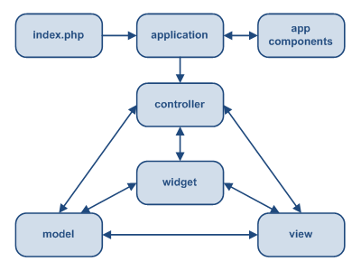
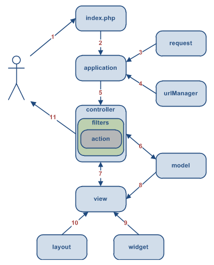

MVC Overview
============

Yii implements the model-view-controller (MVC) design pattern, which is
widely adopted in Web and other application programming. MVC aims to separate business logic from
user interface considerations, allowing developers to more easily change one component of an application without affecting, or even touching, another.

In MVC, the *model* represents both the
information (the data) and the business rules to which the data must adhere. The *view* contains elements
of the user interface, such as text, images, and form elements. The *controller* manages
the communication between the model and the view, acting as an agent that handles actions and requests.

Besides implementing the MVC design pattern, Yii also introduces a *front-controller*, called
*application*. The front-controller encapsulates the *execution context* for the processing of a request. This means that the front-controller collects information about a user request, and
then dispatches it to an appropriate controller for the actual handling of that request. In other words, the front-controller is the primary application manager, handling all requests and delegating action accordingly.

The following diagram shows the static structure of a Yii application:

A Typical Workflow
------------------

The following diagram shows a typical workflow of a Yii application  handling a user request:

1. A user makes a request of the URL `http://www.example.com/index.php?r=post/show&id=1`.
   The Web server handles the request by executing the bootstrap script `index.php`.
2. The bootstrap script creates an [[yii\web\Application|Application]] instance and runs it.
3. The Application instance obtains the detailed user request information from an application component named `request`.
4. The application determines which [controller](controller.md) and which action of that controller was requested.
   This is accomplished with the help of an application component named `urlManager`.
   For this example, the controller is `post`, which refers to the `PostController` class, and the action is `show`,
   whose actual meaning is determined by the controller.
5. The application creates an instance of the requested controller to further handle the user's request.
   The controller determines that the action `show` refers to a method named `actionShow` in the controller class.
   The controller then creates and executes any filters associated with this action (e.g. access control or benchmarking).
   The action is then executed, if execution is allowed by the filters (e.g., if the user has permission to execute that action).
6. The action creates a `Post` [model](model.md) instance, using the underlying database table, where the ID value of the corresponding record is `1`.
7. The action renders a [view](view.md) named `show`, providing to the view the `Post` model instance.
8. The view reads the attributes of the `Post` model instance and displays the values of those attributes.
9. The view executes some [widgets](view.md#widgets).
10. The view rendering result--the output from the previous steps--is embedded within a [layout](view.md#layout) to create a complete HTML page.
11. The action completes the view rendering and displays the result to the user.