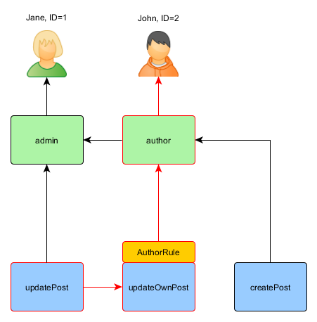
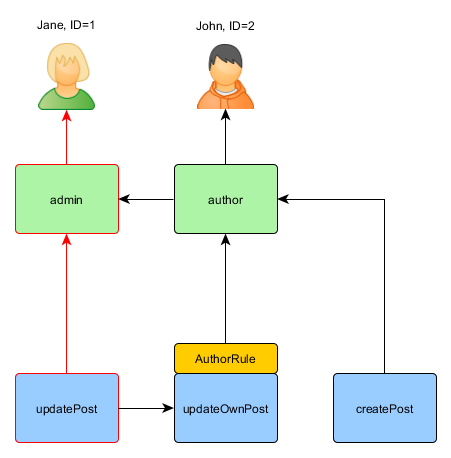

Authorization
=============

Authorization is the process of verifying that a user has enough permission to do something. Yii provides two authorization
methods: Access Control Filter (ACF) and Role-Based Access Control (RBAC).


## Access Control Filter <span id="access-control-filter"></span>

Access Control Filter (ACF) is a simple authorization method implemented as [[yii\filters\AccessControl]] which
is best used by applications that only need some simple access control. As its name indicates, ACF is 
an action [filter](structure-filters.md) that can be used in a controller or a module. While a user is requesting
to execute an action, ACF will check a list of [[yii\filters\AccessControl::rules|access rules]] 
to determine if the user is allowed to access the requested action.

The code below shows how to use ACF in the `site` controller:

```php
use yii\web\Controller;
use yii\filters\AccessControl;

class SiteController extends Controller
{
    public function behaviors()
    {
        return [
            'access' => [
                'class' => AccessControl::className(),
                'only' => ['login', 'logout', 'signup'],
                'rules' => [
                    [
                        'allow' => true,
                        'actions' => ['login', 'signup'],
                        'roles' => ['?'],
                    ],
                    [
                        'allow' => true,
                        'actions' => ['logout'],
                        'roles' => ['@'],
                    ],
                ],
            ],
        ];
    }
    // ...
}
```

In the code above ACF is attached to the `site` controller as a behavior. This is the typical way of using an action
filter. The `only` option specifies that the ACF should only be applied to the `login`, `logout` and `signup` actions.
All other actions in the `site` controller are not subject to the access control. The `rules` option lists 
the [[yii\filters\AccessRule|access rules]], which reads as follows:

- Allow all guest (not yet authenticated) users to access the `login` and `signup` actions. The `roles` option
  contains a question mark `?` which is a special token representing "guest users".
- Allow authenticated users to access the `logout` action. The `@` character is another special token representing
  "authenticated users".

ACF performs the authorization check by examining the access rules one by one from top to bottom until it finds
a rule that matches the current execution context. The `allow` value of the matching rule will then be used to 
judge if the user is authorized or not. If none of the rules matches, it means the user is NOT authorized,
and ACF will stop further action execution.

When ACF determines a user is not authorized to access the current action, it takes the following measure by default:

* If the user is a guest, it will call [[yii\web\User::loginRequired()]] to redirect the user browser to the login page.
* If the user is already authenticated, it will throw a [[yii\web\ForbiddenHttpException]].

You may customize this behavior by configuring the [[yii\filters\AccessControl::denyCallback]] property like the following:

```php
[
    'class' => AccessControl::className(),
    ...
    'denyCallback' => function ($rule, $action) {
        throw new \Exception('You are not allowed to access this page');
    }
]
```

[[yii\filters\AccessRule|Access rules]] support many options. Below is a summary of the supported options.
You may also extend [[yii\filters\AccessRule]] to create your own customized access rule classes.

 * [[yii\filters\AccessRule::allow|allow]]: specifies whether this is an "allow" or "deny" rule.

 * [[yii\filters\AccessRule::actions|actions]]: specifies which actions this rule matches. This should
be an array of action IDs. The comparison is case-sensitive. If this option is empty or not set,
it means the rule applies to all actions.

 * [[yii\filters\AccessRule::controllers|controllers]]: specifies which controllers this rule
matches. This should be an array of controller IDs. The comparison is case-sensitive. If this option is
empty or not set, it means the rule applies to all controllers.

 * [[yii\filters\AccessRule::roles|roles]]: specifies which user roles that this rule matches.
   Two special roles are recognized, and they are checked via [[yii\web\User::isGuest]]:

     - `?`: matches a guest user (not authenticated yet)
     - `@`: matches an authenticated user

   Using other role names will trigger the invocation of [[yii\web\User::can()]], which requires enabling RBAC 
   (to be described in the next subsection). If this option is empty or not set, it means this rule applies to all roles.

 * [[yii\filters\AccessRule::ips|ips]]: specifies which [[yii\web\Request::userIP|client IP addresses]] this rule matches.
An IP address can contain the wildcard `*` at the end so that it matches IP addresses with the same prefix.
For example, '192.168.*' matches all IP addresses in the segment '192.168.'. If this option is empty or not set,
it means this rule applies to all IP addresses.

 * [[yii\filters\AccessRule::verbs|verbs]]: specifies which request method (e.g. `GET`, `POST`) this rule matches.
The comparison is case-insensitive.

 * [[yii\filters\AccessRule::matchCallback|matchCallback]]: specifies a PHP callable that should be called to determine
if this rule should be applied.

 * [[yii\filters\AccessRule::denyCallback|denyCallback]]: specifies a PHP callable that should be called when this rule
will deny the access.

Below is an example showing how to make use of the `matchCallback` option, which allows you to write arbitrary access
check logic:

```php
use yii\filters\AccessControl;

class SiteController extends Controller
{
    public function behaviors()
    {
        return [
            'access' => [
                'class' => AccessControl::className(),
                'only' => ['special-callback'],
                'rules' => [
                    [
                        'actions' => ['special-callback'],
                        'allow' => true,
                        'matchCallback' => function ($rule, $action) {
                            return date('d-m') === '31-10';
                        }
                    ],
                ],
            ],
        ];
    }

    // Match callback called! This page can be accessed only each October 31st
    public function actionSpecialCallback()
    {
        return $this->render('happy-halloween');
    }
}
```


## Role Based Access Control (RBAC) <span id="rbac"></span>

Role-Based Access Control (RBAC) provides a simple yet powerful centralized access control. Please refer to
the [Wikipedia](http://en.wikipedia.org/wiki/Role-based_access_control) for details about comparing RBAC
with other more traditional access control schemes.

Yii implements a General Hierarchical RBAC, following the [NIST RBAC model](http://csrc.nist.gov/rbac/sandhu-ferraiolo-kuhn-00.pdf).
It provides the RBAC functionality through the [[yii\rbac\ManagerInterface|authManager]] [application component](structure-application-components.md).

Using RBAC involves two parts of work. The first part is to build up the RBAC authorization data, and the second
part is to use the authorization data to perform access check in places where it is needed.

To facilitate our description next, we will first introduce some basic RBAC concepts.


### Basic Concepts <span id="basic-concepts"></span>

A role represents a collection of *permissions* (e.g. creating posts, updating posts). A role may be assigned
to one or multiple users. To check if a user has a specified permission, we may check if the user is assigned
with a role that contains that permission.

Associated with each role or permission, there may be a *rule*. A rule represents a piece of code that will be
executed during access check to determine if the corresponding role or permission applies to the current user.
For example, the "update post" permission may have a rule that checks if the current user is the post creator.
During access checking, if the user is NOT the post creator, he/she will be considered not having the "update post" permission.

Both roles and permissions can be organized in a hierarchy. In particular, a role may consist of other roles or permissions;
and a permission may consist of other permissions. Yii implements a *partial order* hierarchy which includes the
more special *tree* hierarchy. While a role can contain a permission, it is not true vice versa.


### Configuring RBAC <span id="configuring-rbac"></span>

Before we set off to define authorization data and perform access checking, we need to configure the
[[yii\base\Application::authManager|authManager]] application component. Yii provides two types of authorization managers:
[[yii\rbac\PhpManager]] and [[yii\rbac\DbManager]]. The former uses a PHP script file to store authorization
data, while the latter stores authorization data in a database. You may consider using the former if your application
does not require very dynamic role and permission management.


#### Using `PhpManager` <span id="using-php-manager"></span>

The following code shows how to configure the `authManager` in the application configuration using the [[yii\rbac\PhpManager]] class:

```php
return [
    // ...
    'components' => [
        'authManager' => [
            'class' => 'yii\rbac\PhpManager',
        ],
        // ...
    ],
];
```

The `authManager` can now be accessed via `\Yii::$app->authManager`.

By default, [[yii\rbac\PhpManager]] stores RBAC data in files under `@app/rbac` directory. Make sure the directory
and all the files in it are writable by the Web server process if permissions hierarchy needs to be changed online.


#### Using `DbManager` <span id="using-db-manager"></span>

The following code shows how to configure the `authManager` in the application configuration using the [[yii\rbac\DbManager]] class:

```php
return [
    // ...
    'components' => [
        'authManager' => [
            'class' => 'yii\rbac\DbManager',
        ],
        // ...
    ],
];
```

`DbManager` uses four database tables to store its data: 

- [[yii\rbac\DbManager::$itemTable|itemTable]]: the table for storing authorization items. Defaults to "auth_item".
- [[yii\rbac\DbManager::$itemChildTable|itemChildTable]]: the table for storing authorization item hierarchy. Defaults to "auth_item_child".
- [[yii\rbac\DbManager::$assignmentTable|assignmentTable]]: the table for storing authorization item assignments. Defaults to "auth_assignment".
- [[yii\rbac\DbManager::$ruleTable|ruleTable]]: the table for storing rules. Defaults to "auth_rule".

Before you can go on you need to create those tables in the database. To do this, you can use the migration stored in `@yii/rbac/migrations`:

`yii migrate --migrationPath=@yii/rbac/migrations`

The `authManager` can now be accessed via `\Yii::$app->authManager`.


### Building Authorization Data <span id="generating-rbac-data"></span>

Building authorization data is all about the following tasks:

- defining roles and permissions;
- establishing relations among roles and permissions;
- defining rules;
- associating rules with roles and permissions;
- assigning roles to users.

Depending on authorization flexibility requirements the tasks above could be done in different ways.

If your permissions hierarchy doesn't change at all and you have a fixed number of users you can create a
[console command](tutorial-console.md#create-command) that will initialize authorization data once via APIs offered by `authManager`:

```php
<?php
namespace app\commands;

use Yii;
use yii\console\Controller;

class RbacController extends Controller
{
    public function actionInit()
    {
        $auth = Yii::$app->authManager;

        // add "createPost" permission
        $createPost = $auth->createPermission('createPost');
        $createPost->description = 'Create a post';
        $auth->add($createPost);

        // add "updatePost" permission
        $updatePost = $auth->createPermission('updatePost');
        $updatePost->description = 'Update post';
        $auth->add($updatePost);

        // add "author" role and give this role the "createPost" permission
        $author = $auth->createRole('author');
        $auth->add($author);
        $auth->addChild($author, $createPost);

        // add "admin" role and give this role the "updatePost" permission
        // as well as the permissions of the "author" role
        $admin = $auth->createRole('admin');
        $auth->add($admin);
        $auth->addChild($admin, $updatePost);
        $auth->addChild($admin, $author);

        // Assign roles to users. 1 and 2 are IDs returned by IdentityInterface::getId()
        // usually implemented in your User model.
        $auth->assign($author, 2);
        $auth->assign($admin, 1);
    }
}
```

After executing the command with `yii rbac/init` we'll get the following hierarchy:


Author can create post, admin can update post and do everything author can.

If your application allows user signup you need to assign roles to these new users once. For example, in order for all
signed up users to become authors in your advanced project template you need to modify `frontend\models\SignupForm::signup()`
as follows:

```php
public function signup()
{
    if ($this->validate()) {
        $user = new User();
        $user->username = $this->username;
        $user->email = $this->email;
        $user->setPassword($this->password);
        $user->generateAuthKey();
        $user->save(false);

        // the following three lines were added:
        $auth = Yii::$app->authManager;
        $authorRole = $auth->getRole('author');
        $auth->assign($authorRole, $user->getId());

        return $user;
    }

    return null;
}
```

For applications that require complex access control with dynamically updated authorization data, special user interfaces
(i.e. admin panel) may need to be developed using APIs offered by `authManager`.


### Using Rules <span id="using-rules"></span>

As aforementioned, rules add additional constraint to roles and permissions. A rule is a class extending
from [[yii\rbac\Rule]]. It must implement the [[yii\rbac\Rule::execute()|execute()]] method. In the hierarchy we've
created previously author cannot edit his own post. Let's fix it. First we need a rule to verify that the user is the post author:

```php
namespace app\rbac;

use yii\rbac\Rule;

/**
 * Checks if authorID matches user passed via params
 */
class AuthorRule extends Rule
{
    public $name = 'isAuthor';

    /**
     * @param string|integer $user the user ID.
     * @param Item $item the role or permission that this rule is associated with
     * @param array $params parameters passed to ManagerInterface::checkAccess().
     * @return boolean a value indicating whether the rule permits the role or permission it is associated with.
     */
    public function execute($user, $item, $params)
    {
        return isset($params['post']) ? $params['post']->createdBy == $user : false;
    }
}
```

The rule above checks if the `post` is created by `$user`. We'll create a special permission `updateOwnPost` in the
command we've used previously:

```php
$auth = Yii::$app->authManager;

// add the rule
$rule = new \app\rbac\AuthorRule;
$auth->add($rule);

// add the "updateOwnPost" permission and associate the rule with it.
$updateOwnPost = $auth->createPermission('updateOwnPost');
$updateOwnPost->description = 'Update own post';
$updateOwnPost->ruleName = $rule->name;
$auth->add($updateOwnPost);

// "updateOwnPost" will be used from "updatePost"
$auth->addChild($updateOwnPost, $updatePost);

// allow "author" to update their own posts
$auth->addChild($author, $updateOwnPost);
```

Now we have got the following hierarchy:


### Access Check <span id="access-check"></span>

With the authorization data ready, access check is as simple as a call to the [[yii\rbac\ManagerInterface::checkAccess()]]
method. Because most access check is about the current user, for convenience Yii provides a shortcut method
[[yii\web\User::can()]], which can be used like the following:

```php
if (\Yii::$app->user->can('createPost')) {
    // create post
}
```

If the current user is Jane with `ID=1` we are starting at `createPost` and trying to get to `Jane`:


In order to check if a user can update a post, we need to pass an extra parameter that is required by `AuthorRule` described before:

```php
if (\Yii::$app->user->can('updatePost', ['post' => $post])) {
    // update post
}
```

Here is what happens if the current user is John:




We are starting with the `updatePost` and going through `updateOwnPost`. In order to pass the access check, `AuthorRule` 
should return `true` from its `execute()` method. The method receives its `$params` from the `can()` method call so the value is
`['post' => $post]`. If everything is fine, we will get to `author` which is assigned to John.

In case of Jane it is a bit simpler since she is an admin:




### Using Default Roles <span id="using-default-roles"></span>

A default role is a role that is *implicitly* assigned to *all* users. The call to [[yii\rbac\ManagerInterface::assign()]]
is not needed, and the authorization data does not contain its assignment information.

A default role is usually associated with a rule which determines if the role applies to the user being checked.

Default roles are often used in applications which already have some sort of role assignment. For example, an application
may have a "group" column in its user table to represent which privilege group each user belongs to.
If each privilege group can be mapped to a RBAC role, you can use the default role feature to automatically
assign each user to a RBAC role. Let's use an example to show how this can be done.

Assume in the user table, you have a `group` column which uses 1 to represent the administrator group and 2 the author group.
You plan to have two RBAC roles `admin` and `author` to represent the permissions for these two groups, respectively.
You can set up the RBAC data as follows,


```php
namespace app\rbac;

use Yii;
use yii\rbac\Rule;

/**
 * Checks if user group matches
 */
class UserGroupRule extends Rule
{
    public $name = 'userGroup';

    public function execute($user, $item, $params)
    {
        if (!Yii::$app->user->isGuest) {
            $group = Yii::$app->user->identity->group;
            if ($item->name === 'admin') {
                return $group == 1;
            } elseif ($item->name === 'author') {
                return $group == 1 || $group == 2;
            }
        }
        return false;
    }
}

$auth = Yii::$app->authManager;

$rule = new \app\rbac\UserGroupRule;
$auth->add($rule);

$author = $auth->createRole('author');
$author->ruleName = $rule->name;
$auth->add($author);
// ... add permissions as children of $author ...

$admin = $auth->createRole('admin');
$admin->ruleName = $rule->name;
$auth->add($admin);
$auth->addChild($admin, $author);
// ... add permissions as children of $admin ...
```

Note that in the above, because "author" is added as a child of "admin", when you implement the `execute()` method
of the rule class, you need to respect this hierarchy as well. That is why when the role name is "author",
the `execute()` method will return true if the user group is either 1 or 2 (meaning the user is in either "admin"
group or "author" group).

Next, configure `authManager` by listing the two roles in [[yii\rbac\BaseManager::$defaultRoles]]:

```php
return [
    // ...
    'components' => [
        'authManager' => [
            'class' => 'yii\rbac\PhpManager',
            'defaultRoles' => ['admin', 'author'],
        ],
        // ...
    ],
];
```

Now if you perform an access check, both of the `admin` and `author` roles will be checked by evaluating
the rules associated with them. If the rule returns true, it means the role applies to the current user.
Based on the above rule implementation, this means if the `group` value of a user is 1, the `admin` role
would apply to the user; and if the `group` value is 2, the `author` role would apply.
