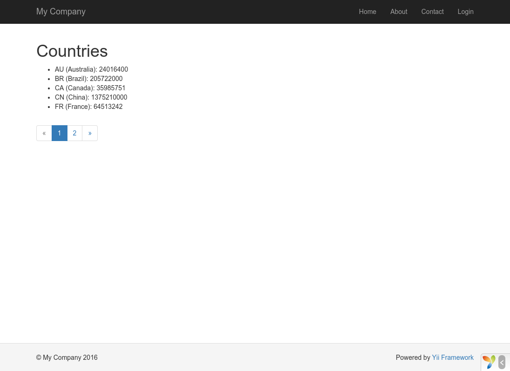

Working with Databases
======================

This section will describe how to create a new page that displays country data fetched from
a database table named `country`. To achieve this goal, you will configure a database connection,
create an [Active Record](db-active-record.md) class, define an [action](structure-controllers.md),
and create a [view](structure-views.md).

Through this tutorial, you will learn how to:

* configure a DB connection,
* define an Active Record class,
* query data using the Active Record class,
* display data in a view in a paginated fashion.

Note that in order to finish this section, you should have basic knowledge and experience using databases.
In particular, you should know how to create a database, and how to execute SQL statements using a DB client tool.


Preparing the Database <span id="preparing-database"></span>
----------------------

To begin, create a database named `yii2basic`, from which you will fetch data in your application.
You may create an SQLite, MySQL, PostgreSQL, MSSQL or Oracle database, as Yii has built-in support for many database applications. For simplicity, MySQL will be assumed in the following description.

Next, create a table named `country` in the database, and insert some sample data. You may run the following SQL statements to do so:

```sql
CREATE TABLE `country` (
  `code` CHAR(2) NOT NULL PRIMARY KEY,
  `name` CHAR(52) NOT NULL,
  `population` INT(11) NOT NULL DEFAULT '0'
) ENGINE=InnoDB DEFAULT CHARSET=utf8;

INSERT INTO `country` VALUES ('AU','Australia',18886000);
INSERT INTO `country` VALUES ('BR','Brazil',170115000);
INSERT INTO `country` VALUES ('CA','Canada',1147000);
INSERT INTO `country` VALUES ('CN','China',1277558000);
INSERT INTO `country` VALUES ('DE','Germany',82164700);
INSERT INTO `country` VALUES ('FR','France',59225700);
INSERT INTO `country` VALUES ('GB','United Kingdom',59623400);
INSERT INTO `country` VALUES ('IN','India',1013662000);
INSERT INTO `country` VALUES ('RU','Russia',146934000);
INSERT INTO `country` VALUES ('US','United States',278357000);
```

At this point, you have a database named `yii2basic`, and within it a `country` table with three columns, containing ten rows of data.

Configuring a DB Connection <span id="configuring-db-connection"></span>
---------------------------

Before proceeding, make sure you have installed both the [PDO](http://www.php.net/manual/en/book.pdo.php) PHP extension and
the PDO driver for the database you are using (e.g. `pdo_mysql` for MySQL). This is a basic requirement
if your application uses a relational database.

With those installed, open the file `config/db.php` and change the parameters to be correct for your database. By default,
the file contains the following:

```php
<?php

return [
    'class' => 'yii\db\Connection',
    'dsn' => 'mysql:host=localhost;dbname=yii2basic',
    'username' => 'root',
    'password' => '',
    'charset' => 'utf8',
];
```

The `config/db.php` file is a typical file-based [configuration](concept-configurations.md) tool. This particular configuration file specifies the parameters
needed to create and initialize a [[yii\db\Connection]] instance through which you can make SQL queries
against the underlying database.

The DB connection configured above can be accessed in the application code via the expression `Yii::$app->db`.

> Info: The `config/db.php` file will be included by the main application configuration `config/web.php`, 
  which specifies how the [application](structure-applications.md) instance should be initialized.
  For more information, please refer to the [Configurations](concept-configurations.md) section.


Creating an Active Record <span id="creating-active-record"></span>
-------------------------

To represent and fetch the data in the `country` table, create an [Active Record](db-active-record.md)-derived
class named `Country`, and save it in the file `models/Country.php`.

```php
<?php

namespace app\models;

use yii\db\ActiveRecord;

class Country extends ActiveRecord
{
}
```

The `Country` class extends from [[yii\db\ActiveRecord]]. You do not need to write any code inside of it! With just the above code, 
Yii will guess the associated table name from the class name. 

> Info: If no direct match can be made from the class name to the table name, you can
override the [[yii\db\ActiveRecord::tableName()]] method to explicitly specify the associated table name.

Using the `Country` class, you can easily manipulate data in the `country` table, as shown in these snippets:

```php
use app\models\Country;

// get all rows from the country table and order them by "name"
$countries = Country::find()->orderBy('name')->all();

// get the row whose primary key is "US"
$country = Country::findOne('US');

// displays "United States"
echo $country->name;

// modifies the country name to be "U.S.A." and save it to database
$country->name = 'U.S.A.';
$country->save();
```

> Info: Active Record is a powerful way to access and manipulate database data in an object-oriented fashion.
You may find more detailed information in the [Active Record](db-active-record.md) section. Alternatively, you may also interact with a database using a lower-level data accessing method called [Data Access Objects](db-dao.md).


Creating an Action <span id="creating-action"></span>
------------------

To expose the country data to end users, you need to create a new action. Instead of placing the new action in the `site`
controller, like you did in the previous sections, it makes more sense to create a new controller specifically
for all actions related to the country data. Name this new controller  `CountryController`, and create
an `index` action in it, as shown in the following.

```php
<?php

namespace app\controllers;

use yii\web\Controller;
use yii\data\Pagination;
use app\models\Country;

class CountryController extends Controller
{
    public function actionIndex()
    {
        $query = Country::find();

        $pagination = new Pagination([
            'defaultPageSize' => 5,
            'totalCount' => $query->count(),
        ]);

        $countries = $query->orderBy('name')
            ->offset($pagination->offset)
            ->limit($pagination->limit)
            ->all();

        return $this->render('index', [
            'countries' => $countries,
            'pagination' => $pagination,
        ]);
    }
}
```

Save the above code in the file `controllers/CountryController.php`.

The `index` action calls `Country::find()`. This Active Record method builds a DB query and retrieves all of the data from the `country` table.
To limit the number of countries returned in each request, the query is paginated with the help of a
[[yii\data\Pagination]] object. The `Pagination` object serves two purposes:

* Sets the `offset` and `limit` clauses for the SQL statement represented by the query so that it only
  returns a single page of data at a time (at most 5 rows in a page).
* It's used in the view to display a pager consisting of a list of page buttons, as will be explained in
  the next subsection.

At the end of the code, the `index` action renders a view named `index`, and passes the country data as well as the pagination
information to it.


Creating a View <span id="creating-view"></span>
---------------

Under the `views` directory, first create a sub-directory named `country`. This folder will be used to hold all the
views rendered by the `country` controller. Within the `views/country` directory, create a file named `index.php`
containing the following:

```php
<?php
use yii\helpers\Html;
use yii\widgets\LinkPager;
?>
<h1>Countries</h1>
<ul>
<?php foreach ($countries as $country): ?>
    <li>
        <?= Html::encode("{$country->name} ({$country->code})") ?>:
        <?= $country->population ?>
    </li>
<?php endforeach; ?>
</ul>

<?= LinkPager::widget(['pagination' => $pagination]) ?>
```

The view has two sections relative to displaying the country data. In the first part, the provided country data is traversed and rendered as an unordered HTML list.
In the second part, a [[yii\widgets\LinkPager]] widget is rendered using the pagination information passed from the action.
The `LinkPager` widget displays a list of page buttons. Clicking on any of them will refresh the country data
in the corresponding page.


Trying it Out <span id="trying-it-out"></span>
-------------

To see how all of the above code works, use your browser to access the following URL:

```
http://hostname/index.php?r=country/index
```



At first, you will see a page showing five countries. Below the countries, you will see a pager with four buttons.
If you click on the button "2", you will see the page display another five countries in the database: the second page of records.
Observe more carefully and you will find that the URL in the browser also changes to

```
http://hostname/index.php?r=country/index&page=2
```

Behind the scenes, [[yii\data\Pagination|Pagination]] is providing all of the necessary functionality to paginate a data set:

* Initially, [[yii\data\Pagination|Pagination]] represents the first page, which reflects the country SELECT query
  with the clause `LIMIT 5 OFFSET 0`. As a result, the first five countries will be fetched and displayed.
* The [[yii\widgets\LinkPager|LinkPager]] widget renders the page buttons using the URLs
  created by [[yii\data\Pagination::createUrl()|Pagination]]. The URLs will contain the query parameter `page`, which 
  represents the different page numbers.
* If you click the page button "2", a new request for the route `country/index` will be triggered and handled.
  [[yii\data\Pagination|Pagination]] reads the `page` query parameter from the URL and sets the current page number to 2.
  The new country query will thus have the clause `LIMIT 5 OFFSET 5` and return  the next five countries
  for display.


Summary <span id="summary"></span>
-------

In this section, you learned how to work with a database. You also learned how to fetch and display
data in pages with the help of [[yii\data\Pagination]] and [[yii\widgets\LinkPager]].

In the next section, you will learn how to use the powerful code generation tool, called [Gii](https://github.com/yiisoft/yii2-gii/blob/master/docs/guide/README.md),
to help you rapidly implement some commonly required features, such as the Create-Read-Update-Delete (CRUD)
operations for working with the data in a database table. As a matter of fact, the code you have just written can all
be automatically generated in Yii using the Gii tool.
