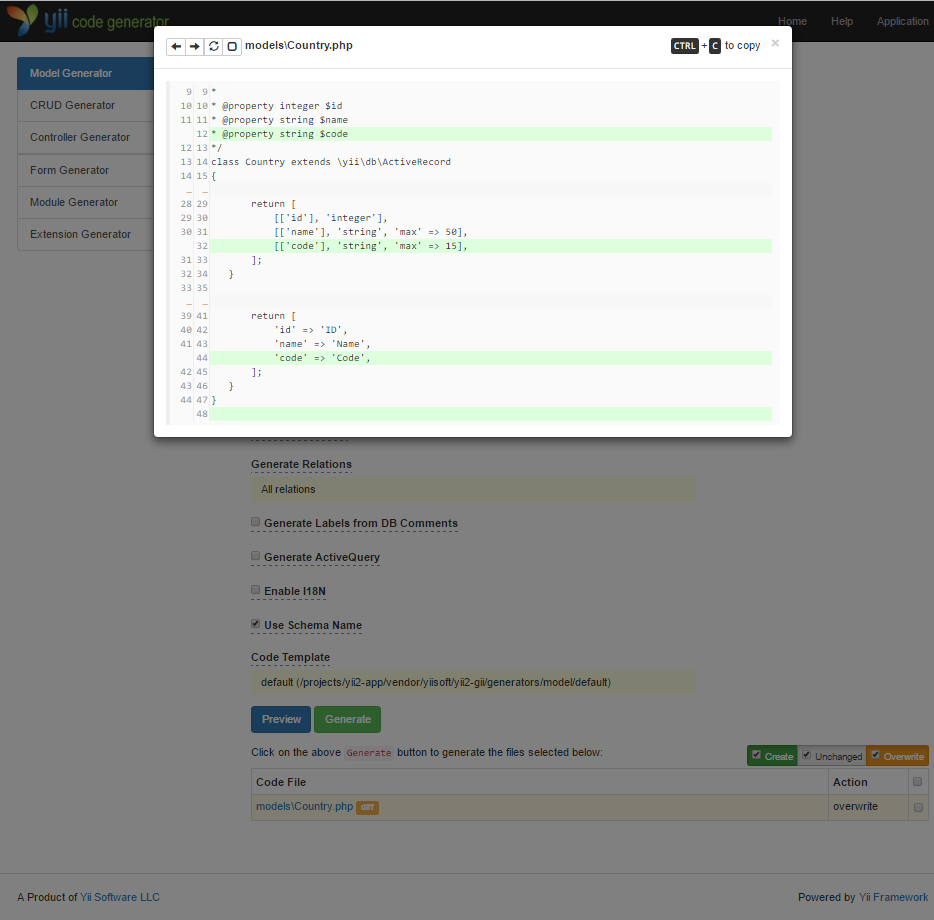
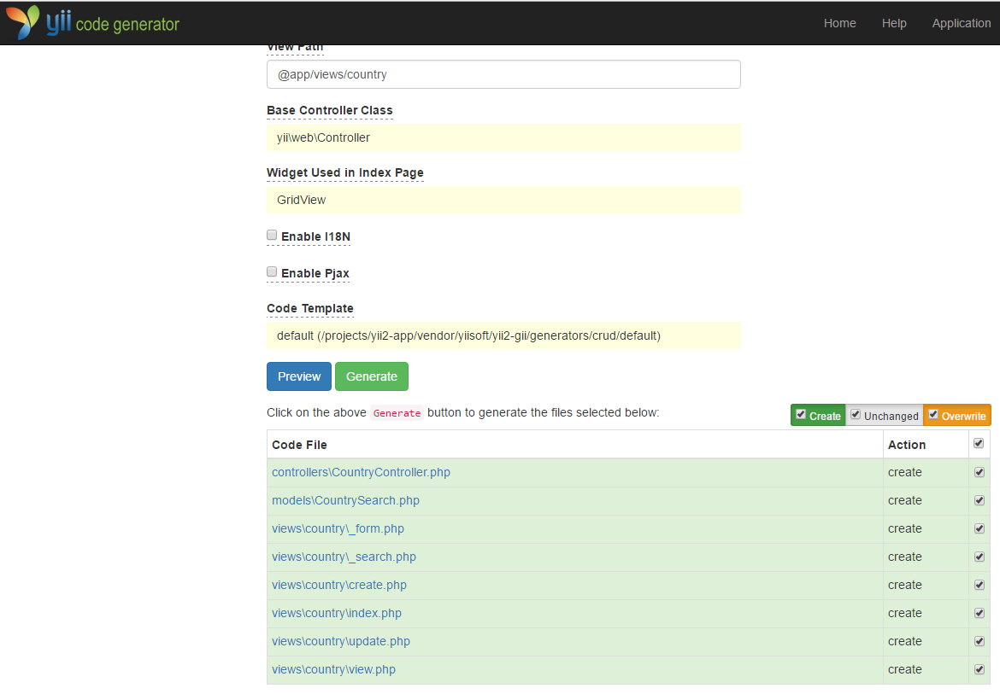

Generating Code with Gii
========================

This section will describe how to use [Gii](https://www.yiiframework.com/extension/yiisoft/yii2-gii/doc/guide) to automatically generate code
that implements some common Web site features. Using Gii to auto-generate code is simply a matter of entering the right information per the instructions shown on the Gii Web pages.

Through this tutorial, you will learn how to:

* enable Gii in your application,
* use Gii to generate an Active Record class,
* use Gii to generate the code implementing the CRUD operations for a DB table,
* customize the code generated by Gii.


Starting Gii <span id="starting-gii"></span>
------------

[Gii](https://www.yiiframework.com/extension/yiisoft/yii2-gii/doc/guide) is provided in Yii as a [module](structure-modules.md). You can enable Gii
by configuring it in the [[yii\base\Application::modules|modules]] property of the application. Depending upon how you created your application, you may find the following code is already provided in the `config/web.php` configuration file:

```php
$config = [ ... ];

if (YII_ENV_DEV) {
    $config['bootstrap'][] = 'gii';
    $config['modules']['gii'] = [
        '__class' => yii\gii\Module::class,
    ];
}
```

The above configuration states that when in [development environment](concept-configurations.md#environment-constants),
the application should include a module named `gii`, which is of class [[yii\gii\Module]].

If you check the [entry script](structure-entry-scripts.md) `web/index.php` of your application, you will
find the following line, which essentially makes `YII_ENV_DEV` to be `true`.

```php
defined('YII_ENV') or define('YII_ENV', 'dev');
```

Thanks to that line, your application is in development mode, and will have already enabled Gii, per the above configuration. You can now access Gii via the following URL:

```
http://hostname/index.php?r=gii
```

> Note: If you are accessing Gii from a machine other than localhost, the access will be denied by default
> for security purpose. You can configure Gii to add the allowed IP addresses as follows,
>
```php
'gii' => [
    '__class' => yii\gii\Module::class,
    'allowedIPs' => ['127.0.0.1', '::1', '192.168.0.*', '192.168.178.20'] // adjust this to your needs
],
```


Generating an Active Record Class <span id="generating-ar"></span>
---------------------------------

To use Gii to generate an Active Record class, select the "Model Generator" (by clicking the link on the Gii index page). Then fill out the form as follows:

* Table Name: `country`
* Model Class: `Country`


Next, click on the "Preview" button. You will see `models/Country.php` is listed in the resulting class file to be created. You may click on the name of the class file to preview its content.

When using Gii, if you have already created the same file and would be overwriting it, click
the `diff` button next to the file name to see the differences between the code to be generated
and the existing version.



When overwriting an existing file, check the box next to "overwrite" and then click  the "Generate" button. If creating a new file, you can just click "Generate". 

Next, you will see
a confirmation page indicating the code has been successfully generated. If you had an existing file, you'll also see a message indicating that it was overwritten with the newly generated code.


Generating CRUD Code <span id="generating-crud"></span>
--------------------

CRUD stands for Create, Read, Update, and Delete, representing the four common tasks taken with data on most Web sites. To create CRUD functionality using Gii, select the "CRUD Generator" (by clicking the link on the Gii index page). For the "country" example, fill out the resulting form as follows:

* Model Class: `app\models\Country`
* Search Model Class: `app\models\CountrySearch`
* Controller Class: `app\controllers\CountryController`


Next, click on the "Preview" button. You will see a list of files to be generated, as shown below.



If you previously created the `controllers/CountryController.php` and
`views/country/index.php` files (in the databases section of the guide), check the "overwrite" box to replace them. (The previous versions did not have full CRUD support.)


Trying it Out <span id="trying-it-out"></span>
-------------

To see how it works, use your browser to access the following URL:

```
http://hostname/index.php?r=country%2Findex
```

You will see a data grid showing the countries from the database table. You may sort the grid,
or filter it by entering filter conditions in the column headers.

For each country displayed in the grid, you may choose to view its details, update it, or delete it.
You may also click on the "Create Country" button on top of the grid to be provided with a form for creating a new country.


The following is the list of the files generated by Gii, in case you want to investigate how these features are implemented,
or to customize them:

* Controller: `controllers/CountryController.php`
* Models: `models/Country.php` and `models/CountrySearch.php`
* Views: `views/country/*.php`

> Info: Gii is designed to be a highly customizable and extensible code generation tool. Using it wisely
  can greatly accelerate your application development speed. For more details, please refer to
  the [Gii](https://www.yiiframework.com/extension/yiisoft/yii2-gii/doc/guide) section.


Summary <span id="summary"></span>
-------

In this section, you have learned how to use Gii to generate the code that implements complete
CRUD functionality for content stored in a database table.
