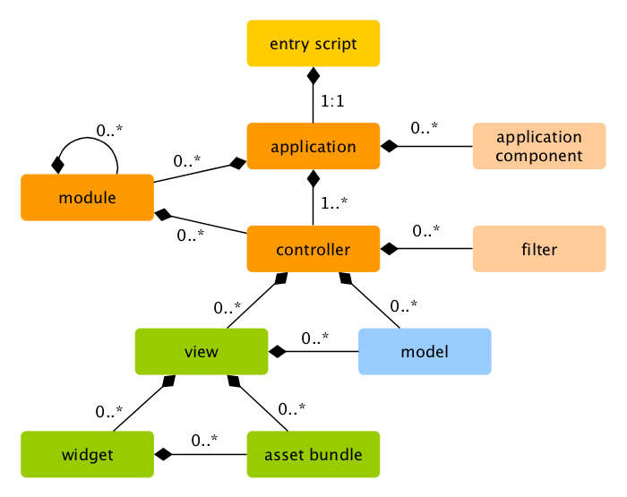

Running Applications
====================

After installing Yii, you have a working Yii application that can be accessed via
the URL `http://hostname/basic/web/index.php` or `http://hostname/index.php`, depending
upon your configuration. This section will introduce the application's built-in functionality,
how the code is organized, and how the application handles requests in general.

> Info: For simplicity, throughout this "Getting Started" tutorial, it's assumed that you have set `basic/web`
  as the document root of your Web server, and configured the URL for accessing
  your application to be `http://hostname/index.php` or something similar.
  For your needs, please adjust the URLs in our descriptions accordingly.
  
Note that unlike framework itself, after project template is installed it's all yours. You're free to add or delete
code and overall modify it as you need.


Functionality <span id="functionality"></span>
-------------

The basic application installed contains four pages:

* the homepage, displayed when you access the URL `http://hostname/index.php`,
* the "About" page,
* the "Contact" page, which displays a contact form that allows end users to contact you via email,
* and the "Login" page, which displays a login form that can be used to authenticate end users. Try logging in
  with "admin/admin", and you will find the "Login" main menu item will change to "Logout".

These pages share a common header and footer. The header contains a main menu bar to allow navigation
among different pages.

You should also see a toolbar at the bottom of the browser window.
This is a useful [debugger tool](https://github.com/yiisoft/yii2-debug/blob/master/docs/guide/README.md) provided by Yii to record and display a lot of debugging information, such as log messages, response statuses, the database queries run, and so on.

Additionally to the web application, there is a console script called `yii`, which is located in the applications base directory.
This script can be used to run background and maintainance tasks for the application, which are described
in the [Console Application Section](tutorial-console.md).


Application Structure <span id="application-structure"></span>
---------------------

The most important directories and files in your application are (assuming the application's root directory is `basic`):

```
basic/                  application base path
    composer.json       used by Composer, describes package information
    config/             contains application and other configurations
        console.php     the console application configuration
        web.php         the Web application configuration
    commands/           contains console command classes
    controllers/        contains controller classes
    models/             contains model classes
    runtime/            contains files generated by Yii during runtime, such as logs and cache files
    vendor/             contains the installed Composer packages, including the Yii framework itself
    views/              contains view files
    web/                application Web root, contains Web accessible files
        assets/         contains published asset files (javascript and css) by Yii
        index.php       the entry (or bootstrap) script for the application
    yii                 the Yii console command execution script
```

In general, the files in the application can be divided into two types: those under `basic/web` and those
under other directories. The former can be directly accessed via HTTP (i.e., in a browser), while the latter can not and should not be.

Yii implements the [model-view-controller (MVC)](http://wikipedia.org/wiki/Model-view-controller) architectural pattern,
which is reflected in the above directory organization. The `models` directory contains all [model classes](structure-models.md),
the `views` directory contains all [view scripts](structure-views.md), and the `controllers` directory contains
all [controller classes](structure-controllers.md).

The following diagram shows the static structure of an application.



Each application has an entry script `web/index.php` which is the only Web accessible PHP script in the application.
The entry script takes an incoming request and creates an [application](structure-applications.md) instance to handle it.
The [application](structure-applications.md) resolves the request with the help of its [components](concept-components.md),
and dispatches the request to the MVC elements. [Widgets](structure-widgets.md) are used in the [views](structure-views.md)
to help build complex and dynamic user interface elements.


Request Lifecycle <span id="request-lifecycle"></span>
-----------------

The following diagram shows how an application handles a request.


1. A user makes a request to the [entry script](structure-entry-scripts.md) `web/index.php`.
2. The entry script loads the application [configuration](concept-configurations.md) and creates
   an [application](structure-applications.md) instance to handle the request.
3. The application resolves the requested [route](runtime-routing.md) with the help of
   the [request](runtime-requests.md) application component.
4. The application creates a [controller](structure-controllers.md) instance to handle the request.
5. The controller creates an [action](structure-controllers.md) instance and performs the filters for the action.
6. If any filter fails, the action is cancelled.
7. If all filters pass, the action is executed.
8. The action loads a data model, possibly from a database.
9. The action renders a view, providing it with the data model.
10. The rendered result is returned to the [response](runtime-responses.md) application component.
11. The response component sends the rendered result to the user's browser.

