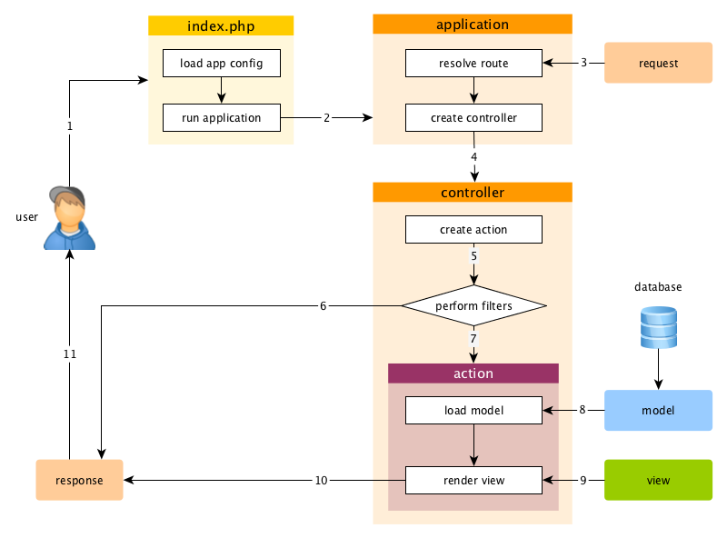

Applications
============

Applications are objects that govern the overall structure and lifecycle of Yii application systems.
Each Yii application system contains a single application object which is created in
the [entry script](structure-entry-scripts.md) and is globally accessible through the expression `\Yii::$app`.

> Info: Depending on the context, when we say "an application", it can mean either an application
  object or an application system.

There are two types of applications: [[yii\web\Application|Web applications]] and
[[yii\console\Application|console applications]]. As the names indicate, the former mainly handles
Web requests, while the latter handles console command requests.


## Application Configurations <span id="application-configurations"></span>

When an [entry script](structure-entry-scripts.md) creates an application, it will load
a [configuration](concept-configurations.md) and apply it to the application, as follows:

```php
require __DIR__ . '/../vendor/autoload.php';

// load application configuration
$config = require __DIR__ . '/../config/web.php';

// instantiate and configure the application
(new yii\web\Application($config))->run();
```

Like normal [configurations](concept-configurations.md), application configurations specify how
to initialize properties of application objects. Because application configurations are often
very complex, they usually are kept in [configuration files](concept-configurations.md#configuration-files),
like the `web.php` file in the above example.


## Application Properties <span id="application-properties"></span>

There are many important application properties that you should configure in application configurations.
These properties typically describe the environment that applications are running in.
For example, applications need to know how to load [controllers](structure-controllers.md),
where to store temporary files, etc. In the following, we will summarize these properties.


### Required Properties <span id="required-properties"></span>

In any application, you should at least configure two properties: [[yii\base\Application::id|id]]
and [[yii\base\Application::basePath|basePath]].


#### [[yii\base\Application::id|id]] <span id="id"></span>

The [[yii\base\Application::id|id]] property specifies a unique ID that differentiates an application
from others. It is mainly used programmatically. Although not a requirement, for best interoperability
it is recommended that you use only alphanumeric characters when specifying an application ID.


#### [[yii\base\Application::basePath|basePath]] <span id="basePath"></span>

The [[yii\base\Application::basePath|basePath]] property specifies the root directory of an application.
It is the directory that contains all protected source code of an application system. Under this directory,
you normally will see sub-directories such as `models`, `views`, and `controllers`, which contain source code
corresponding to the MVC pattern.

You may configure the [[yii\base\Application::basePath|basePath]] property using a directory path
or a [path alias](concept-aliases.md). In both forms, the corresponding directory must exist, or an exception
will be thrown. The path will be normalized by calling the `realpath()` function.

The [[yii\base\Application::basePath|basePath]] property is often used to derive other important
paths (e.g. the runtime path). For this reason, a path alias named `@app` is predefined to represent this
path. Derived paths may then be formed using this alias (e.g. `@app/runtime` to refer to the runtime directory).


### Important Properties <span id="important-properties"></span>

The properties described in this subsection often need to be configured because they differ across
different applications.


#### [[yii\base\Application::aliases|aliases]] <span id="aliases"></span>

This property allows you to define a set of [aliases](concept-aliases.md) in terms of an array.
The array keys are alias names, and the array values are the corresponding path definitions.
For example:

```php
[
    'aliases' => [
        '@name1' => 'path/to/path1',
        '@name2' => 'path/to/path2',
    ],
]
```

This property is provided so that you can define aliases in terms of application configurations instead of
by calling the [[Yii::setAlias()]] method.


#### [[yii\base\Application::bootstrap|bootstrap]] <span id="bootstrap"></span>

This is a very useful property. It allows you to specify an array of components that should
be run during the application [[yii\base\Application::bootstrap()|bootstrapping process]].
For example, if you want a [module](structure-modules.md) to customize the [URL rules](runtime-routing.md),
you may list its ID as an element in this property.

Each component listed in this property may be specified in one of the following formats:

- an application component ID as specified via [components](#components),
- a module ID as specified via [modules](#modules),
- a class name,
- a configuration array,
- an anonymous function that creates and returns a component.

For example:

```php
[
    'bootstrap' => [
        // an application component ID or module ID
        'demo',

        // a class name
        app\components\Profiler::class,

        // a configuration array
        [
            '__class' => app\components\Profiler::class,
            'level' => 3,
        ],

        // an anonymous function
        function () {
            return new app\components\Profiler();
        }
    ],
]
```

> Info: If a module ID is the same as an application component ID, the application component will be used during
> the bootstrapping process. If you want to use the module instead, you may specify it using an anonymous function
> like the following:
>
> ```php
> [
>     function () {
>         return Yii::$app->getModule('user');
>     },
> ]
> ```


During the bootstrapping process, each component will be instantiated. If the component class
implements [[yii\base\BootstrapInterface]], its [[yii\base\BootstrapInterface::bootstrap()|bootstrap()]] method
will also be called.

Another practical example is in the application configuration for the [Basic Project Template](start-installation.md),
where the `debug` and `gii` modules are configured as bootstrapping components when the application is running
in the development environment:

```php
if (YII_ENV_DEV) {
    // configuration adjustments for 'dev' environment
    $config['bootstrap'][] = 'debug';
    $config['modules']['debug'] = 'yii\debug\Module';

    $config['bootstrap'][] = 'gii';
    $config['modules']['gii'] = 'yii\gii\Module';
}
```

> Note: Putting too many components in `bootstrap` will degrade the performance of your application because
  for each request, the same set of components need to be run. So use bootstrapping components judiciously.


#### [[yii\web\Application::catchAll|catchAll]] <span id="catchAll"></span>

This property is supported by [[yii\web\Application|Web applications]] only. It specifies
a [controller action](structure-controllers.md) which should handle all user requests. This is mainly
used when the application is in maintenance mode and needs to handle all incoming requests via a single action.

The configuration is an array whose first element specifies the route of the action.
The rest of the array elements (key-value pairs) specify the parameters to be bound to the action. For example:

```php
[
    'catchAll' => [
        'offline/notice',
        'param1' => 'value1',
        'param2' => 'value2',
    ],
]
```

> Info: Debug panel on development environment will not work when this property is enabled.

#### [[yii\base\Application::components|components]] <span id="components"></span>

This is the single most important property. It allows you to register a list of named components
called [application components](structure-application-components.md) that you can use in other places. For example:

```php
[
    'components' => [
        'cache' => [
            '__class' => yii\caching\FileCache::class,
        ],
        'user' => [
            'identityClass' => app\models\User::class,
            'enableAutoLogin' => true,
        ],
    ],
]
```

Each application component is specified as a key-value pair in the array. The key represents the component ID,
while the value represents the component class name or [configuration](concept-configurations.md).

You can register any component with an application, and the component can later be accessed globally
using the expression `\Yii::$app->componentID`.

Please read the [Application Components](structure-application-components.md) section for details.


#### [[yii\base\Application::controllerMap|controllerMap]] <span id="controllerMap"></span>

This property allows you to map a controller ID to an arbitrary controller class. By default, Yii maps
controller IDs to controller classes based on a [convention](#controllerNamespace) (e.g. the ID `post` would be mapped
to `app\controllers\PostController`). By configuring this property, you can break the convention for
specific controllers. In the following example, `account` will be mapped to
`app\controllers\UserController`, while `article` will be mapped to `app\controllers\PostController`.

```php
[
    'controllerMap' => [
        'account' => app\controllers\UserController::class,
        'article' => [
            '__class' => app\controllers\PostController::class,
            'enableCsrfValidation' => false,
        ],
    ],
]
```

The array keys of this property represent the controller IDs, while the array values represent the corresponding
controller class names or [configurations](concept-configurations.md).


#### [[yii\base\Application::controllerNamespace|controllerNamespace]] <span id="controllerNamespace"></span>

This property specifies the default namespace under which controller classes should be located. It defaults to
`app\controllers`. If a controller ID is `post`, by convention the corresponding controller class name (without
namespace) would be `PostController`, and the fully qualified class name would be `app\controllers\PostController`.

Controller classes may also be located under sub-directories of the directory corresponding to this namespace.
For example, given a controller ID `admin/post`, the corresponding fully qualified controller class would
be `app\controllers\admin\PostController`.

It is important that the fully qualified controller classes should be [autoloadable](concept-autoloading.md)
and the actual namespace of your controller classes match the value of this property. Otherwise,
you will receive a "Page Not Found" error when accessing the application.

In case you want to break the convention as described above, you may configure the [controllerMap](#controllerMap)
property.


#### [[yii\base\Application::language|language]] <span id="language"></span>

This property specifies the language in which the application should display content to end users.
The default value of this property is `en`, meaning English. You should configure this property
if your application needs to support multiple languages.

The value of this property determines various [internationalization](tutorial-i18n.md) aspects,
including message translation, date formatting, number formatting, etc. For example, the [[yii\jui\DatePicker]] widget
will use this property value by default to determine in which language the calendar should be displayed and how
the date should be formatted.

It is recommended that you specify a language in terms of an [IETF language tag](http://en.wikipedia.org/wiki/IETF_language_tag).
For example, `en` stands for English, while `en-US` stands for English (United States).

More details about this property can be found in the [Internationalization](tutorial-i18n.md) section.


#### [[yii\base\Application::modules|modules]] <span id="modules"></span>

This property specifies the [modules](structure-modules.md) that the application contains.

The property takes an array of module classes or [configurations](concept-configurations.md) with the array keys
being the module IDs. For example:

```php
[
    'modules' => [
        // a "booking" module specified with the module class
        'booking' => 'app\modules\booking\BookingModule',

        // a "comment" module specified with a configuration array
        'comment' => [
            '__class' => app\modules\comment\CommentModule::class,
            'db' => 'db',
        ],
    ],
]
```

Please refer to the [Modules](structure-modules.md) section for more details.


#### [[yii\base\Application::name|name]] <span id="name"></span>

This property specifies the application name that may be displayed to end users. Unlike the
[[yii\base\Application::id|id]] property, which should take a unique value, the value of this property is mainly for
display purposes; it does not need to be unique.

You do not always need to configure this property if none of your code is using it.


#### [[yii\base\Application::params|params]] <span id="params"></span>

This property specifies an array of globally accessible application parameters. Instead of using hardcoded
numbers and strings everywhere in your code, it is a good practice to define them as application parameters
in a single place and use the parameters in places where needed. For example, you may define the thumbnail
image size as a parameter like the following:

```php
[
    'params' => [
        'thumbnail.size' => [128, 128],
    ],
]
```

Then in your code where you need to use the size value, you can simply use code like the following:

```php
$size = \Yii::$app->params['thumbnail.size'];
$width = \Yii::$app->params['thumbnail.size'][0];
```

Later if you decide to change the thumbnail size, you only need to modify it in the application configuration;
you don't need to touch any dependent code.


#### [[yii\base\Application::sourceLanguage|sourceLanguage]] <span id="sourceLanguage"></span>

This property specifies the language that the application code is written in. The default value is `'en-US'`,
meaning English (United States). You should configure this property if the text content in your code is not in English.

Like the [language](#language) property, you should configure this property in terms of
an [IETF language tag](http://en.wikipedia.org/wiki/IETF_language_tag). For example, `en` stands for English,
while `en-US` stands for English (United States).

More details about this property can be found in the [Internationalization](tutorial-i18n.md) section.


#### [[yii\base\Application::timeZone|timeZone]] <span id="timeZone"></span>

This property is provided as an alternative way of setting the default time zone of the PHP runtime.
By configuring this property, you are essentially calling the PHP function
[date_default_timezone_set()](http://php.net/manual/en/function.date-default-timezone-set.php). For example:

```php
[
    'timeZone' => 'America/Los_Angeles',
]
```


#### [[yii\base\Application::version|version]] <span id="version"></span>

This property specifies the version of the application. It defaults to `'1.0'`. You do not need to configure
this property if none of your code is using it.


### Useful Properties <span id="useful-properties"></span>

The properties described in this subsection are not commonly configured because their default values
derive from common conventions. However, you may still configure them in case you want to break the conventions.


#### [[yii\base\Application::charset|charset]] <span id="charset"></span>

This property specifies the charset that the application uses. The default value is `'UTF-8'`, which should
be kept as-is for most applications unless you are working with a legacy system that uses a lot of non-Unicode data.


#### [[yii\base\Application::defaultRoute|defaultRoute]] <span id="defaultRoute"></span>

This property specifies the [route](runtime-routing.md) that an application should use when a request
does not specify one. The route may consist of a child module ID, a controller ID, and/or an action ID.
For example, `help`, `post/create`, or `admin/post/create`. If an action ID is not given, this property will take
the default value specified in [[yii\base\Controller::defaultAction]].

For [[yii\web\Application|Web applications]], the default value of this property is `'site'`, which means
the `SiteController` controller and its default action should be used. As a result, if you access
the application without specifying a route, it will show the result of `app\controllers\SiteController::actionIndex()`.

For [[yii\console\Application|console applications]], the default value is `'help'`, which means the core command
[[yii\console\controllers\HelpController::actionIndex()]] should be used. As a result, if you run the command `yii`
without providing any arguments, it will display the help information.


#### [[yii\base\Application::extensions|extensions]] <span id="extensions"></span>

This property specifies the list of [extensions](structure-extensions.md) that are installed and used by the application.
By default, it will take the array returned by the file `@vendor/yiisoft/extensions.php`. The `extensions.php` file
is generated and maintained automatically when you use [Composer](https://getcomposer.org) to install extensions.
So in most cases, you do not need to configure this property.

In the special case when you want to maintain extensions manually, you may configure this property as follows:

```php
[
    'extensions' => [
        [
            'name' => 'extension name',
            'version' => 'version number',
            'bootstrap' => 'BootstrapClassName',  // optional, may also be a configuration array
            'alias' => [  // optional
                '@alias1' => 'to/path1',
                '@alias2' => 'to/path2',
            ],
        ],

        // ... more extensions like the above ...

    ],
]
```

As you can see, the property takes an array of extension specifications. Each extension is specified with an array
consisting of `name` and `version` elements. If an extension needs to run during the [bootstrap](runtime-bootstrapping.md)
process, a `bootstrap` element may be specified with a bootstrapping class name or a [configuration](concept-configurations.md)
array. An extension may also define a few [aliases](concept-aliases.md).


#### [[yii\base\Application::layout|layout]] <span id="layout"></span>

This property specifies the name of the default layout that should be used when rendering a [view](structure-views.md).
The default value is `'main'`, meaning the layout file `main.php` under the [layout path](#layoutPath) should be used.
If both of the [layout path](#layoutPath) and the [view path](#viewPath) are taking the default values,
the default layout file can be represented as the path alias `@app/views/layouts/main.php`.

You may configure this property to be `false` if you want to disable layout by default, although this is very rare.


#### [[yii\base\Application::layoutPath|layoutPath]] <span id="layoutPath"></span>

This property specifies the path where layout files should be looked for. The default value is
the `layouts` sub-directory under the [view path](#viewPath). If the [view path](#viewPath) is taking
its default value, the default layout path can be represented as the path alias `@app/views/layouts`.

You may configure it as a directory or a path [alias](concept-aliases.md).


#### [[yii\base\Application::runtimePath|runtimePath]] <span id="runtimePath"></span>

This property specifies the path where temporary files, such as log files and cache files, can be generated.
The default value is the directory represented by the alias `@app/runtime`.

You may configure it as a directory or a path [alias](concept-aliases.md). Note that the runtime path must
be writable by the process running the application. And the path should be protected from being accessed
by end users, because the temporary files under it may contain sensitive information.

To simplify access to this path, Yii has predefined a path alias named `@runtime` for it.


#### [[yii\base\Application::viewPath|viewPath]] <span id="viewPath"></span>

This property specifies the root directory where view files are located. The default value is the directory
represented by the alias `@app/views`. You may configure it as a directory or a path [alias](concept-aliases.md).


#### [[yii\base\Application::vendorPath|vendorPath]] <span id="vendorPath"></span>

This property specifies the vendor directory managed by [Composer](https://getcomposer.org). It contains
all third party libraries used by your application, including the Yii framework. The default value is
the directory represented by the alias `@app/vendor`.

You may configure this property as a directory or a path [alias](concept-aliases.md). When you modify
this property, make sure you also adjust the Composer configuration accordingly.

To simplify access to this path, Yii has predefined a path alias named `@vendor` for it.


#### [[yii\console\Application::enableCoreCommands|enableCoreCommands]] <span id="enableCoreCommands"></span>

This property is supported by [[yii\console\Application|console applications]] only. It specifies
whether the core commands included in the Yii release should be enabled. The default value is `true`.


## Application Events <span id="application-events"></span>

An application triggers several events during the lifecycle of handling a request. You may attach event
handlers to these events in application configurations as follows:

```php
[
    'on beforeRequest' => function ($event) {
        // ...
    },
]
```

The use of the `on eventName` syntax is described in the [Configurations](concept-configurations.md#configuration-format)
section.

Alternatively, you may attach event handlers during the [bootstrapping process](runtime-bootstrapping.md)
after the application instance is created. For example:

```php
\Yii::$app->on(\yii\base\Application::EVENT_BEFORE_REQUEST, function ($event) {
    // ...
});
```

### [[yii\base\Application::EVENT_BEFORE_REQUEST|EVENT_BEFORE_REQUEST]] <span id="beforeRequest"></span>

This event is triggered *before* an application handles a request. The actual event name is `beforeRequest`.

When this event is triggered, the application instance has been configured and initialized. So it is a good place
to insert your custom code via the event mechanism to intercept the request handling process. For example,
in the event handler, you may dynamically set the [[yii\base\Application::language]] property based on some parameters.


### [[yii\base\Application::EVENT_AFTER_REQUEST|EVENT_AFTER_REQUEST]] <span id="afterRequest"></span>

This event is triggered *after* an application finishes handling a request but *before* sending the response.
The actual event name is `afterRequest`.

When this event is triggered, the request handling is completed and you may take this chance to do some postprocessing
of the request or customize the response.

Note that the [[yii\web\Response|response]] component also triggers some events while it is sending out
response content to end users. Those events are triggered *after* this event.


### [[yii\base\Application::EVENT_BEFORE_ACTION|EVENT_BEFORE_ACTION]] <span id="beforeAction"></span>

This event is triggered *before* running every [controller action](structure-controllers.md).
The actual event name is `beforeAction`.

The event parameter is an instance of [[yii\base\ActionEvent]]. An event handler may set
the [[yii\base\ActionEvent::isValid]] property to be `false` to stop running the action.
For example:

```php
[
    'on beforeAction' => function ($event) {
        if (some condition) {
            $event->isValid = false;
        } else {
        }
    },
]
```

Note that the same `beforeAction` event is also triggered by [modules](structure-modules.md)
and [controllers](structure-controllers.md). Application objects are the first ones
triggering this event, followed by modules (if any), and finally controllers. If an event handler
sets [[yii\base\ActionEvent::isValid]] to be `false`, all of the subsequent events will NOT be triggered.


### [[yii\base\Application::EVENT_AFTER_ACTION|EVENT_AFTER_ACTION]] <span id="afterAction"></span>

This event is triggered *after* running every [controller action](structure-controllers.md).
The actual event name is `afterAction`.

The event parameter is an instance of [[yii\base\ActionEvent]]. Through
the [[yii\base\ActionEvent::result]] property, an event handler may access or modify the action result.
For example:

```php
[
    'on afterAction' => function ($event) {
        if (some condition) {
            // modify $event->result
        } else {
        }
    },
]
```

Note that the same `afterAction` event is also triggered by [modules](structure-modules.md)
and [controllers](structure-controllers.md). These objects trigger this event in the reverse order
as for that of `beforeAction`. That is, controllers are the first objects triggering this event,
followed by modules (if any), and finally applications.


## Application Lifecycle <span id="application-lifecycle"></span>



When an [entry script](structure-entry-scripts.md) is being executed to handle a request,
an application will undergo the following lifecycle:

1. The entry script loads the application configuration as an array.
2. The entry script creates a new instance of the application:
  * [[yii\base\Application::preInit()|preInit()]] is called, which configures some high priority
    application properties, such as [[yii\base\Application::basePath|basePath]].
  * Register the [[yii\base\Application::errorHandler|error handler]].
  * Configure application properties.
  * [[yii\base\Application::init()|init()]] is called which further calls
    [[yii\base\Application::bootstrap()|bootstrap()]] to run bootstrapping components.
3. The entry script calls [[yii\base\Application::run()]] to run the application:
  * Trigger the [[yii\base\Application::EVENT_BEFORE_REQUEST|EVENT_BEFORE_REQUEST]] event.
  * Handle the request: resolve the request into a [route](runtime-routing.md) and the associated parameters;
    create the module, controller, and action objects as specified by the route; and run the action.
  * Trigger the [[yii\base\Application::EVENT_AFTER_REQUEST|EVENT_AFTER_REQUEST]] event.
  * Send response to the end user.
4. The entry script receives the exit status from the application and completes the request processing.
