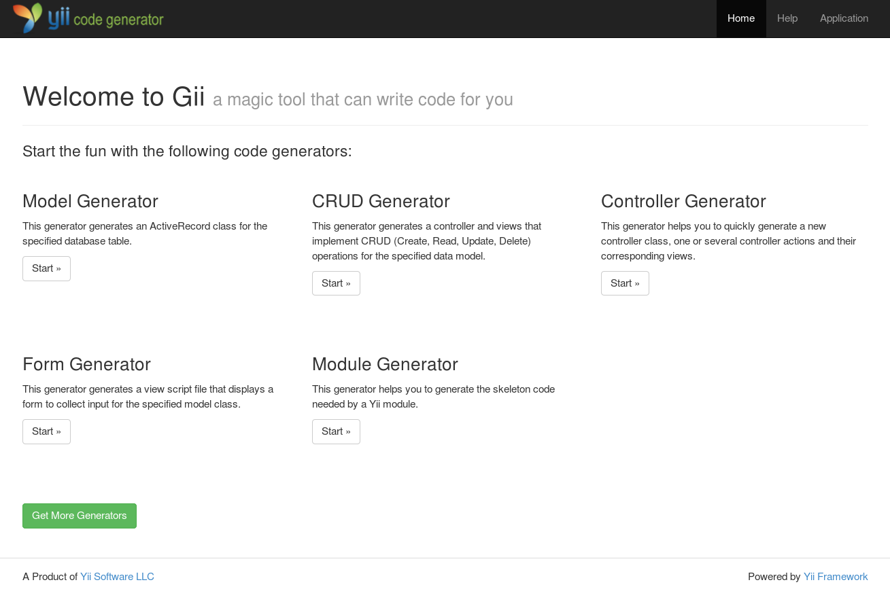

The Gii code generation tool
============================

> Note: This section is under development.

Yii includes a handy tool, named Gii, that provides rapid prototyping by generating commonly used code snippets
as well as complete CRUD controllers.

Gii provides a Web-based interface for you to interactively generate the code you want. It also provides a
command line interface for people who prefer to work with their console windows most of the time.


Installing and configuring
--------------------------

Gii is an official Yii extension. The preferred way to install this extension is through
[composer](http://getcomposer.org/download/).

You can either run this command:

```
composer require "yiisoft/yii2-gii:*"
```

Or you can add this code to the require section of your `composer.json` file:

```
"yiisoft/yii2-gii": "*"
```

Once the Gii extension has been installed, you enable it by adding these lines to your application configuration file:

```php
return [
    'bootstrap' => ['gii'],
    'modules' => [
        'gii' => 'yii\gii\Module',
        // ...
    ],
    // ...
];
```

You can then access Gii through the following URL:

```
http://localhost/path/to/index.php?r=gii
```

If you have enabled pretty URLs, you may use the following URL:

```
http://localhost/path/to/index.php/gii
```

> Note: if you are accessing gii from an IP address other than localhost, access will be denied by default.
> To circumvent that default, add the allowed IP addresses to the configuration:
>
```php
'gii' => [
    'class' => 'yii\gii\Module',
    'allowedIPs' => ['127.0.0.1', '::1', '192.168.0.*', '192.168.178.20'] // adjust this to your needs
],
```

If you have configured Gii similarly in your console application configuration, you may also access Gii through
command window like the following:

```
# change path to your application's base path
cd path/to/AppBasePath

# show help information about Gii
yii help gii

# show help information about the model generator in Gii
yii help gii/model

# generate City model from city table
yii gii/model --tableName=city --modelClass=City
```


### Basic application

In basic application template configuration structure is a bit different so Gii should be configured in
`config/web.php`:

```php
// ...
if (YII_ENV_DEV) {
    // configuration adjustments for 'dev' environment
    $config['bootstrap'][] = 'debug';
    $config['modules']['debug'] = 'yii\debug\Module';

    $config['bootstrap'][] = 'gii';
    $config['modules']['gii']['class'] = 'yii\gii\Module'; // <--- here
}
```

So in order to adjust IP address you need to do it like the following:

```php
if (YII_ENV_DEV) {
    // configuration adjustments for 'dev' environment
    $config['bootstrap'][] = 'debug';
    $config['modules']['debug'] = 'yii\debug\Module';

    $config['bootstrap'][] = 'gii';
    $config['modules']['gii'] = [
        'class' => 'yii\gii\Module',
        'allowedIPs' => ['127.0.0.1', '::1', '192.168.0.*', '192.168.178.20'],
    ];
}
```

How to use it
-------------

When you open Gii you first see the entry page that lets you choose a generator.



By default there are the following generators available:

- **Model Generator** - This generator generates an ActiveRecord class for the specified database table.
- **CRUD Generator** - This generator generates a controller and views that implement CRUD (Create, Read, Update, Delete)
  operations for the specified data model.
- **Controller Generator** - This generator helps you to quickly generate a new controller class, one or several
  controller actions and their corresponding views.
- **Form Generator** - This generator generates a view script file that displays a form to collect input for the
  specified model class.
- **Module Generator** - This generator helps you to generate the skeleton code needed by a Yii module.
- **Extension Generator** - This generator helps you to generate the files needed by a Yii extension.

After choosing a generator by clicking on the "Start" button you will see a form that allows you to configure the
parameters of the generator. Fill out the form according to your needs and press the "Preview" button to get a
preview of the code that Gii is about to generate. Depending on the generator you chose and whether the files
already existed or not, you will get an output similar to what you see in the following picture:


Clicking on the file name you can view a preview of the code that will be generated for that file.
When the file already exists, Gii also provides a diff view that shows what is different between the code that exists
and the one that will be generated. In this case you can also choose which files should be overridden and which not.

> Tip: When using the Model Generator to update models after database change, you can copy the code from Gii preview
  and merge the changes with your own code. You can use IDE features like PHPStorms
  [compare with clipboard](http://www.jetbrains.com/phpstorm/webhelp/comparing-files.html), [Aptana Studio](http://www.aptana.com/products/studio3/download) or [Eclipse](http://www.eclipse.org/pdt/) based editor also allows [compare with clipboard](http://andrei.gmxhome.de/anyedit/examples.html) by using [AnyEdit tools plugin](http://andrei.gmxhome.de/anyedit/) for this, which allows you to merge in relevant changes and leave out others that may revert your own code.
  

After you have reviewed the code and selected the files to be generated you can click the "Generate" button to create
the files. If all went fine you are done. When you see errors that Gii is not able to generate the files you have to
adjust directory permissions so that your webserver is able to write to the directories and create the files.

> Note: The code generated by Gii is only a template that has to be adjusted to your needs. It is there
  to help you create new things quickly but it is not something that creates ready to use code.
  We often see people using the models generated by Gii without change and just extend them to adjust
  some parts of it. This is not how it is meant to be used. Code generated by Gii may be incomplete or incorrect
  and has to be changed to fit your needs before you can use it.


Creating your own templates
---------------------------

Every generator has a form field `Code Template` that lets you choose a template to use for code generation.
By default Gii only provides one template `default` but you can create your own templates that are adjusted to your needs.

If you open the folder `@app\vendor\yiisoft\yii2-gii\generators`, you'll see six folders of generators.

```
+ controller
- crud
    + default
+ extension
+ form
+ model
+ module
```

These names are the generator names. If you open any of these folders, you can see the folder `default`, which is the name of the template.

Copy the folder `@app\vendor\yiisoft\yii2-gii\generators\crud\default` to another location, for example `@app\myTemplates\crud\`.
Now open this folder and modify any template to fit your desires, for example, add `errorSummary` in `views\_form.php`:

```php
<?php
//...
<div class="<?= Inflector::camel2id(StringHelper::basename($generator->modelClass)) ?>-form">

    <?= "<?php " ?>$form = ActiveForm::begin(); ?>
    <?= "<?=" ?> $form->errorSummary($model) ?> <!-- ADDED HERE -->
    <?php foreach ($safeAttributes as $attribute) {
        echo "    <?= " . $generator->generateActiveField($attribute) . " ?>\n\n";
    } ?>
//...
```

Now you need to tell Gii about our template. The setting is made in the config file:

```php
// config/web.php for basic app
// ...
if (YII_ENV_DEV) {    
    $config['modules']['gii'] = [
        'class' => 'yii\gii\Module',      
        'allowedIPs' => ['127.0.0.1', '::1', '192.168.0.*', '192.168.178.20'],  
        'generators' => [ //here
            'crud' => [ // generator name
                'class' => 'yii\gii\generators\crud\Generator', // generator class
                'templates' => [ //setting for out templates
                    'myCrud' => '@app/myTemplates/crud/default', // template name => path to template
                ]
            ]
        ],
    ];
}
```
Open the CRUD generator and you will see that in the field `Code Template` of form appeared own template .

Creating your own generators
----------------------------

Open the folder of any generator and you will see two files `form.php` and `Generator.php`.
One is the form, the second is the generator class. In order to create your own generator, you need to create or
override these classes in any folder. Again as in the previous paragraph customize the configuration:

```php
//config/web.php for basic app
//..
if (YII_ENV_DEV) {    
    $config['modules']['gii'] = [
        'class' => 'yii\gii\Module',      
        'allowedIPs' => ['127.0.0.1', '::1', '192.168.0.*', '192.168.178.20'],  
         'generators' => [
            'myCrud' => [
                'class' => 'app\myTemplates\crud\Generator',
                'templates' => [
                    'my' => '@app/myTemplates/crud/default',
                ]
            ]
        ],
    ];
}
```

```php
// @app/myTemplates/crud/Generator.php
<?php
namespace app\myTemplates\crud;

class Generator extends \yii\gii\Generator
{
    public function getName()
    {
        return 'MY CRUD Generator';
    }

    public function getDescription()
    {
        return 'My crud generator. The same as a native, but he is mine...';
    }
    
    // ...
}
```

Open Gii Module and you will see a new generator appears in it.

