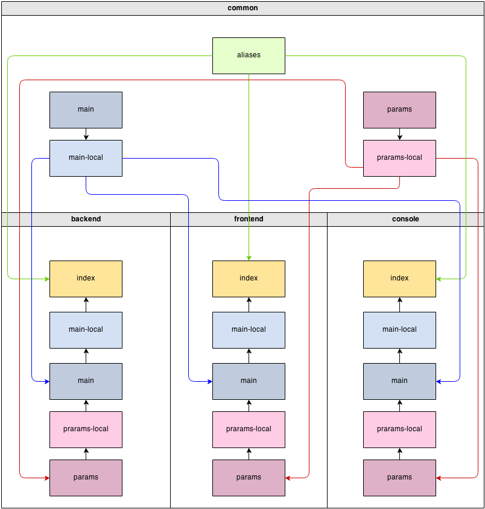

Advanced Application Template
=============================

> Note: This section is under development.

This template is for large projects developed in teams where the backend is divided from the frontend, application is deployed
to multiple servers etc. This application template also goes a bit further regarding features and provides essential
database, signup and password restore out of the box.

The following table compares the difference between the advanced and the basic application templates:


| Feature  |  Basic  |  Advanced |
|---|:---:|:---:|
| Project structure |  ✓  |  ✓  |
| Site controller |  ✓  |  ✓  |
| User login/logout |   ✓  |  ✓  |
| Forms  |   ✓  |  ✓  |
| DB connection  |   ✓  |  ✓  |
| Console command  |   ✓  |  ✓  |
| Asset bundle  |   ✓  |  ✓  |
| Codeception tests  |   ✓  |  ✓  |
| Twitter Bootstrap  |  ✓   |  ✓  |
| Front- and back-end apps  |    |  ✓  |
| Ready to use User model |    |  ✓  |
| User signup and password restore  |     |  ✓  |


Installation
------------

### Install via Composer

If you do not have [Composer](http://getcomposer.org/), follow the instructions in the
[Installing Yii](start-installation.md#installing-via-composer) section to install it.

With Composer installed, you can then install the application using the following commands:

    composer global require "fxp/composer-asset-plugin:1.0.0-beta4"
    composer create-project --prefer-dist yiisoft/yii2-app-advanced yii-application

The first command installs the [composer asset plugin](https://github.com/francoispluchino/composer-asset-plugin/)
which allows managing bower and npm package dependencies through Composer. You only need to run this command
once for all. The second command installs the advanced application in a directory named `yii-application`.
You can choose a different directory name if you want.

Getting started
---------------

After you install the application, you have to conduct the following steps to initialize
the installed application. You only need to do these once for all.

1. Execute the `init` command and select `dev` as environment.

    ```
    php /path/to/yii-application/init
    ```

    Otherwise, in production execute `init` in non-interactive mode.

    ```
    php /path/to/yii-application/init --env=Production --overwrite=All
    ```

2. Create a new database and adjust the `components.db` configuration in `common/config/main-local.php` accordingly.
3. Apply migrations with console command `yii migrate`.
4. Set document roots of your web server:

- for frontend `/path/to/yii-application/frontend/web/` and using the URL `http://frontend/`
- for backend `/path/to/yii-application/backend/web/` and using the URL `http://backend/`

To login into the application, you need to first sign up, with any of your email address, username and password. Then, you can login into the application with same email address and password at any time.

Directory structure
-------------------

The root directory contains the following subdirectories:

- `backend` - backend web application.
- `common` - files common to all applications.
- `console` - console application.
- `environments` - environment configs.
- `frontend` - frontend web application.

Root directory contains a set of files.

- `.gitignore` contains a list of directories ignored by git version system. If you need something never get to your source
  code repository, add it there.
- `composer.json` - Composer config described in "Configuring Composer" below.
- `init` - initialization script described in "Configuration and environments" below.
- `init.bat` - same for Windows.
- `LICENSE.md` - license info. Put your project license there. Especially when opensourcing.
- `README.md` - basic info about installing template. Consider replacing it with information about your project and its
  installation.
- `requirements.php` - Yii requirements checker.
- `yii` - console application bootstrap.
- `yii.bat` - same for Windows.

Predefined path aliases
-----------------------

- `@yii` - framework directory.
- `@app` - base path of currently running application.
- `@common` - common directory.
- `@frontend` - frontend web application directory.
- `@backend` - backend web application directory.
- `@console` - console directory.
- `@runtime` - runtime directory of currently running web application.
- `@vendor` - Composer vendor directory.
- `@bower` - vendor directory that contains the [bower packages](http://bower.io/).
- `@npm` - vendor directory that contains [npm packages](https://www.npmjs.org/).
- `@web` - base URL of currently running web application.
- `@webroot` - web root directory of currently running web application.

The aliases specific to the directory structure of the advanced application
(`@common`,  `@frontend`, `@backend`, and `@console`) are defined in `common/config/bootstrap.php`.


Applications
------------

There are three applications in advanced template: frontend, backend and console. Frontend is typically what is presented
to end user, the project itself. Backend is admin panel, analytics and such functionality. Console is typically used for
cron jobs and low-level server management. Also it's used during application deployment and handles migrations and assets.

There's also a `common` directory that contains files used by more than one application. For example, `User` model.

frontend and backend are both web applications and both contain the `web` directory. That's the webroot you should point your
web server to.

Each application has its own namespace and alias corresponding to its name. Same applies to common directory.

Configuration and environments
------------------------------

There are multiple problems with a typical approach to configuration:

- Each team member has its own configuration options. Committing such config will affect other team members.
- Production database password and API keys should not end up in the repository.
- There are multiple server environments: development, testing, production. Each should have its own configuration.
- Defining all configuration options for each case is very repetitive and takes too much time to maintain.

In order to solve these issues Yii introduces a simple environments concept. Each environment is represented
by a set of files under the `environments` directory. The `init` command is used to switch between these. What it really does is
copy everything from the environment directory over to the root directory where all applications are.

By default there are two environments: `dev` and `prod`. First is for development. It has all the developer tools
and debug turned on. Second is for server deployments. It has debug and developer tools turned off. 

Typically environment contains application bootstrap files such as `index.php` and config files suffixed with
`-local.php`. These are added to `.gitignore` and never added to source code repository.

In order to avoid duplication configurations are overriding each other. For example, the frontend reads configuration in the
following order:

- `common/config/main.php`
- `common/config/main-local.php`
- `frontend/config/main.php`
- `frontend/config/main-local.php`

Parameters are read in the following order:

- `common/config/params.php`
- `common/config/params-local.php`
- `frontend/config/params.php`
- `frontend/config/params-local.php`

The later config file overrides the former.

Here's the full scheme:



Configuring Composer
--------------------

After the application template is installed it's a good idea to adjust default `composer.json` that can be found in the root
directory:

```json
{
    "name": "yiisoft/yii2-app-advanced",
    "description": "Yii 2 Advanced Application Template",
    "keywords": ["yii2", "framework", "advanced", "application template"],
    "homepage": "http://www.yiiframework.com/",
    "type": "project",
    "license": "BSD-3-Clause",
    "support": {
        "issues": "https://github.com/yiisoft/yii2/issues?state=open",
        "forum": "http://www.yiiframework.com/forum/",
        "wiki": "http://www.yiiframework.com/wiki/",
        "irc": "irc://irc.freenode.net/yii",
        "source": "https://github.com/yiisoft/yii2"
    },
    "minimum-stability": "dev",
    "require": {
        "php": ">=5.4.0",
        "yiisoft/yii2": "*",
        "yiisoft/yii2-bootstrap": "*",
        "yiisoft/yii2-swiftmailer": "*"
    },
    "require-dev": {
        "yiisoft/yii2-codeception": "*",
        "yiisoft/yii2-debug": "*",
        "yiisoft/yii2-gii": "*",
        "yiisoft/yii2-faker": "*"
    },
    "config": {
        "process-timeout": 1800
    },
    "extra": {
        "asset-installer-paths": {
            "npm-asset-library": "vendor/npm",
            "bower-asset-library": "vendor/bower"
        }
    }
}
```

First we're updating basic information. Change `name`, `description`, `keywords`, `homepage` and `support` to match
your project.

Now the interesting part. You can add more packages your application needs to the `require` section.
All these packages are coming from [packagist.org](https://packagist.org/) so feel free to browse the website for useful code.

After your `composer.json` is changed you can run `composer update --prefer-dist`, wait till packages are downloaded and
installed and then just use them. Autoloading of classes will be handled automatically.

Creating links from backend to frontend
---------------------------------------

Often it's required to create links from the backend application to the frontend application. Since the frontend application may
contain its own URL manager rules you need to duplicate that for the backend application by naming it differently:

```php
return [
    'components' => [
        'urlManager' => [
            // here is your normal backend url manager config
        ],
        'urlManagerFrontend' => [
            // here is your frontend URL manager config
        ],

    ],
];
```

After it is done, you can get an URL pointing to frontend like the following:

```php
echo Yii::$app->urlManagerFrontend->createUrl(...);
```
