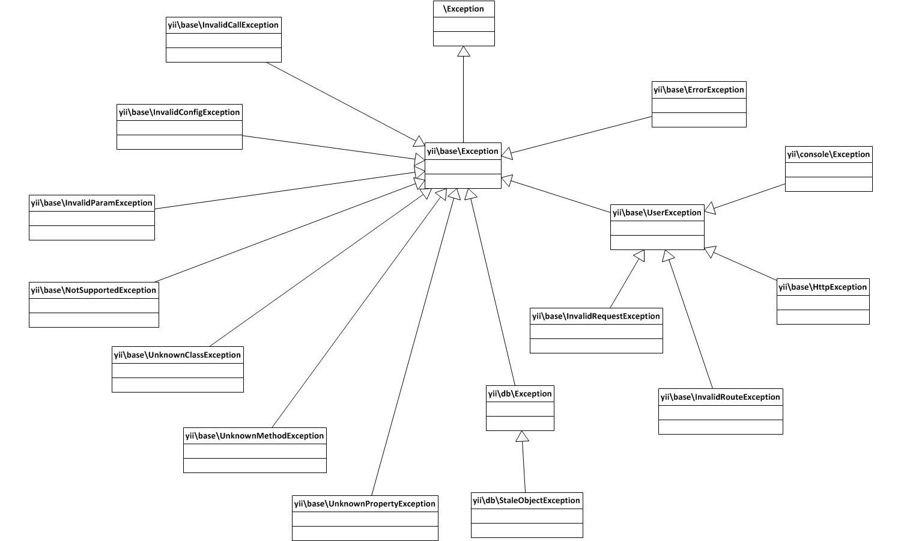

Yii 開発者ドキュメント
======================

このディレクトリは、Yii フレームワークの開発とリリース・プロセスに関するドキュメントを含んでいます。

寄稿者のためのガイドライン
--------------------------

- [課題を報告する仕方](report-an-issue.md)
- [始めよう](getting-started.md)
- [Yii 2 寄稿者のための Git ワークフロー](git-workflow.md) - 開発環境をセットアップして Yii に対する寄稿を始めるためのステップ・バイ・ステップのガイド。
- [Yii 2 コア・フレームワーク・コード・スタイル](core-code-style.md)
- [Yii 2 ビュー・コード・スタイル](view-code-style.md)

ドキュメント
------------

- [翻訳ステータス](translation-status.md) - どのドキュメントが翻訳できる状態か。
- [翻訳チーム](translation-teams.md)
- [翻訳ワークフロー](translation-workflow.md)

フレームワーク開発
------------------

- [プル・リクエストの品質保証](pull-request-qa.md)
- [自動化されるタスク](automation.md) コード・スタイルの修正、ドキュメントやファイルの自動生成など。
- [設計上の決定](design-decisions.md) - よく議論される事柄についての FAQ 形式の声明リスト。

バージョニングとリリース
------------------------

- [プロジェクトの編成](project-organization.md)
- [Yii のバージョニング](versions.md)
- [後方互換性](bc.md)
- [新しいバージョンのリリース](release.md)

その他
------

### 例外の階層

### データベースのテスト

[こちら](https://gist.github.com/sergeymakinen/0696a5952f160ea28d7b64c3adfecf6f) に、Yii がサポートする全てのデータベースのためのテスト環境構成があります。
