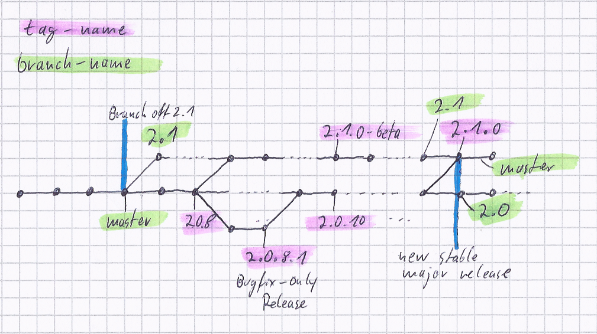

Yii バージョン規約
==================

この文書は Yii のバージョン付与ポリシーを要約するものです。
私たちの現在のバージョン付与戦略は、[Semantic Versioning](https://semver.org/) の一変種です。

コア開発者チームの内部では、2.0.x リリースを後方互換に保つことが重要であることが、何度も強調されました。
しかし、これは理想としての計画です。現実の世界では達成することは困難です。
後方互換性とは何であるかについての詳細は、[後方互換性](bc.md) を参照して下さい。

要約すれば、Yii 2 に対する私たちのバージョン付与ポリシーは次のようになります。

## バージョン番号

バージョン番号は `2.x.y.z` のフォーマットとします。ここで `z` が `0` であるリリースについては、`z` は省略可能です。

将来出るであろう Yii バージョン 3 については、1.0 に対する 2.0 のようなものになると予想されるので、ここでは言及しません。
このようなことは、外的な技術進歩 (たとえば PHP の 5.0 から 5.4 へのアップグレード) によって、3年から5年に一度しか生じないものと予期しています。

## `2.X.0`: メジャー・リリース

後方互換性を損ないうる大きな機能追加と変更を含む、非後方互換なリリースです。
以前のバージョンからのアップグレードは簡単ではないかも知れませんが、完全なアップグレードのガイドが提供されます。

* 主として新機能とバグ修正を含む。
* パッチ・リリースからマージされた小さな機能強化とバグ修正を含む。
* `UPGRADE-2.X.md` ファイルに記録される非後方互換な変更を含みうる。
* リリースのサイクルはだいたい12ヶ月またはそれ以上。
* プレ・リリースが必要: `2.X.0-alpha`, `2.X.0-beta`, `2.X.0-rc`
* 大きなニュース・リリースとマーケティング努力を必要とする。

## `2.x.Y`: マイナー・リリース

ほぼ後方互換であるマイナー・リリースです。
理想的には、後方互換性を損なわない変更だけを含ませたいと私たちは望んでいます。
しかし、すべてを 100% 後方互換に保つことが常に可能である訳ではありませんので、アップグレードに関するノートが `UPGRADE.md` に記録されます。
実際の運用では、2.0.x はより頻繁にリリースされるので、小さな機能改良の追加も行って、ユーザが新機能をより早く享受できるようにしています。

* 主としてバグ修正と機能強化を含む。
* 不安無しのアップグレードを保証するために、ほぼ後方互換でなければならない。
  ごく少数の例外は許容されるが、その場合は `UPGRADE.md` に記録される。
* リリースのサイクルは1～2ヶ月程度。
* プレ・リリース (alpha, beta, RC) は不要。
* 継続的に (少なくとも週に一回は手作業で) マスター・ブランチにマージ・バックされるべき。
* ニュースによる広報を伴う。プロジェクト・サイトがアップデートされる。

### `2.x.y.Z`: パッチ・リリース

バグ修正のみを含む、100% 後方互換であるべき、パッチ・リリースです。
ニュースによる広報やプロジェクト・サイトのアップデートはしません (ただし、重大な/セキュリティの問題についての修正を含む場合は、別です)。
このリリースのプロセスはほぼ自動化されています。

* バグ修正のみを含み、機能追加はしない
* 不安無しのアップグレードを保証するために、100% 後方互換でなければならない。唯一の例外はセキュリティ問題で、その場合は後方互換性が破られることもある
* リリースのサイクルは1～2週間程度
* プレ・リリース (alpha, beta, RC) は不要
* リリース時にマスター・ブランチにマージ・バックされなければならない

## ブランチ規約

* `master` ブランチは、現在の安定版メジャー・リリースの開発ブランチで、現在は `2.0.x` バージョンです。
* 各メジャー・リリースは、そのバージョン番号の名前を持つブランチ上で開発されます。例えば、`2.1`。
* メジャー・リリース `2.n` の準備が出来たら、`master` から `2.(n-1).x` と名付けられた保守ブランチを作成します。
  例えば、バージョン `2.1.0` が安定版としてリリースされ、`master` 上で開発されるようになると、`2.0` ブランチが作成されます。
  ([composer branch naming schema](https://getcomposer.org/doc/02-libraries.md#branches) を参照).
* パッチ・リリースをマークするために `2.x.y.z` というタグと `2.x.y` ブランチを作成します。`0` は省略されます。
* `2.n.x` 保守ブランチ上の変更は、継続的に `master` ブランチにマージ・バックされます。

次の図は、各ブランチ上でのコミット履歴の経時的な変化を説明したものです。

## リリース

フレームワークと公式エクステンションのプロジェクトは、お互いに独立にリリースされます。すなわち、フレームワークとエクステンションの間で、バージョン番号が異なることが予想されます。
アプリケーション・テンプレートは、常に、フレームワークと同時にリリースされます。

上記で説明されたリリース・サイクルは、コア・フレームワークにのみ適用されます。
エクステンションは必要に応じてリリースされます。
エクステンションは、何らバグ修正や機能拡張を受けずに、長期間にわたって新しいリリースを持たないことがあり得ます。
