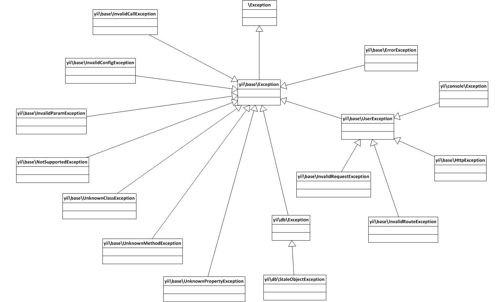

Dokumentacja dewelopera Yii
===========================

Ten folder zawiera dokumentację dotyczącą procesu rozwoju i powstawania nowych wydań frameworka Yii.

Wskazówki dla kontrybutorów
---------------------------

- [W jaki sposób zgłaszać problemy](report-an-issue.md)
- [Od czego zacząć](getting-started.md)
- [Cykl produkcji Git dla kontrybutorów Yii 2](git-workflow.md) - przewodnik krok po kroku jak utworzyć środowisko deweloperskie i współtworzyć Yii.
- [Styl kodowania bazowych plików frameworka Yii 2](core-code-style.md)
- [Styl kodowania widoków Yii 2](view-code-style.md)

Dokumentacja
------------

- [Status tłumaczeń](translation-status.md) - które z dokumentów są gotowe do przetłumaczenia.
- [Ekipy tłumaczące](translation-teams.md)
- [Cykl tworzenia tłumaczenia](translation-workflow.md)

Rozwój frameworka
-----------------

- [Zapewnienie jakości kodu w prośbie o połączenie](pull-request-qa.md)
- [Zadania zautomatyzowane](automation.md), takie jak poprawki stylu kodu, automatyczne tworzenie dokumentacji i generowanie plików.
- [Decyzje projektowe](design-decisions.md) - lista pytań i odpowiedzi dotyczących często rozważanych zagadnień.

Wersjonowanie i wydania
-----------------------

- [Organizacja projektu](project-organization.md)
- [Wersjonowanie Yii](versions.md)
- [Wsteczna kompatybilność](bc.md)
- [Wydawanie nowej wersji](release.md)

Inne zagadnienia
----------------

### Hierarchia wyjątków

