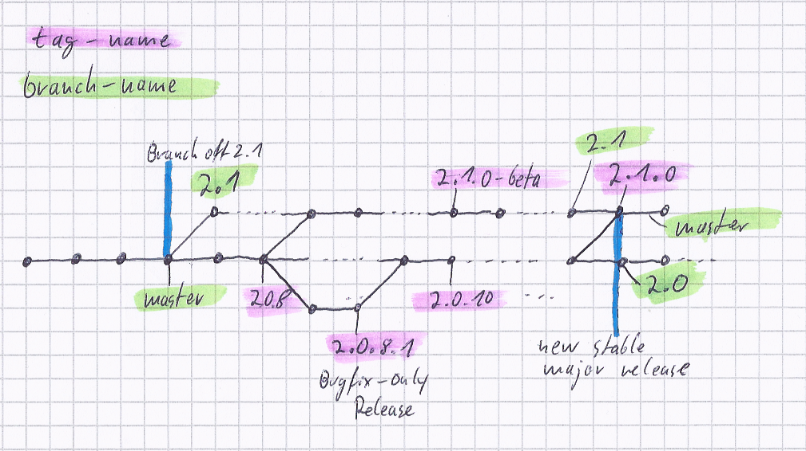

Wersjonowanie Yii
=================

Ten dokument podsumowuje politykę wersjonowania Yii. Naszą aktualną strategię wersjonowania jest wariant [wersjonowania semantycznego](https://semver.org/).

Główni programiści Yii wiele razy już zgadzali się i podkreślali, że ważnym jest utrzymanie wydań 2.0.x kompatybilnych 
wstecznie. To jednak idealna teoria, którą w praktyce nie zawsze udaje się osiągnąć. Zapoznaj się z sekcją [Wsteczna kompatybilność](bc.md), 
opisującą w szczegółach, czym jest wsteczna kompatybilność.

Podsumowując, nasza polityka wersjonowania Yii 2 przedstawia się następująco:

## Numery wersji

Numery wersji dodawane są w formacie `2.x.y.z`, gdzie `z` można pominąć, w przypadku, gdy wynosi `0`.

Ewentualna wersja 3 Yii nie jest tu uwzględniania, ponieważ zakładamy, że skok rozwojowy będzie tutaj podobny jak w przypadku 2.0 
zastępującego 1.0. Zakładamy, że przejście nastąpi co 3 do 5 lat, w zależności od rozwoju zewnętrznych technologii (takich jak 
aktualizacja PHP z 5.0 do 5.4).

### `2.X.0`: główne wydania

Wydania nie zachowujące wstecznej kompatybilności, które zawierają główne funkcjonalności i zmiany. Aktualizacja z wcześniejszych 
wersji może nie być trywialna, ale dostępna będzie zawsze dotycząca tego instrukcja.

* Zawiera głównie nowe funkcjonalności i poprawki błędów.
* Zawiera pomniejsze funkcjonalności i poprawki błędów z wydań łatających.
* Może zawierać zmiany nie zachowujące wstecznej kompatybilności,  które są wymienione w pliku `UPGRADE-2.X.md`.
* Cykl wydania to około 12 miesięcy lub więcej.
* Wymaga wydań poprzedzających: `2.X.0-alpha`, `2.X.0-beta`, `2.X.0-rc`.
* Wymaga podania informacji o ważnym wydaniu i zabiegów marketingowych.

### `2.x.Y`: pomniejsze wydania

Wydania łatająces, które powinny być w 100% wstecznie kompatybilne. Zakładając idealny przypadek, mamy nadzieję, że zawierają tylko 
zmiany nie wpływające na wsteczną kompatybilność, jednak ponieważ nie jest to zawsze możliwe, nota aktualizacyjna jest dodawana 
w `UPGRADE.md`. W praktyce, ponieważ 2.0.x są wydawane częściej, dodajemy tam pomniejsze funkcjonalności, aby użytkownicy mogli 
nacieszyć się nimi wcześniej.

* Głównie zawierają poprawki błędów i pomniejsze ulepszenia funkcjonalności.
* Brak głównych zmian w funkcjonalnościach.
* Powinny być w 100% wstecznie kompatybilne, aby zapewnić bezproblemową aktualizację. Dozwolone jest tylko kilka wyjątków, które powinny być opisane w `UPGRADE.md`.
* Cykl wydania to około 1 do 2 miesięcy.
* Nie wymagają wydań poprzedzających (alpha, beta, RC).
* Powinny być ciągle scalane z główną gałęzią projektu (ręcznie przynajmniej raz w tygodniu).
* Z ogłoszeniem o wydaniu. Strona projektu będzie również uaktualniona.

### `2.x.y.Z`: wydania łatające

Wydania łatające, które powinny być w 100% wstecznie kompatybilne, zawierające tylko poprawki błędów.
Bez ogłoszeń o wydaniu lub aktualizacji strony projektu (chyba, że zawierają ważną poprawkę lub dotyczą bezpieczeństwa).
Proces wydania odbędzie się głównie automatycznie.

* Zawierają tylko poprawki błędów, bez dodawania funkcjonalności.
* Muszą być w 100% wstecznie kompatybilne, aby zapewnić bezproblemową aktualizację. Dozwolone są tylko wyjątki w kwestii poprawy bezpieczeństwa, które mogą wymagać naruszenia wstecznej kompatybilności.
* Cykl produkcyjny to 1 do 2 tygodni.
* Nie wymagają wydań poprzedzających (alpha, beta, RC).
* Powinny być scalone z główną gałęzią projektu w momencie wydania.

## Polityka dotycząca gałęzi projektu

* Gałąź `master` jest gałęzią deweloperską dla aktualnego stabilnego głównego wydania.
* Praca nad każdym nowym głównym wydaniem będzie odbywać się w gałęzi nazwanej numerem wersji, np. `2.1`.
* Kiedy główne wydanie `2.n` jest gotowe, należy utworzyć gałąź utrzymującą o nazwie `2.(n-1).x` z `master`.
  Przykładowo gałąź `2.0` jest tworzona w momencie wydania stabilnej wersji `2.1.0`, która to od tej pory będzie rozwijana w `master`
  (zobacz [schemat nazw gałęzi dla composera](https://getcomposer.org/doc/02-libraries.md#branches)).
* Tworzone są tagi `2.x.y.z` i `2.x.y` gałęzi, aby oznaczyć wydania łat. Dla wydań `2.x.y.0` pominięte będzie `0`.
* Zmiany w gałęzi utrzymującej `2.n.x` będą ciągle scalane do `master`.

Poniższy obrazek ilustruje historię gałęzi zmieniających się w czasie:

## Wydania

Zarówno framework Yii 2, jak i oficjalne projekty rozszerzeń, przestrzegają powyższej polityki wersjonowania i gałęzi projektu.
Framework i oficjalne rozszerzenia są wydawane niezależnie od siebie, zatem różnica numerów wersji pomiędzy tymi projektami jest czymś normalnym.
Szablony projektów aplikacji są zawsze wydawane razem z frameworkiem.

Cykl wydawniczy opisany powyżej dotyczy tylko głównego frameworka.
Rozszerzenia są wydawane w razie potrzeby.
Rozszerzenie może nie otrzymywać nowych wydań przez bardzo długi czas, kiedy nie ma dla niego żadnych poprawek błędów lub ulepszeń.
