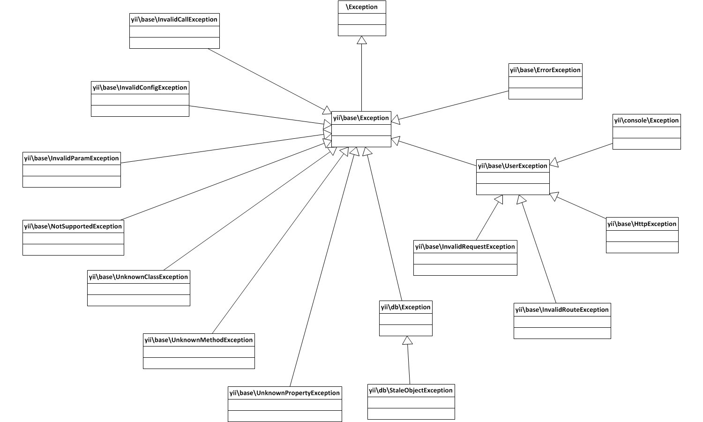

Yii Developer Documentation
===========================

This directory contains documentation about Yii Framework development and release process.

Contributor Guidelines
----------------------

- [How to Report an Issue](report-an-issue.md)
- [Getting started](getting-started.md)
- [Git workflow for Yii 2 contributors](git-workflow.md) - a step by step guide on how to set up your dev environment and start contributing to Yii.
- [Yii 2 Core Framework Code Style](core-code-style.md)
- [Yii 2 View Code Style](view-code-style.md)

Documentation
-------------

- [Translation Status](translation-status.md) - which documents are ready for translation.
- [Translation teams](translation-teams.md)
- [Translation workflow](translation-workflow.md)

Framework Development
---------------------

- [Pull request quality assurance](pull-request-qa.md)
- [Automated Tasks](automation.md), like code style fixes, automatic documentation and file generation.
- [Design Decisions](design-decisions.md) - a FAQ-like list of statements about commonly debated things.

Versioning and Release
----------------------

- [Project Organization](project-organization.md)
- [Yii Versioning](versions.md)
- [Backwards Compatibility](bc.md)
- [Releasing a new version](release.md)

Misc
----

### Exception Hierarchy

### Database testing

[Here](https://gist.github.com/sergeymakinen/0696a5952f160ea28d7b64c3adfecf6f) is config for test environments for all supported Yii databases.
