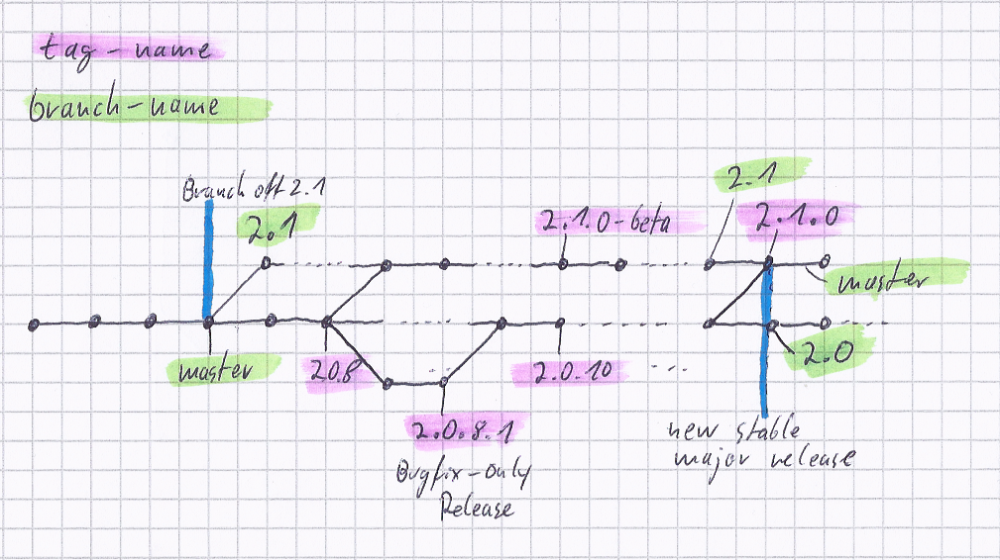

Yii Versioning
==============

This document summarizes the versioning policy of Yii. Our current versioning strategy is
[Semantic Versioning](http://semver.org/).

Within the core developer team, we have emphasized several times that it is important to keep major releases backwards
compatible. But this is an ideal plan. In a real world this is hard to achieve. See [Backwards Compatibility](bc.md)
document for detailed description of what BC is.

## Yii 2.0.x versioning policy

In Yii 2.0.x Yii wasn't following SemVer precisely. Our versioning policy for Yii 2 is as follows:

### Version numbers

Version numbers are in the format of `2.x.y.z`, where the `z` can be skipped for releases for which `z` is `0`.

A possible Yii version 3 is not covered here as we'd expect it to be like 2.0 over 1.0. We expect that this only happens every 3 to 5 years,
depending on external technology advancement (such as PHP upgraded from 5.0 to 5.4).

#### `2.X.0`: major releases

Backwards compatibility breaking releases, which contain major features and changes that may break BC. Upgrading from
earlier versions may not be trivial, but a complete upgrade guide will be available.

* Mainly contain new features and bug fixes
* Contain minor features and bug fixes merged from patch releases.
* May contain BC-breaking changes which are recorded in a `UPGRADE-2.X.md` file.
* Release cycle is around 12 months or more.
* Require pre-releases: `2.X.0-alpha`, `2.X.0-beta`, `2.X.0-rc`.
* Requires major news releases and marketing effort.

#### `2.x.Y`: minor releases

Minor releases, which are mostly BC-compatible. Ideally, we hope they contain only changes that do not affect backwards
compatibility. However, it is not always possible to keep everything 100% BC-compatible, so upgrade notes are recorded
in `UPGRADE.md`. Practically, since 2.0.x is released more frequently, we are also adding minor features
to it so that users can enjoy them earlier.

* Mainly contain bug fixes and enhancements
* Should be mostly backwards compatible to ensure worry-free upgrade. Only a few exceptions are allowed which are documented
  in `UPGRADE.md`.
* Release cycle is around 1 to 2 months.
* No pre-releases (alpha, beta, RC) needed.
* Should be merged back to master branch constantly (at least once every week manually).
* With news announcements. Project site will be updated.

#### `2.x.y.Z`: patch releases

Patch releases, which should be 100% BC-compatible, containing bug fixes only.
No news announcement or project site update (unless it contains major/security issue fixes).
The release process is mostly automatic.

* Containing bug fixes only, no features included
* Must be 100% backward compatible to ensure worry-free upgrade. Only exception is security issues that may require breaking BC
* Release cycle is around 1 to 2 weeks
* No pre-releases (alpha, beta, RC) needed
* Should be merged back to master branch on release

### Branching policy

* `master` branch is the development branch for the current stable major release, currently `2.0.x` versions.
* Each new major release will be developed on a branch named after the version number, e.g. `2.1`.
* Once a new major release `2.n` is ready, create a maintenance branch named `2.(n-1).x` off `master`.
  E.g. a `2.0` branch is created if version `2.1.0` is released as stable and will now be developed on `master`
  (cmp. [composer branch naming schema](https://getcomposer.org/doc/02-libraries.md#branches)).
* Create tags `2.x.y.z` and `2.x.y` branch to mark patch releases. For `2.x.y.0` releases, the `0` will be skipped.
* Changes on `2.n.x` maintenance branches will be merged back to `master` constantly.

The following image shows an illustration of the branches on changing commit history over time:

### Releases

Framework and official extension projects are released independently of each other, i.e. version number mismatch between
framework and extension is expected. The Application Templates are always released together with the framework.

The release cycles described above only apply to the core framework. Extensions are released on demand.
It is likely that an extension has no new releases for a very long time because it does not receive any bug fixes
or enhancements.
